# Web

学习推荐：[3小时前端入门教程（HTML+CSS+JS）_哔哩哔哩_bilibili](https://www.bilibili.com/video/BV1BT4y1W7Aw/?spm_id_from=333.337.search-card.all.click&vd_source=1f9a658b3c0816438bea2f3933a0f8e9)

前端是网页的一部分，负责用户看到与交互的内容

网页是用户浏览过程中呈现的文档或页面，网页主要有html，css，js（JavaScript）构成，笔记的以下内容会分模块讲解

# 配置前端环境

1. 安装vscode [Visual Studio Code - Code Editing. Redefined](https://code.visualstudio.com/)

2. (可选项)，安装中文插件

   - 选择如图所示的功能，搜索Chinese，根据需要安装插件

   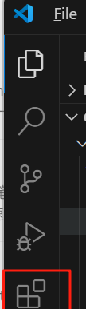

   - 安装完成后会提示是否重启并更换语言，依照提示重启即可

3. 安装前端插件：

   - HTML CSS Support

     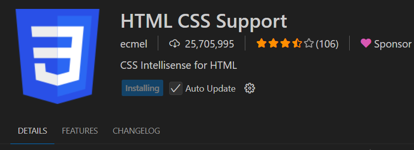

   - Live Server：用于在浏览器中实时预览当前变化，建议配合开启file- auto save使用（当前新版本可直接预览，该插件可省略）

     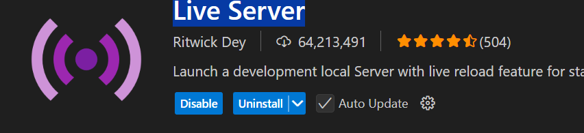

   - Auto Rename Tag：在修改html标签时，同步修改另一个标签

     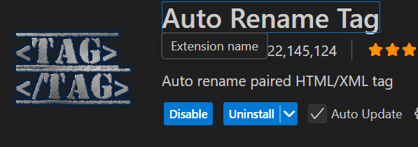

---

# 1. HTML

全称是Hypertext Markup Language(超文本标记语言）

用于定义网页的内容，给网页提供结构。

HTML通过一系列的标签(也称为元素)，来定义文本，图像，链接等。

## 1.1 HTML标签

HTML标签是由尖括号包围的关键字。有**双标签和单标签**

- **双标签：**成对出现，包括**开始标签和结束标签**(也称为双标签)，**内容**位于这两个标签之间
- **单标签：**没有内容，和结束标签

常见标签：

1. 编码格式

```html
<meta charset="UTF-8">
```

​    注意：

​	- utf-8 为常用格式，该格式可识别中文，若使用其他格式，可能会出现中文乱码的情况

### 1.1.1 段落标签

1. 段落标签 ，在<body>中使用,相比于标题标签，段落标签的字体与之不同

```html
<p>中间可以填写段落内容</p>
```

2. 段落标签的格式更改

-- 加粗：`<b></b>`

 -- 斜体：`<i></i>` 

 -- 下划线`<u></u>`  

-- 删除线：`<s></s>`

```html
<p>把段落加粗：<b>加粗</b>,<i>斜体</i>,<u>下划线</u>,<s>删除线</s></p>
```

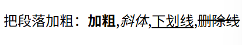

### 1.1.2 标题标签 

- `<title>`是在head中使用的，用于定义网页标题

- `<h></h>`是在body中使用的，用来标识网站内的标题

  共有六级标题，在h后面增加数字来定义标题登记

```html
<title>文档大标题</title>

<h1>一级标题</h1>
<hn>n级标题</hn>
```

图例：

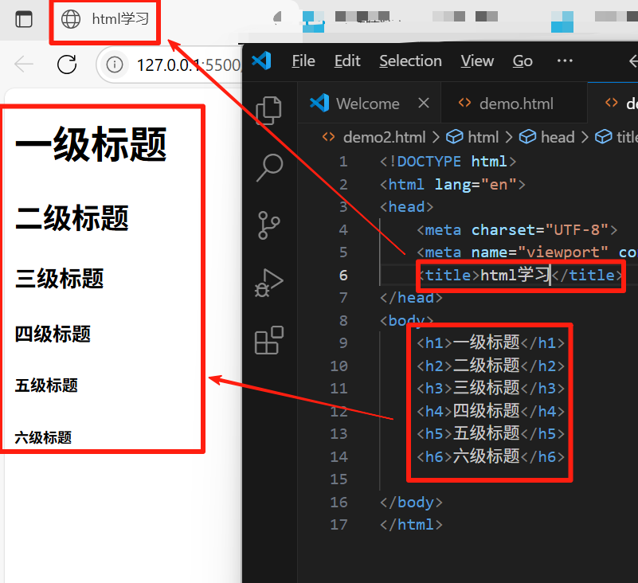

### 1.1.3 无/有序列表

1. 无序列表就是一个<ul>标签中嵌套着<li>标签

```html
<ul>
        <li>无序列表1</li>
        <li>无序列表1</li>
        <li>无序列表1</li>   
</ul>
```

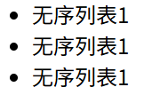

2. 有序列表是 `<ol>`中嵌套 `<il>`

```html
 <ol>
        <li>有序列表1</li>
        <li>有序列表1</li>
        <li>有序列表1</li>
    
</ol>
```

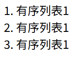

### 1.1.4 表格标签

使用`<table>` 作为根元素，其中有：

`<tr>`:(table row) : 表格列

`<td>`(table data) ：表格数据

`<th>`(table header) ：列标题

注意：

- 使用时，列标题<th> , 数据<td> 都需要**<u>分别</u>**嵌套在<tr>中
- 如果需要多行数据，需要使用多个<tr>包裹

- 指定表格边框：在<table> 里加入border=“n“ ，其中n表示边框的宽度，一般为1

```html
<table border="1">
        <tr>
            <th>列1</th>
            <th>列2</th>
            <th>列3</th>
            
        </tr>
        <tr>
            <td>数据1</td>
            <td>数据2</td>
            <td>数据3</td>
        </tr>
        <tr>
            <td>数据1</td>
            <td>数据2</td>
            <td>数据3</td>
        </tr>
        <tr>
            <td>数据1</td>
            <td>数据2</td>
            <td>数据3</td>
        </tr>
</table>
```

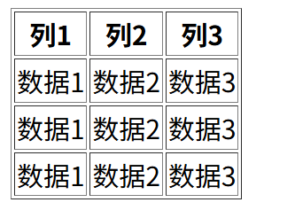


### 1.1.5 链接标签

a标签主要用于创建链接到网页或其他位置，而href是其中的一个常见属性

1. 基础格式:

```html
<a href="超链接">对该链接进行解释说明</a>
```

- 此处的 `href="xxx"` 为标签属性，可在：[1.3 HTML 标签属性](#1.3 HTML 标签属性)中具体学习

target:定义链接的打开方式，主要使用blank或默认

```html
<a target=""></a>
```

选项内容：

- _self：链接在当前窗口打开
- _blank：链接在新的窗口打开
- _parent：链接在父窗口，或父框架打开
- _top:在顶层窗口或顶层框架打开

### 1.1.6 输入框标签

1.

```html
<input type = "text">
```


## 1.2 HTML的文件结构

（在vscode的html文件中，开头输入！，并且按tab，会自动按照格式补全内容）

```html
<!DOCTYPE html>
<html lang="en">
<head>
    <meta charset="UTF-8">
    <meta name="viewport" content="width=device-width, initial-scale=1.0">
    <title>Document</title>
</head>
<body>
    
</body>
</html>
```


- 在头部需要有一个标识信息，`<!DOCTYPE html>`,用来说明格式

- 开头`<html>`和结尾的`</html>`是一对html的标签对，即是该文档的根元素，用于记录文档的起点和终点

  

- `<head></head>`头部标签对，用来记录一些文档的信息，如标题`<title>`，编码格式`<meta>`，外部样式表等内容

  注意，<head> 里面的内容是**不会实际显示**在可浏览的网页中的!`<title>`除外，它会显示在标签页/窗口标题栏

  

- `<body></body>` 此处是网页会**实际显示**的内容

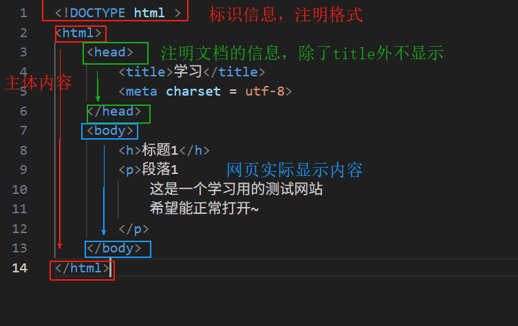

```html
<!DOCTYPE html >
<html>
    <head>
        <title>学习</title>
        <meta charset = utf-8>
    </head>
    <body>
        <h>标题1</h>
        <p>段落1
            这是一个学习用的测试网站
            希望能正常打开~
        </p>
    </body>
</html>
```

右键代码，选择

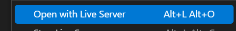

即可在浏览器中预览自己写的网页。此时在VsCode处保存，即可实时看到网页的变更，不需要反复打开网页

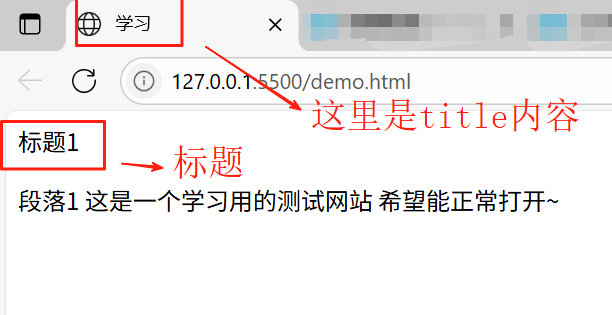

## 1.3 HTML 标签属性

1. 定义：属性用于定义元素的行为和外观，以及与其他元素的关系。每个标签都可以有一个或多个属性，用于描述元素的特征行为

2. 基础语法：

- 属性值可以用单引号或双引号
- 属性名不区分大小写，属性值区分大小写
- 多个属性间用空格分割

```html
<开始标签 属性名="属性值">
```

3. 常见属性：

| 名称  | 描述                                 |
| ----- | ------------------------------------ |
| class | 类属性，为html标签定义一个或多个类名 |
| id    | 定义元素的唯一id                     |
| style | 规定元素行内样式                     |

### 1.3.1属性列表

#### 1. 链接属性

1. herf：独属于**a标签**的属性，该属性定义了链接到的目标可以是：网页的url，文件路径，电子邮箱地址，电话号码等等

   案例：

   ```html
   <!-- 跳转到网页 -->
   <a href="https://www.baidu.com">跳转到百度</a>
   ```

   - 注意跳转到网页要加`https://`或`http://`前缀，不然会识别为本地文件

2. target:独属于**a标签**的属性，定义链接的打开方式，主要使用blank或默认

   ```html
   <a target=""></a>
   ```

   选项内容：

   - _self：链接在当前窗口打开
   - _blank：链接在新的窗口打开
   - _parent：链接在父窗口，或父框架打开
   - _top:在顶层窗口或顶层框架打开

#### 2. 换行

1. 换行标签：单独占一行，在两个需要换行的标签中间

```html
<br> <!-- 直接换行 -->
<hr> <!-- 创建水平分割线 -->
```

案例：

```html
<!-- 使用换行前 图1 -->
 <a href="https://www.baidu.com">跳转到百度</a>
 <a href="https://www.baidu.com" target="_blank">百度</a>

<!-- 使用换行后 图2 -->
  <a href="https://www.baidu.com">跳转到百度</a>
  <br>  
  <a href="https://www.baidu.com" target="_blank">百度</a>

<!-- 使用分割线 图3 -->
  <a href="https://www.baidu.com">跳转到百度</a>
  <hr>
  <a href="https://www.baidu.com" target="_blank">百度</a>
```

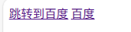图一

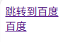图二

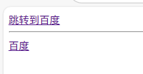图三

#### 3. 图片

- src：定义了图片的路径或url，可以是相对路径也可以是绝对路径。如果图片和该html处于同一目录下，或者图片在于html同级的文件下，就可以直接输入路径来显示图片

  图片与html文件的结构：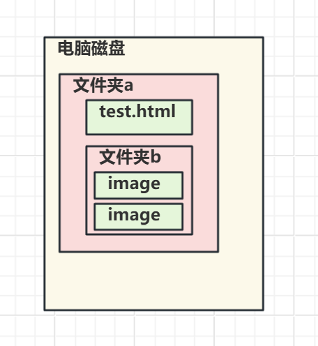

- alt: alt里面内容在浏览器**无法正常加载图片**时才会显示
- width，height：设置图片的宽高，大小

```html
 
```

案例：

- 也可以输入网络图片的链接在src后，获取图片
- 

```html
<!-- 显示本地图片,此处使用的是相对路径 -->


<!-- 如果图片和html同级，也可以直接写图片名称 -->

```


```html

```

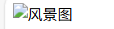


# 2. CSS

定义页面的样式和布局

# 3. js

用于添加交互性与动态功能作用