# blender学习

本笔记学习于b站up主[KurTips](https://space.bilibili.com/225179867/?spm_id_from=333.788.upinfo.detail.click)，部分案例来自视频内容

---

# 1.基础入门

## 1.1 操作和快捷键

1. 基础操作：

| 操作                           | 功能                               |
| ------------------------------ | ---------------------------------- |
| 鼠标中键                       | 移动视角，观察3d空间               |
| shift+鼠标中键                 | 平移3d空间                         |
| 鼠标中键滑轮                   | 缩放空间                           |
| Delete                         | 删除选中的模型                     |
| shift                          | 多选                               |
| shift+A                        | 添加菜单                           |
| shift+A，在菜单中选择网格      | 新建物体（新物体默认出现在游标处） |
| ctrl+A                         | 应用菜单                           |
| 鼠标右键                       | 取消                               |
| 鼠标左键                       | 确认                               |
| 左键框选（需要在工具栏选框选） | 快速选择多个物体                   |
| Alt+鼠标中键旋转               | 旋转到上下左右的正视图             |
| ctrl+Space                     | 最大化当前面板（再按一次恢复）     |
| shift + 右键                   | 移动游标                           |
| shift+ S                       | 排目录                             |
| shift + C                      | 将游标回到原点                     |
| /                              | 单独观察选中物体                   |

- 操作视图：

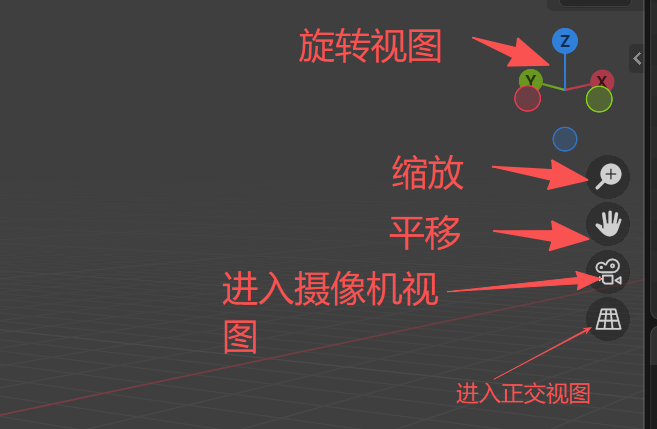

点击此处的几个球体，可以快速定位顶视图，正视图，俯视图等等，便于查看空间关系

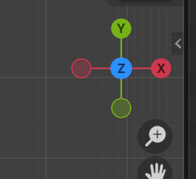

- 在菜单左侧有一栏小菜单，有小箭头的可以长按展开，在选中这个功能之后，也可以用w向下切换功能

- 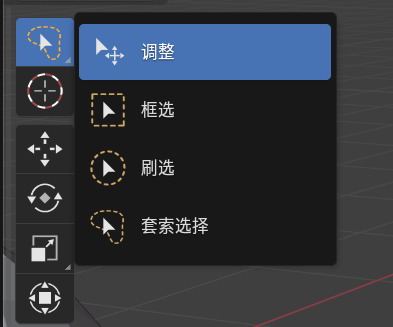

- 操作物体：

  通过这里的工具栏可以显示xyz轴来操作物体的位置和方向

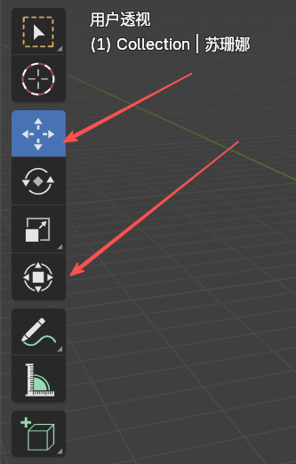

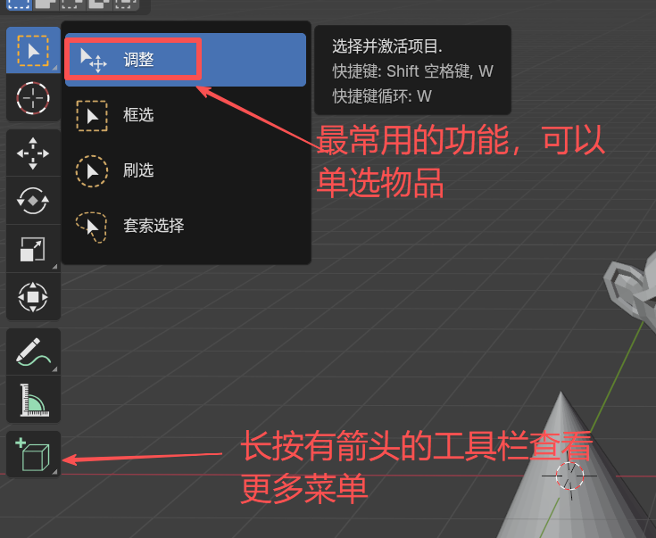

- 图层介绍：在新建了模型或者是摄像机等之后，会在旁边的菜单里看到这个栏目，这个就是物品的图层

  

  其中小箭头（需要设置）：表示物品是否可选择，关掉后则无法选中

  眼睛：物品在视图预览中是否看见，及时关掉，在摄像机视角依然能看到

  摄像机：表示在摄像机模式是否可见，关掉不影响视图，但是会在摄像机视角影藏

- 平滑着色：右键模型，选择平滑着色

  注意：如果对于立方体等需要不那么光滑的物体，在平滑着色后边缘会被柔和化，此时可以重新右键物体，选择**平直着色**即可

  （图一平滑着色前，图二平滑着色后）

  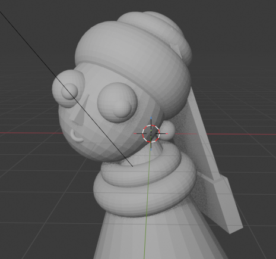

  ​											(图一)

  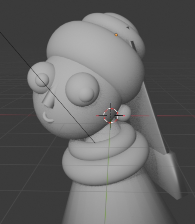

  ​											（图二）

- 视图优化：

  使视图的放大缩小以鼠标为中心：最上方的 编辑--偏好设置-- 缩放至鼠标位置

  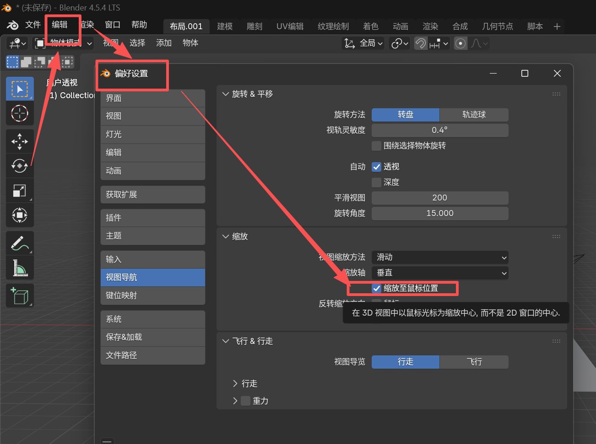

  在选择物体时可以围绕物体选择，则打开 编辑--偏好设置--围绕物体选择

  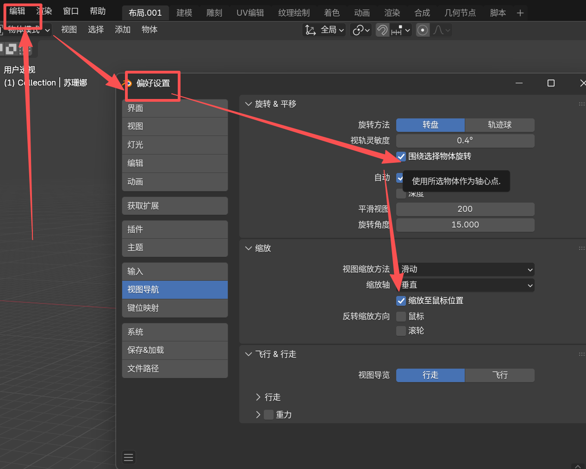

- 可选模式：为了避免误选图形，通过打开可选模式即可实现：右侧菜单--漏斗--将可选（小箭头）勾上

  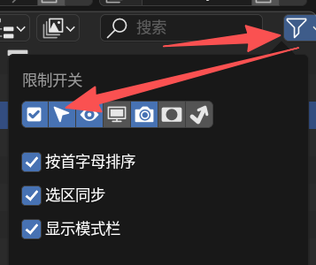

  此时再看图层界面，会多出一个小箭头的图标，亮着的图层代表可选，暗着的表示不可选

  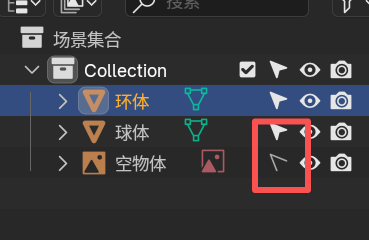

2. 快捷键：最上面为常用的基础功能，后面的快捷键根据需要选择记忆

   注：<u>以下快捷键都需要选中物体后使用</u>

| 快捷键        | 功能                         | 应用场景                                                     |
| :------------ | ---------------------------- | ------------------------------------------------------------ |
| G             | 移动物体                     | 调整外壳位置，同时按住ctrl，**有吸附功能**，可以按照格子来移动 |
| R             | 旋转物体                     | 改变物体角度                                                 |
| S             | 缩放物体                     | 调整大小                                                     |
| Tab           | 物体/编辑模式切换            | 进入编辑模型细节                                             |
| Ctrl+R        | 环切（添加一圈线）           | 为模型增加细节或支撑边                                       |
| E（编辑模式） | 挤出                         | 从面或边拉伸出新的结构                                       |
| I（编辑模式） | 内插面                       | 在现有面上插入一个缩小的面，用于开孔                         |
| G/S/R + x/y/z | 在坐标轴上移动/旋转/缩放物体 | 显示坐标轴，更快定位                                         |
| Alt+S         | 撤销缩放                     | 回到原始的大小，而非上一步的大小                             |
| Alt+R         | 撤销旋转                     | 回到原始的角度，而非上一步的角度                             |
| Alt+G         | 撤销移动                     | 原点回到原始的位置，而非上一步的位置。注意是原点，具体可看原点章节的介绍 |
| H             | 隐藏物体                     | 关闭物体所在图层                                             |
| shift+H       | 把没有选中的物体隐藏         | 关闭没有选中的物体所在图层                                   |
| Alt+H         | 显示所有物体                 | 打开所有图层                                                 |
| shift+D       | 复制+移动物体                | 先复制，然后可以把复制的物体移动出来，右键只能取消移动，不能取消复制 |
| C             | 刷选                         | 用鼠标涂抹选择，鼠标中键擦除选取，滚轮调整大小。esc/点击空白处退出刷选 |
| B             | 框选                         | 画框选中框内物体                                             |
| Ctrl+I        | 反选                         | 选中之后用此快捷键可以反选                                   |
| X             | 删除物体                     | 删除所选物体                                                 |
| f12           | 渲染                         | 根据当前所选渲染器进行渲染，以摄像机视角输出                 |

 **注意**：E（挤出）I（内插面）都需要在编辑模式选中物体的点/线/面后才能使用

- 小键盘专用快捷键：部分台式机或自己配的小键盘（即数字键盘）上的专用快捷键

  若没有小键盘，也可以**点击`~`切出的菜单来快速切换视图**

| 快捷键                     | 功能                                                         |
| -------------------------- | ------------------------------------------------------------ |
| 1                          | 正视图                                                       |
| 3                          | 右视图                                                       |
| 7                          | 顶视图                                                       |
| 9                          | 翻转当前视图                                                 |
| 2,4,6,8                    | 在当前视图的基础上微调，每次调整15°                          |
| 5                          | 切换正焦视图和透视视图                                       |
| 0                          | 切换摄像机视图                                               |
| 小数点                     | 将选择物体放大到屏幕中间                                     |
| （编辑模式，选择)Ctrl+加号 | 增加选区（若无小键盘，顶部菜单 `选择`--`扩展/缩减选选择 `也是同理） |
| （编辑模式，选择)Ctrl+减号 | 减少选区                                                     |

- 编辑模式快捷键：

| 快捷键 | 功能       |
| ------ | ---------- |
| 1      | 选择**点** |
| 2      | 选择**线** |
| 3      | 选择**面** |

## 1.2 视图介绍

1.主界面的几个功能区都是可以相互替换的，但是在学习前期尽量保持原样，避免找不到工具（图一）

窗口都是可增加/减少的，将鼠标放在窗口边缘，变成加号时，就可以拖动窗口：往自己的方向拉是分裂（图二）往其他房间拉是合并

应用场景：

- 一个视图打开摄像机视图，另一个建模视图，可以实时调整摄像机视角

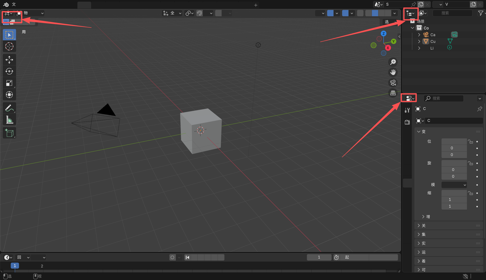

​										（图一）

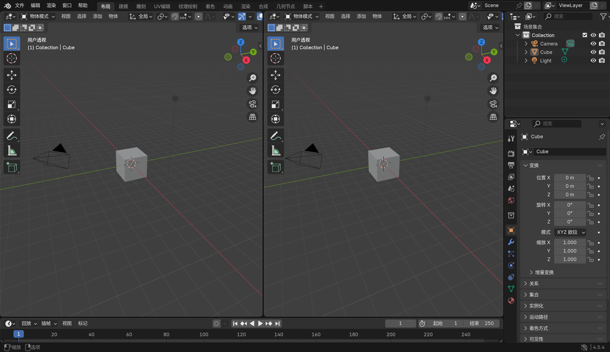

​											（图二）

这个功能既可以用于实时预览摄像机视角，也可以放置参考图：拉出一个窗口，选择上面的视图（默认是3d视图），改成图像编辑器，即可导入图片

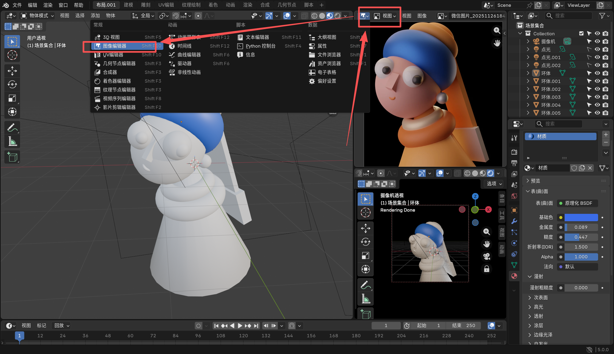

2. 若想把布局恢复原状，可以在右上角的加号处（图三）选择常规--布局（图四），即可新建布局，右键新布局，选择向前排序，然后把老布局（老布局一般就叫布局）删掉即可

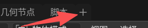

​												(图四)

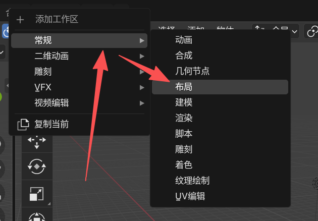

​												（图五）

3. **轴心点介绍：**

   - 质心点：单个物体则是他的原点，若有多个物体则是他们的重心
   - 3d游标：即游标所在位置
   - 外边框中心：即将多个物体拿最小的框框住之后，外边框的中心
   - 各自原点:即选中多个物体后，旋转时或移动还是按照各自原点移动
   - 活动元素：在多选时最后选中的物体就是活动元素。改变活动元素：在多选时按住shift+要更新的物体即可改变

   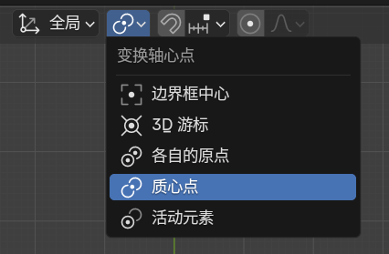

4. **坐标介绍：**

   在使用全局/局部坐标的时候，例如G+z，一开始会按照当前坐标系来移动，这时候再次按下方向键（如z），就可以切换坐标方式

   - 全局坐标：即世界坐标，上下左右根据xyz轴来定义，是不变的
   - 局部坐标：即物体本身自带的坐标系，会跟着物体的旋转改变

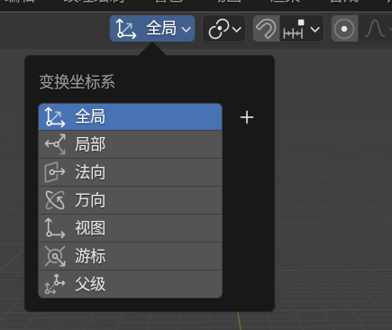

5. 保存和输出：在右下角的菜单里，可以设置输出的分辨率和文件位置，记得设置合适的位置

   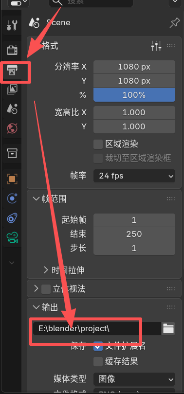

### 1.2.1 ==游标和原点==:

1. 游标，即视图中间的红白圆形：

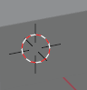

- 游标的功能：

  1）游标在哪里你新建的物体，就会出现在哪里

  2）游标可以作为轴心点来旋转：

  选择在菜单上方的第二个功能，默认为质心点，将其改成3D游标，物体旋转时便会随着游标的位置来旋转

  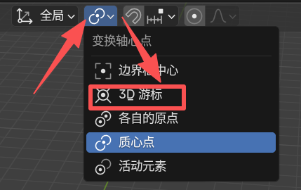

- 游标的操作：

  1）在边缘菜单选择游标图形，即可移动游标位置。或 shift + 右键

  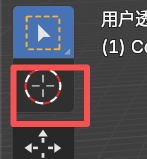

  2）选中物体，shift+s调出排菜单，选择 `选中项-游标`可以将该物体快速移动到游标位置

  

  3）shift + c ：将游标移动到原点处

2. 原点：即每个物体中心的黄点，物体在进行缩放等操作时会围绕原定进行。计算机只认识原点

   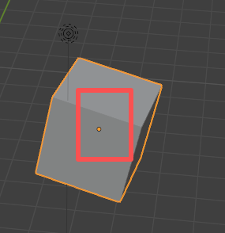

- 原点的操作：

  1）修改原点位置：右上角选项，选择仅影响-原点，切换到正视图（前视图），此时按住G会移动的只有原点了，而非模型，可以调整原点的位置。移动完成后注意把仅影响原点关掉

  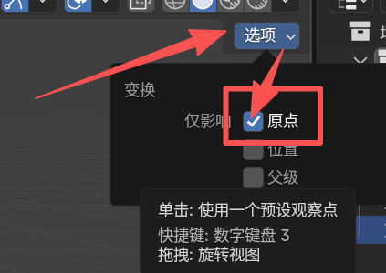

### 1.2.2 参考图设置

1. 添加参考图：切为前视图--shift+A -- 图像-- 参考

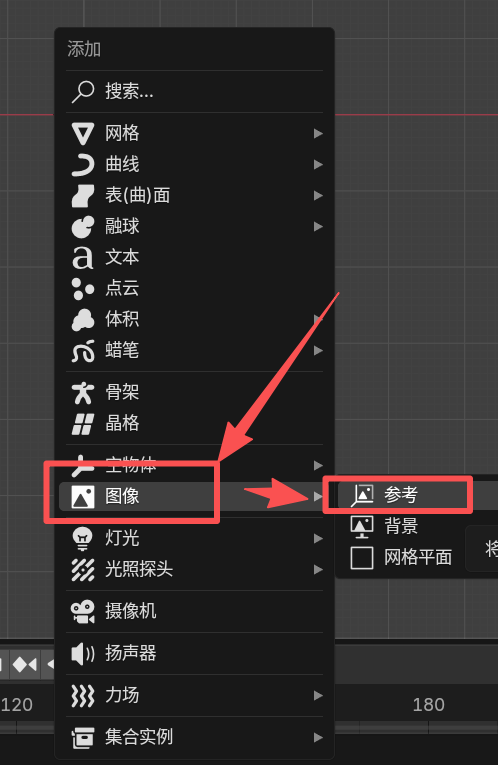

2. 设置参考图属性：选中参考图，在右下方出现的图像标志里调整图像属性，<u>如果改变属性没有变化，注意属性名称前的框是否有勾选</u>

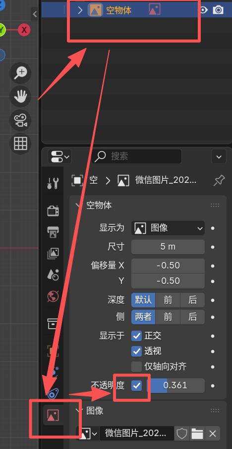

3. 属性面板介绍：

- 深度：前/后：将参考图显示在物体前后，用于参考图被遮挡时可以显示/避免参考图遮挡模型

### 1.2.3 摄像机的使用：

1. 在摄像机视图下调整摄像机位置：除了拖出两个窗口实时调整以外，也可以通过这个方法

   在**摄像机视图**下 : n -- 视图 --  勾选**摄像机到视图方位**。

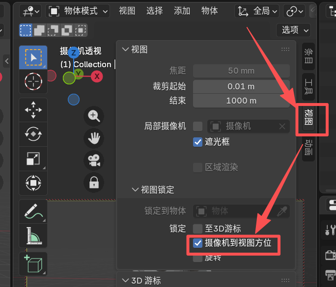

2. 设置背景框的透明度：在摄像机视图，选择右下角菜单的摄像机，遮光框可以设置摄像机视图外背景的透明度

   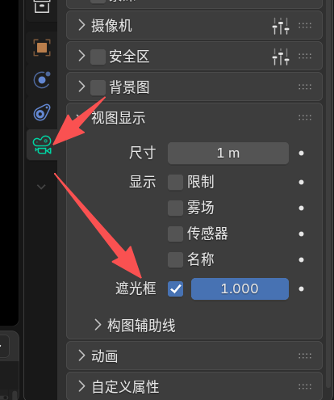

## 1.3 建模应用（基础）

### 1.3.1图形的基本操作：

1. 以经纬球为案例，在新建经纬球后，可以在左下角看到 `添加经纬球选项`（图一），在这里可以改变图形的段数，半径等数据。注意：若鼠标点击了其他位置，则无法更改了。在每次缩放，移动后，左下角同位置都会出现类似的操作界面，可以通过数值调整物体的大小和位置（图二）同理也是在鼠标点击其他位置后变无法修改

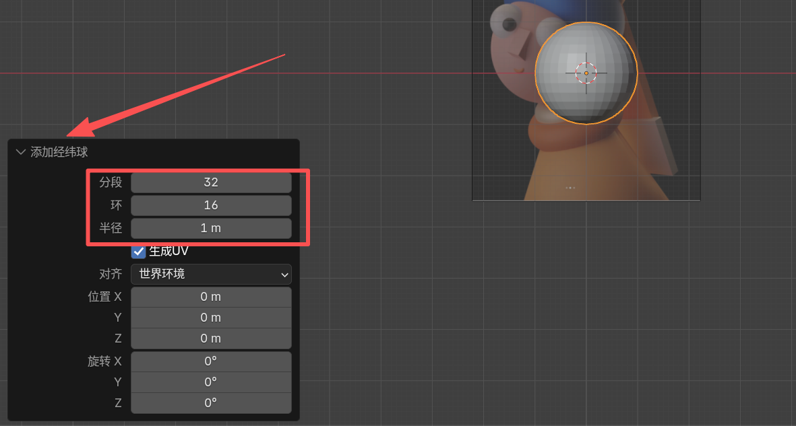

​													（图一）

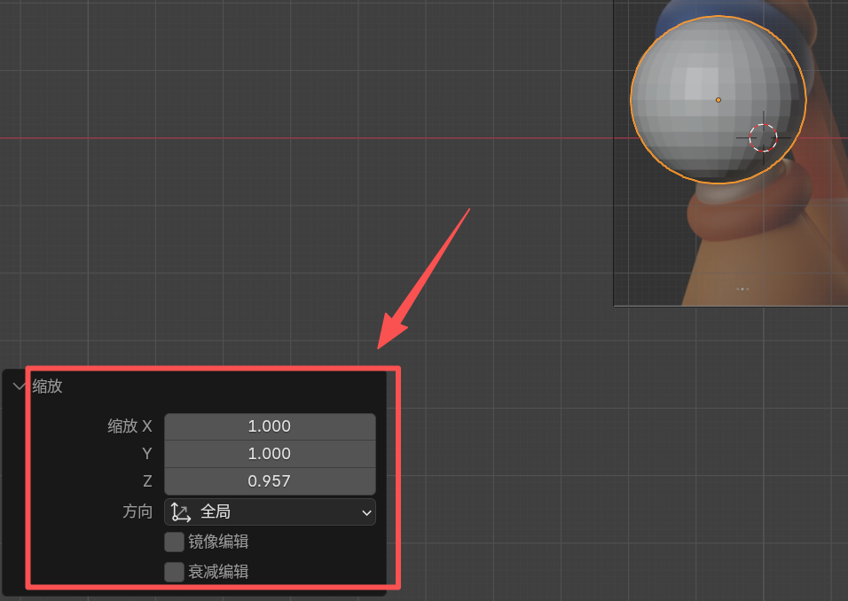

​													（图二）

### 1.3.2 渲染入门

在blender 里自带了两个渲染，EEVEE，以及CYCLES，两个渲染的功能对比：

| 渲染器 | 优点                                          | 缺点                                                         |
| ------ | --------------------------------------------- | ------------------------------------------------------------ |
| EEVEE  | 快，相对不占资源                              | 没有光线追踪，很多光线阴影的细节不佳，需要额外更多参数设置辅助。 |
| CYCLES | 逼真,高级能模拟出物理世界里非常细节的光线阴影 | 慢,相对更消耗硬件资源                                        |

（表格来源：KurTips）

1. 渲染器的选择：

   在菜单的右下方菜单里可找到渲染器，在确认完渲染器之后通过f12可以快捷渲染

   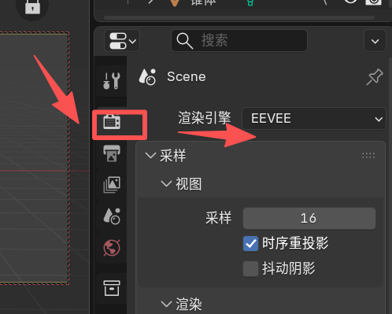

2. 世界属性：在blender里为了方便实用，所以软件自带了一个世界属性，包括基础的灯光等内容，可以在右下方的菜单处看到：

   - 强度：即默认的亮度，越低越暗

   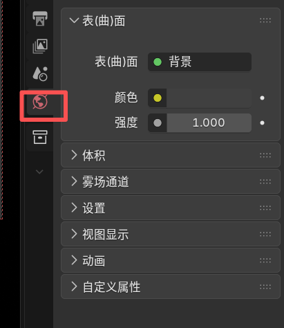

### 1.3.3 渲染的全局预览

首先把鼠标放在`全局`的位置，滚动鼠标滚轮显示隐藏的菜单，这里可以看到四个球形选项，以下将依次讲解其功能

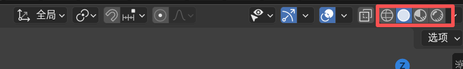

1. 渲染预览（最右）：渲染预览显示最终渲染结果预览，但是相对占资源,速度慢

   效果对比图：

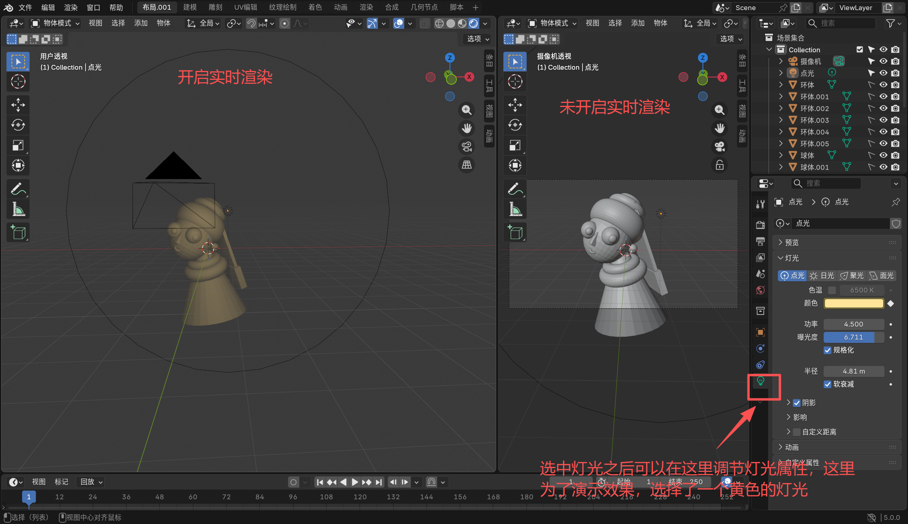

2. 材质预览（右二）：可以预览材质的颜色和简单纹理，但是不计算光线追踪细节，比渲染预览快
3. 实体模式预览（右三）：<u>默认渲染模式</u>，不显示颜色和材质，建模时候使用，快,不占太多资源

4. 线框模式预览（最左）：可以显示内部和背面的走线，建模时候常用

### 1.3.4 灯光

在创建并选中灯光之后，可以看到这里的几个灯光属性，可以根据应用场景具体选择

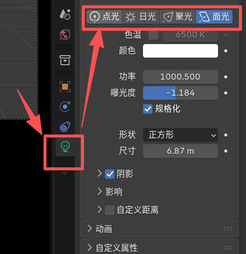

1. 面光：面光即只有一面光（前面有光则后面没光）。

   - 在面光模式下用鼠标直接拖动光源，可以显示出一个长方形，即面光的范围，可以拖动来调整长方形的大小。

   - 面光前的直线上有个黄点，拖动黄点来调整面光的角度

     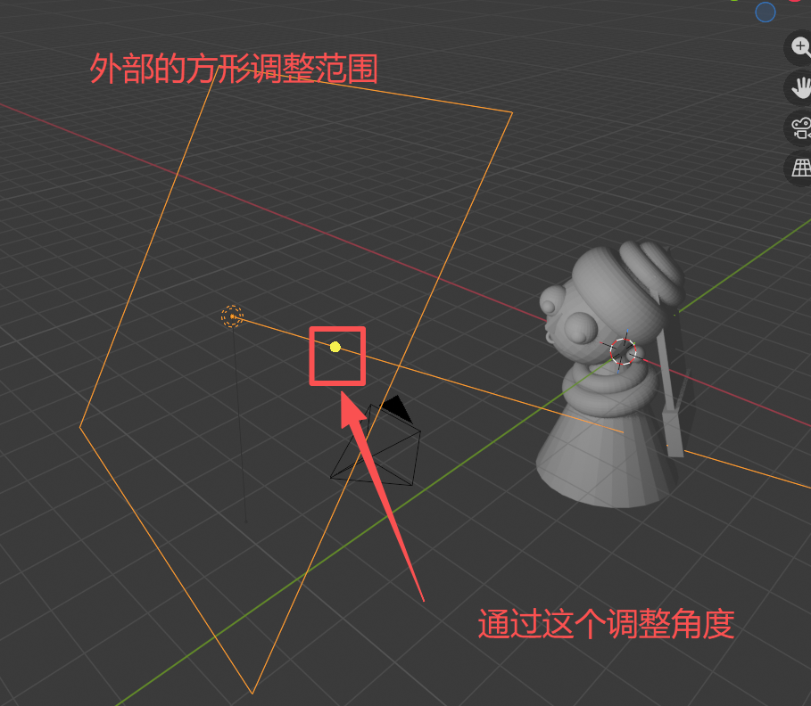

# 2. 开始建模

## 2.1 点线面

在开始之前，首先要进入编辑模式，通过Tab可以在物体模式和编辑模式之间切换。但此时切换其他模式便不足够方便，通过这个设置可以解决这个问题：

编辑 -- 偏好设置 -- 键位映射 -- 勾选 <u>拖动激活饼菜单</u>后，回到主视图，按Tab依旧是切换编辑模式，但是长按Tab加移动鼠标，可快捷调出饼菜单

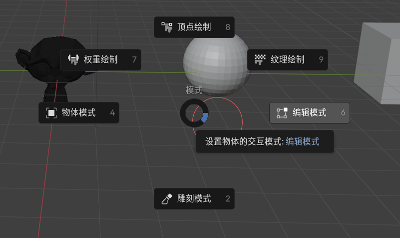

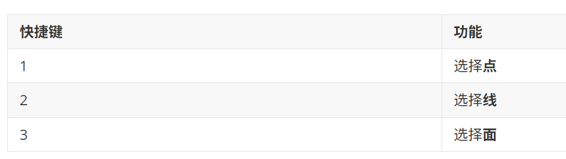

1. 选择快捷键：

- 按住shift+1/2/3 可以一次性多选点线面

| 快捷键                    | 功能                 | 介绍                                                         |
| :------------------------ | -------------------- | ------------------------------------------------------------ |
| B                         | 框选                 | 画框选中框内物体                                             |
| Ctrl+I                    | 反选                 | 选中之后用此快捷键可以反选                                   |
| C                         | 刷选                 | 用鼠标涂抹选择，鼠标中键擦除选取，滚轮调整大小。esc/点击空白处退出刷选 |
| Shift+选择                | 多选                 | 多选点/线/面                                                 |
| Ctrl+选择点               | 连接点               | 自动连接点之间的最短路径（若无法连接可能是因为刷选导致的）   |
| 选中+L                    | 选中相连点           | 全选和选择目标的所有物体（或点线面），使用时要保持鼠标在选中物体上，否则会无法选中 |
| （物体模式）Shift多选+Tab | 多个物体切换编辑模式 | 可以同时编辑多个物体                                         |
| 选中点/线/面+Alt+双击鼠标 | 选中相连点           | 只会选中相连的一圈点。圈的位置会根据鼠标点击的位置决定，如想纵向选择，可以将鼠标放在选中点的上方 |
| Alt+Z                     | 切换透视模式         | 透视模式可以看到物体内部，后部结构，**此时再使用框选，就可以选到物体的后部** |

