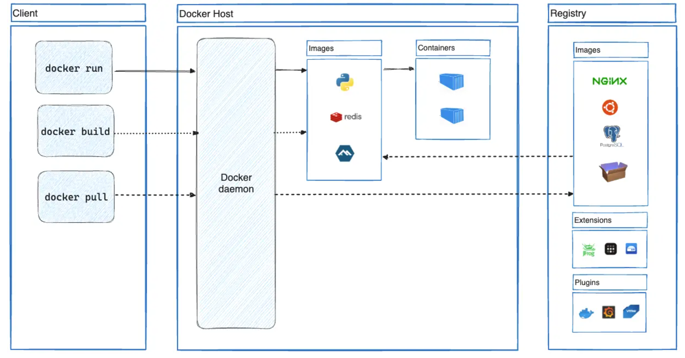
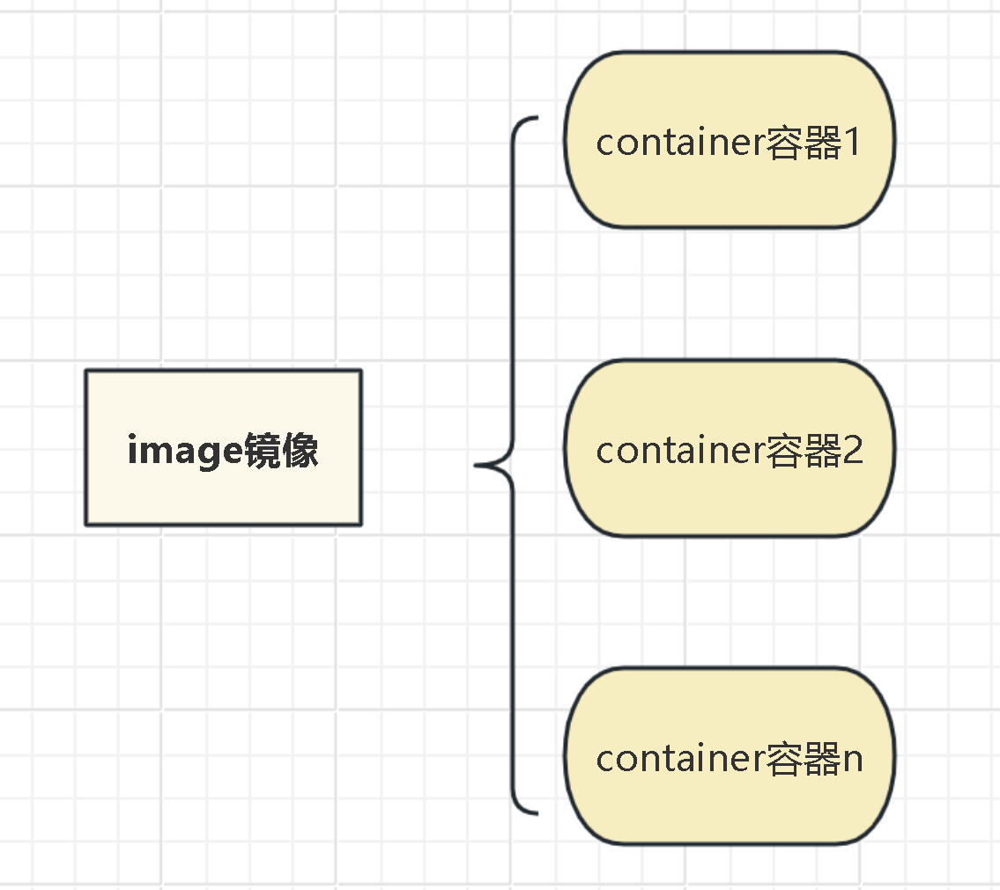
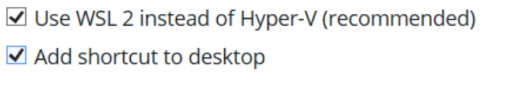

[toc]

# docker 入门

该笔记内容学习自b站[Docker 10分钟快速入门_哔哩哔哩_bilibili](https://www.bilibili.com/video/BV1s54y1n7Ev/?spm_id_from=333.337.search-card.all.click&vd_source=0cca411bb40fc860c52e59312233e4cb)

## 1.概念：

### 1.1 docker

docker在功能上与虚拟机非常相似，但是相比虚拟机而言体积更为轻量。docker为开发者提供了一个完全隔离的运行环境，<u>在环境中可配置不同的工具和软件，且每个环境互不影响</u>。可用于不受硬件影响的开发和测试。该环境也被称为**container（容器）**

docker架构：[Docker 架构 | 菜鸟教程](https://www.runoob.com/docker/docker-architecture.html)



### 1.2 image 镜像

1. 概念：相当于虚拟机中的快照，在镜像中包含了开发所关联的所有库，软件

2. 与容器的关系：通过镜像可以创建许多容器，每台容器独立运行，互不影响

   

### 1.3 dockerfile

一个自动化脚本，用于创建镜像,类似于虚拟机中安装操作系统

## 2.docker 的安装

推荐指南：[一篇就够！Windows上Docker Desktop安装 + 汉化完整指南（包含解决wsl更新失败方案）_docker汉化-CSDN博客](https://blog.csdn.net/Natsuago/article/details/145588600)

1. win或mac的最新版本可直接在官网安装：[Docker Desktop: The #1 Containerization Tool for Developers | Docker](https://www.docker.com/products/docker-desktop/)

2. 安装时，记得两者都要勾选

   （第一个意思为用WSL 2替代Hyper-v，注意尽量不要使用Hyper部署，否则容易导致文件权限无法正常管理，

   

## 3.应用的部署：


此处以linux系统为例：

1. 安装docker

   apt install -y docker 

2. `FROM 官方镜像名称：版本号` 相当于安装一个（镜像）快照，这个快照内存储好了别人事先存储好的工具包，不需要再次安装下载。现成的镜像可在docker hub找到。

3. `WORKDIR /路径 ` 指定**之后**所有docker命令的路径，若路径不存在，docker会自动创建

## 4. docker 常用命令

### 4.1 docker命令：

1. 查看容器状态：

   `容器名 ps`

### 4.2 docker compose命令

1. 重新部署容器：

` dp名 down && dp名 up -d `

- down是关闭，up是开启，意为将容器重启
- && 为前一条执行成功再执行后一条
- -d 是在后台运行

若使用 ps看到容器未正常运行，可使用该命令重新部署容器

## 5. 进入容器

1. 安装docker-compose：

   ````
   curl -L https://github.com/docker/compose/releases/download/v2.32.4/docker-compose-linux-x86_64 -o /usr/bin/docker-compose
   ````

   - 这里的链接是把容器的存储链接，通过curl命令访问该链接。此处是将容器放在github上
   - -o : 把执行结果写如文件，而不输出到屏幕。相当于下载功能。补充：其他下载命令：wget 或 curl -sSL -o  文件名 URL

   赋予权限：

   `chmod a+x /usr/bin/docker-compose `

2. 进入容器

   docker run -it --rm [-d] --name ubuntu --privileged  newzyer/ubuntu:dev2 init 

   - -it : 给容器分配终端，在交互式进入容器时必须加上，比如进入容器运行 bash

   - --rm是删除残留容器，减少空间浪费
   - --name 名字 ：给容器指定名字
   - -d把内容放到后台运行,若有该命令则不需要加-it ，docker exec -it 容器名 [shell] ：重新进入容器

   - newzyer/ubuntu:dev2 ：newzyer是镜像名称，ubuntu是镜像版本。

3. 把外部内容映射到容器：
   `docker run -it --rm --privileged -v $PWD/mgbox:/mgbox  newzyer/ubuntu:dev2 [init]`

   - -v  ：是把 $PWD（即当前目录的内容）里面的mgbox映射到/mgbox 里，相当于把容器外的内容**共享**
     （即哪一边改动，另一边也会改动）存储到容器里

   - init ：该位置可以根据需要填写命令，此处的init指的是初始化容器里面的linux系统，会启动linux系统包括里面的systemed服务等
   - --privileged :是给容器设置特权，即root的所有权限。若不加该参数容器只有一部分root权限，创建网络，设置systemd等命令都无法执行。该命令权限较高，启用普通容器时无需使用。

4. 启动docker-compose（要求当前目录有dc~的yml文件） ：
   `docker-compose up `

5. 进入其他容器执行命令：
   `docker exec -it 容器名 [bash] [ps -elf ]`
   [ ]是指执行某命令

6. 删除容器：

   `docker rm  -f 容器id`
   -f 强制删除