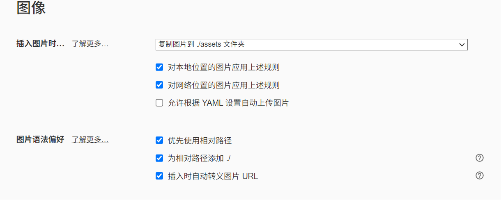

[toc]

# git 学习

```bash
git clone ssh://hostname/repo.git　  # 从某个仓库拉下所有代码
git pull                            # 从远程仓库拉取变更到本地
git push                            # 推送变更到到远程仓库
git 								# 缓存

git status                          # 查看当前变更
git checkout -- <filename>          # 撤销变更
git restore <filename>			    # 撤销变更
git add <filename>                  # 添加文件
git rm <filename>                   # 删除文件
git commit -m"变更说明"                 # 提交变更到本地仓库

git branch                          # 查看分支
git checkout <branch-name>          # 切换分支
git checkout -b <branch-name>       # 创建新分支

git log                             # 查看变更日志
git diff <filename>                 # 查看变更日志
```

## 1.1 上传笔记

1. 在typora的偏好设置-- 图像里勾选以下选项：



注意，如果上传多个笔记，建议把图像上传到同一个文件夹


## 1.2 下载笔记

1. ssh-keygen 获取本电脑公钥
2. 复制获取内容，登录到github上 -- setting --SSH and GPG keys ---选择new ssh key--- 将刚才复制内容黏贴进去

- 如果ssh-keygen获取的内容不是ssh-rsa开头，则cat ~/.ssh/id_ed25519.pub，复制内容，执行上述步骤

- RSA 生成的密钥长度比较长，而ECDSA 或 ECD2559 生成的会很短。所以现在很多系统都在用 ECDSA 或 ECD2559 

3. git clone git@github.com:

​	clone 后面的是自己的gihub链接，通过下图方式查看


