# Linux命令

[toc]

## 基础命令

1. / xx 安装xx文件, ./+文件名：运行该文件
2. sudo apt-get install +net-tools/iputils-ping / openssh-server/vim  安装 网络/ping/ssh/文字编辑器/  工具
3. ctrl+c 停止，一些后台程序，和一些 强制关闭了 CTRL+C功能的程序不可用（强制关闭 CTRL +C 的程序，可能是要连续执行的程序，它不允许除随便终止，以防意外。比如编辑器程序，就不允许 CTRL+C，防止内容还没保存被不小心退出了）
4. tar - zxvf xx 解压xx文件（xx文件输入文件前两个字母，按table自动补全）
5. cat /etc/lsb-release 查看当前发行版的版本
6. gedit 一种文本编辑器
7. sudo+命令 使用高权限执行命令
8. sudo reboot 强制重启vm
9. clear 清除显示的所有内容=ctrl+l
10. alias 查看命令别名（即命令的一些特殊功能或者限制）
11. curl -sSl +网址 ，打开该网址并且输出到终端

-  -o +文件名+网址，把网页内容输出到文件

12. wget +网址 ，下载网页内容到文件，没有文件会生成一个文件，文件名为该网址最后一个斜杠后的内容，若名称重复则覆盖

- -o +文件名+网址，把网页内容输出到指定文件

13. vim ~/.bashrc 用vim编辑bashrc（包括alias）

source ~/.bashrc 使编辑内容生效

14. 关机重启命令：（需要root权限）

关机：shutdown -h/now 立即关机=halt

- Shutdown -h 1 一分钟后关机

- Shutdwon -r now 现在重启计算机

- Shutdown -c 取消关机

重启：reboot

15. Sync :将内存数据同步至硬盘（每次关机前都必要）
16. date 查看当前时间（年月日时分秒）注意大小写

- date +%Y 只查看年

-  +%m 只看月

- +%d只看天

l date “+%Y-%m-%d %H：%M：%S”显示当前年月日时分秒，

（ps：中间的连接符号“-”和“：”是指令输出在屏幕上后连接使用的，也可用别的代替）

- date -s “时间字符串” 更改时间

17. Cal 查看当月日历信息

- Cal 2020 查看2020年整年的日历信息

- Cal -y 查看今年整年的日历信息

sudo apt-get install bsdmaintils用于乌班图下载cal

18. Xx（某指令）--help 查看指令帮助

Man 指令 查看详细帮助手册，按空格继续向下查看，按q退出

## 1.**查找指令**

19. history 查看历史指令，默认所有

history 5 查看历史五条指令

！10 执行历史使用的第十条指令

20. find+范围+选项 查找指定范围内各个子目录，并把符合条件的显示在终端,若无查询结果，则不显示内容

**选项内容：**

​             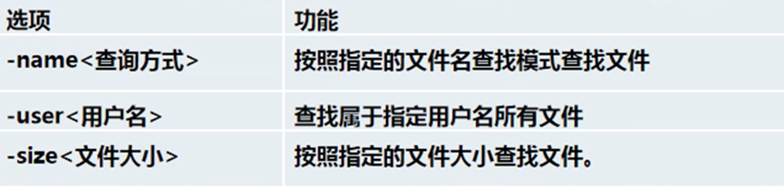                  

**应用实例：**

- find /home -name hello 在home下按名称寻找所有叫hello 的文件

-  find / -size +n 在根目录下查找所有大小大于n的文件（*n为数字，+n为大于n的文件，-n为小于n的文件，n前面无字符则是等于n的文件，**数字后面要带单位，如****k****，M,G****等**）

**21.**    locate+查找文件，快速全局查找所需要内容，第一次使用前需要使用updatedb，创建locate数据库（乌班图使用plocate）

**22.**    | wc -l ，统计数量，可与grep等结合使用，具体实例查看磁盘指令-文件查询

- -c 是统计数量
- -w 是全字匹配：如果是grep abc，则搜索的时候会检索abc，二不是把abc作为分开的元素搜索

-- 使用案例：

```
cat ceshi |grep error |wc -l
# 输出结果：
3 
# 表示error的内容有三行
```


**23.**    which 查看某指令在哪个目录下

24. grep+查找内容+源文件，过滤查找，可搭配管道符号使用（默认区分大小写）

-  grep -n 添加查找内容行号

- grep -i 忽略字母大小写

-  grep “^x” ，查找筛选以 x为开头的内容，x可以根据需要改变

- Ps -elf |grep+进程id 查找进程

- Ps -elf  查看当前所有进程

 应用实例：

1. Cat a.txt |grep “hello” 读取并查找a.txt中hello 的内容
2. grep -n “yes”/home/hello 在hello中查找yes，并添加行号

## 2. **压缩指令**

25. gzip +文件 压缩文件，只可压缩成.gz格式
26. gunzip +已被压缩文件 ，解压文件
27. zip +压缩后文件名+需压缩文件， 压缩文件或者文件夹（使用更多），压缩为.zip格式（**压缩文件在传输过程中可避免文件的缺失**）

l zip -r 递归压缩，即压缩整个目录

l **应用实例：**

Zip -r myhome /home/（此处加*，不影响压缩结果）， 将home目录（包括home文件夹本身）压缩成为myhome

28. unzip 解压.zip格式的文件/文件夹，默认指定解压到当前目录

l unzip -d +目录名 将解压内容放到指定目录

l 应用实例：

Unzip -d /opt/tmp /home/myhome.zip 将myhome.zip解压到/opt/tmp下

**29.**    tar +打包后文件名称.tar.gz+需要打包的文件/目录，打包压缩指令，默认打包后的文件格式为.tar.gz，可以打包压缩文件或者文件夹（目录）,**可以同时将多个文件一起压缩并且打包为一个文件**

*（#**打包：打包是将多个文件组合成一个文件）*

l **选项功能**：（选项可组合使用）

Ø tar -c 产生.tar打包文件

Ø -v 显示详细信息

Ø -z **打包同时压缩/****解压 .gz****文件**

Ø **-x** **解压.tar****文件**

Ø -f 指定压缩后的文件名

Ø -C 指定解压/压缩后存放的目录

Ø 应用实例：

-  tar -zcvf pc.tar.gz /home/hello /home/hhh将hello和hhh打包压缩为pc.tar.gz 

- tar -zcvf myhome.tar.gz /home 将home目录压缩为myhome.tar.gz

- tar -zxvf pc.tar.gz 将pc.tar.gz解压  (zxvf一般放在一起使用)

-  如果报错：

tar: Removing leading `/' from member names

则直接变成 zcPf即可，P要在zf中间

- tar -zxvf /home/pc.tar.gz -C /opt/tmp将pc.tar.gz解压到/opt/tmp下

（补充：-zxvf的意思为：解压.gz文件，解压.tar文件，显示详细信息，最后指定压缩后的文件名）

## 3.**用户模块**

- **用户详解：参考地址**[**Linux****用户管理终极指南：从基础到进阶，一篇就够！**](https://mp.weixin.qq.com/s/7s3wvxpTLUE1GdhipzEDqw)**（**该链接使用的centos，部分指令与Ubuntu不一定契合**）**

30. Su-root 切换成管理员身份 su – 用户名 切换成xx用户

（若遇到无法登录，使用 sudo passwd root（或其他用户名），更改root或用户密码），不指定用户名，则会默认修改当前登录用户密码

31. Logout/**exit**（乌班图简略版暂时只能用exit） 注销(退出)用户，切换至之前用户 （该指令在图形界面无效，只有在运行级别3：即多用户无图形下，有效），可以用于退出root用户至普通用户; 权限低用户切换至权限高用户需要密码，反之不需要
32. loginctl list-users 查看当前在线用户
33. aaduser a 新增a用户，默认在/home目录下创建a家目录，得到/home/a

- adduser –home /home/b/a 将a用户指定在/home/b目录下创建

-- useradd的相关条件

-  -g 指定用户组的id

- -c 添加附加信息

- -d 指定家目录

- -u 指定uid

- -r 创建系统用户

- -m 创建用户的家目录

- -k 复制指定目录下的文件，需同-m一起使用

新建用户默认无密码，passwd 用户名 **修改用户密码**

- userdel -rf 删除a用户及其家目录和mail，慎重使用

- deluser a 删除a用户，保留其家目录（建议使用）

(需要管理员权限)

<u>（ Ps：adduser和useradd区别：</u>

两者对应着两条删除用户的命令：deluser和userdel。

adduser：会自动为创建的用户指定主目录、系统shell版本，会在创建时输入用户密码。

 useradd：需要使用参数选项指定上述基本设置，如果不使用任何参数，则创建的用户无密码、无主目录、没有指定shell版本。**因此日常使用adduser**）

34. whoami 查看第一次登录时的用户

 w，who 查看当前用户登录的情况

35. cat /etc/passwd 查看当前所有用户：包括系统用户及自己创建用户 （用户具体内容查看笔记）

- 解释：linux系统的所有用户信息都储存在该目录下，但是不包括密码。密码在：/etc/shadow目录中

这两个目录十分重要，不可以随意更改

 

36. sudo usermod -aG sudo new_user 给用户增加sudo权限
37. 用户uid及其对应含义：

 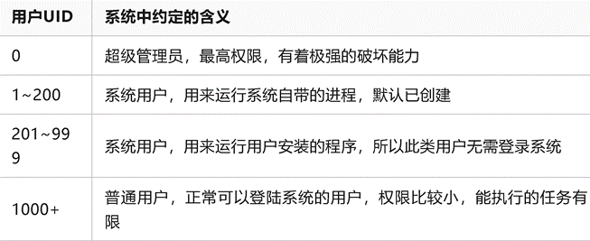

38. id+用户名 查看用户信息：用户gid，uid及所在组

**不加用户名**则是默认查看当前所登录的用户信息

39. passwd 用户名 修改用户密码
40. finger +用户名：查看用户信息

 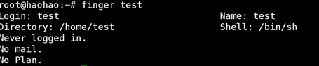

（注意finger插件需要提前下载：apt install finger）

41. chfn +用户名，修改用户注释

 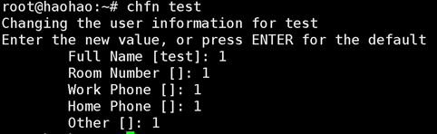

42. chsh +用户名，修改用户的bash shell

 

43. ls -ahl或者ll查看当前目录下所有文件的所有者

- -a 查看所有文件

- -h 显示为合适大小

- -l 竖着排列

- -Rl 列出目录下所有文件内容，以及子文件

44. chown +用户名+文件/目录，将文件/目录转移给其他用户

chown +用户名+组+文件/目录，将文件目录转移给新的用户和新的组

-R 将目录下的所有文件都一起移动

 

##  4.**用户组管理**：

45. Cat /etc/group 查看当前所有用户组

Cat /etc/group |grep a 定向搜索a组

46. groupadd abc 新建用户组abc，groupdel abc 删除用户组abc，若新建用户b未指定组，则会默认新建一个名为b的组将其归入
47. 将新建用户放入指定组：useradd -g abc b ：将b用户放入abc组
48. 更改**用户**组：usermod -g abc c ：将c用户更改入abc组中
49. Usermod 修改用户信息

- -c 修改描述信息

- -g 修改用户组

- -G 修改用户的附加组，默认情况下是替换

- -a 追加附加组

- -l修改用户的登录名称

- -L 锁定用户，不能登录系统，修改密码默认情况下回解锁

- -U 解锁用户

- -s 修改用户登录后的shell

- -u 修改用户的uid

- -d +目录+用户名，更改用户登录的初始目录(即家目录)，默认不会创建新目录，如果想移动家目录，则需要使用-m

（ ps：若用户无进入指定组的权限，则该指令无法执行）

- e 年-月-日 修改用户的过期时间，过期以后不能登录

50. chgrp +组名+文件名，更改**文件****/****目录**所在组

chgrp -R +组名+目录名，递归整个目录到新的组

## 5.**运行级别指令**

51. Init +（0-6）切换运行级别，零时设置，重启后会失效
52. 目录：/etc/initab
53. 常用运行级别名称：

- multi-user.target **运行级别三**（名称）：多用户有网络服务（常用）

- graphical.target 运行级别⑤：图形界面

54. systemctl get-default 查看当前运行级别
55. systemctl set-default TARGET（输入运行级别对应名称）.target 设置默认运行级别
56. chkconfig 用于给某个服务指定他的运行级别是**自动**否开启或关闭，用该指令设置后，需要重启后才会生效

（若无法使用，参考文献：[一个解决linux系统下没有chkconfig命令导致的command not found: chkconfig问题_chkconfig: command not found-CSDN博客](https://blog.csdn.net/wildwolf_001/article/details/115250102)）

-  chkconfig --list [ |grep xxx] 查看该指令管理的服务有哪些

（ps：[ ] 代表可选）

- chkconfig --level （数字）服务名称 on/off 设置某服务在某个运行级别是否自启动

57. chkconfig 目前不适用于新版本，现在使用

systemctl enable/disable 服务名 ，来使用该功能，更改用systemctl daemon-reload 来启用更改

 

## 6.目录/文件管理

Ps：文件目录中大部分都使用绝对路径

*（ ls**后，蓝色代目录，白色为文件，红色是压缩包）*

  （若需要对目录内的文件进行操作，则现需要对目录拥有相应的操作权限）

58. cd /a/ 进入a目录（如果a不在当前目录，需要使用绝对路径，如cd /home/a）

cd , cd ~ 回到当前用户的家目录

如root，将回到/root , tom则是/home/tom

Cd .. 回到上一级目录，cd ../../xx 返回上一层，再上一层后面的root目录

不可使用sudo cd

59. ls 列出当前目录下的文件/子目录

l ls /xx/  列出xx目录 绝对路径 下的所有文件

l ls -l /xx  ls -s /usr/bin 列出xx目录下文件详细属性（目录名称可以放在最后，可以放在ls后）

l ls -a 显示所有文件，包括隐藏文件（可与上一条组合使用）

l ls-lh 显示文件大小

l ls-lt 按时间排列

l ls -lS按大小排列

**（ps****：这几个都可以与-l****组合使用，也可自行组合）**

l 后缀 |tail -n 10 查看末尾十个  |head -n 10 查看开头十个

 

60. pwd 查看当前目录/文件的绝对路径，若不以/开头的目录或文件，都是相对当前目录的
61. 在本机拷贝其他服务器的文件：scp 目标名+地址 ：+原文件目录 + 拷贝后的文件目录。 可以直接拷贝较小的文件，较大文件需要压缩成tar后拷贝

案例：scp root@www.某某.com:/usr/bin/a (这个是源文件)

 /usr/bin/a（这个是拷贝后文件）

 将本机的文件拷贝到其他服务器：

scp （源文件）+ 目的服务器的地址 ：+目的文件夹

案例：scp /usr/bin/a （源文件）

root@www.某地址.com:/usr/bin/a（目的文件）

62. mkdir +要创建目录（需要路径），但只能创建一级目录，如mkdir /home/dog,在home下创建dog目录

- mkdir -p +两级目录，创建多级目录，如mkdir -p /home/pig/dog

63. rmdir +目录路径  空目录，如rmdir /home/dog
64. |more 指令 ：可跟随任意查看指令后面，可查看较大文件，例如：ps -elf |more
65. rm -rf +目录路径 强制递归删除，目录内有内容也可以删除，***谨慎使用***

- rm +文件路径 删除文件（只可删除文件）

- rm -r强制删除整个目录

- rm -f 删除且不提示（非所有发行版都有）

66. touch +（文件名） 创造一个空文件

（ps：若mkdir，touch等等命令在普通用户lucy使用时显示无权限，则cd /home/lucy 到该用户的根目录下使用即可）

67. cp 拷贝文件到指定目录，cp a /home/b,a即所需要拷贝的文件，/home/b则为需要拷贝的目标目录的**完整路径**，具体过程如下：

- 如在/home 下创建文件 a.txt，

需要拷贝到/home/test/bbb目录下时，必须写出完整路径，即 cp a.txt /home/test/bbb

- cp -r /home/bbb/ /opt 强制递归复制*整个目录（*拷贝整个目录*）*，即将/home下的目录bbb拷贝到/opt下

- \cp -r 强制覆盖无需提示，用于拷贝更新后的同名目录（非所有发行版适用）

68. mv 可用于重命名和移动（剪切）文件/目录

mv a b 在同一个目录下，将a**重命名**为b

mv a /home/test 将a文件，**移动**到/test里：例如：

- 如果当前在/home下，且a也在home下，可直接mv a /home/test 将a移动到test里，注意**目标路径一定要写完整**

- 若当前不在home中，在/root下，而想要将home下的a移动到/opt ,则需要原文件和目的目录的路径都写完整：mv /home/a /opt,将a移动到opt

- mv a .txt /root/b.txt 将a.txt移动到root，且改名为b.txt

- mv /home/abc /root 将home下的abc目录移动到/root下

69. cat +文件名 查看内容（相比vim更为<u>安全便捷）</u>

- cat -n 查看文件内容并且显示行号

- cat -n a | more 文件a较大时，会省略一部分 ，按enter继续查看，按空格翻页（more相关具体看liunx笔记）
- -A 查看原始文件内容（显示隐藏符号）

70. echo +内容 输出内容到控制台:

- 查看环境变量: echo $HOSTNAME 查看主机名称

- 输出内容：echo “hello” 输出hello至控制台

- **重定向指令：**Echo “abc” > /home/day 把终端显示的内容“abc”输出到文件day（会覆盖原先文件）

​      Echo “abc” >> /home/day 把终端显示的内容“abc”追加到到文件day（不会覆盖文件内容）

71. head 查看文件开头内容（默认十行）

head -n 5 查看前五行

72. tail 查看文件尾部内容（默认十行）

tail -n 5 查看倒数五行内容

tail -f 实时追踪文档更新(只可检测echo输入的)，ctrl+c退出监控模式

73. 输出重定指令和追加：“>”覆盖文件内容，“>>”追加内容

- ls -l >/home/a 将列表内容覆盖写入a

- ls -l >>/home/a 将列表内容追加写入a

- cat a>b 将文件a内容覆盖文件b

- Echo “abc” > /home/day 把终端显示的内容“abc”输出到文件day（会覆盖原先文件）

- Echo “abc” >> /home/day 把终端显示的内容“abc”追加到到文件day（不会覆盖文件内容）

74. Sudo chmod a+w /home/a 给a文件添加可写权限

- 权限变更：

（ps：当文件变为可执行时，文件名会变为绿色）

- 变更符号：+，=添加权限

- 删除权限

- 字母对应含义：u：所有者，g：所在组，o：其他人，

a：所有人（即ugo的总和）

- 使用案例：

1)chmod u=rwx,g=rx,o=x 文件/目录名：给所有者添加rwx权限，为所在组添加rx权限，为其他人添加x权限

2)chmod o+w 文件/目录名

3)chmod a-x 文件/目录名 ：删除所有人的x权限

4）chmod 751 文件/目录名 ：给所有者rwx权限，给所在组rx权限，给其他人x权限

75. ls -l +文件 查看当前文件的权限：（详细内容看liunx笔记）

- rwx作用在文件：

Ø r -可读

Ø w – 可写，但不可删除该文件，删除文件的前提是对文件所在**目录**拥有可写权

Ø x – 可执行

Ø 若某个一个显示为“-”，则说明没有该权限

分别表示：当前用户（读、写、执行），同组用户（读、写、执行），其它用户（读、写、执行）

- rwx作用在目录：

Ø r -可读 ：可以读取，ls该目录文件

Ø w – 可写：可以对目录内的文件 删除+修改+重命名

Ø x – 可执行：可进入该目录，使用cd

76. ln -s 软链接/符号链接，为一个目录/文件创建快捷方式：如为root创建在home下的快捷方式：

ln -s /root /home/myroot 目标文件在前面，快捷方式在后面，成功后cd /myroot目录可直接跳转到root，ls -l查看也可看到 

使用rm /home/myroot 即可删除

Ps：

Ø 使用pwd查看文件路径时，只能看到软连接的路径，

Ø 创建链接文件后，使用ll查看文件信息，其第一位为l

 

 

## 7.**定时任务**

77. crontab 设置定时任务调度 （crond）

- crontab -e 设置编辑定时任务

- -l 查询定时任务

- service crond restart 重启

- -r 删除当前用户所有crontab任务

（ps：若使用命令中有%，需要用\代替转译，否则%后内容不被识别）

crond 时间自动生成器：[在线Cron表达式生成器 (qqe2.com)](https://cron.qqe2.com/)

 --时间设置：

-  特殊时间标识：

1）    时间使用：*****，若不设置数字，使用*，则代表全部范围：如第一个*，则代表一小时中的每分钟都执行，使用实例：

1 * * * * ：代表每一分钟执行指令

 

占位符含义：（分时日月天）

 

2）    时间使用：“,” 代表不连续时间，使用实例：0 8,12,16 * * * ：0代表0分，后面顿号隔开的数字代表小时，该指令代表：每天的8时0分，12时0分，16时0分 执行指令

3）    时间使用：“-”代表连续时间，使用实例：0 8 * * 1-6 代表周一到周六的8时0分执行指令

4）    时间使用：代表每隔多久执行一次，使用实例：*/10 * * * *，代表每隔10分钟就执行一遍命令

时间使用案例：

 

- **使用实例**：

1. 输入 crontab -e 进入编辑模式（乌班图可自行选择编辑器）
2. 编辑时间和内容：

如 */1 * * * * (此处表示时间) ls -l /etc/ > /tmp/to.txt (指令内容) ，保存并退出

3. 该指令内容表示，每分钟将/etc/中的内容重定向覆盖到to.txt（注意，若之后删除了to.txt，过一分钟后会重新生成一个to.txt，并且执行指令内容）

- 时间调度脚本命令（适用于多条指令的调度）：（使用案例）

4. 使用vim my.sh 编写脚本内容，如：

date >> /home/mycal

cal >> /home/mycal

5. 为该脚本添加可执行权限（默认无）：chmod u+x /home/mycal
6. 使用crontab -e 进入编辑模式，设定时间，如*/1 * * * * ，后接上刚才写的预设脚本路径 /home/my.sh

完整：*/1 * * * * /home/my.sh

7. （ps：若不使用crontab，可直接通过 ./my.sh 运行脚本，但是需要设置运行权限）
8. at 定时执行一次性任务 （需atd在后台运行，使用ps -elf |grep atd查看即可）

-- at详解：

https://blog.csdn.net/liupeifeng3514/article/details/80174880

- at的使用（重要）：

1. at +（时间）
2. 回车后，在“at>”后输入需要执行的命令
3. ctrl + d 结束输入命令
4. at会返回最终的执行时间

- at的基本语法

（ps ：命令中”>”会无法识别，需要用“>>”）

Ø at +时间 定时执行命令

Ø ctrl +d 结束at命令的输入

Ø 使用ctrl +back 删除字符

Ø atq或 at -l查询当前未执行的预设任务

Ø atrm +编号 删除预设任务

Ø 其他选项：

 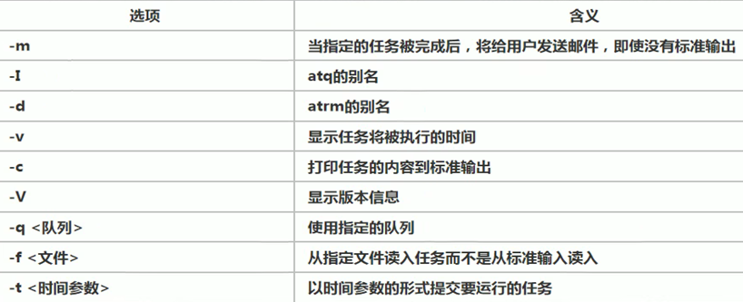

- at的时间定义：

Ø 按照当天时间指定：hh：mm（小时：分钟），如：04:00，则是当日的凌晨四点，若当前时间已经超过该时间，则会在**第二天**同时间执行

Ø 使用模糊时间词：midnight（午夜），noon（中午），teatime（下午四点左右）

Ø 12小时制：时间后加上am（上午），pm（下午），如12pm，+天数，如：5pm **+**2 days（注意空格，加号保留），指两天后的下午五点

Ø 具体时间：时间+ 1）月 日 2）年/月/日/ 3) 年.月.日 ，其中，指定日期必须在时间后面，如02:00 2024/6/12

Ø 相对计时法：now+数字 时间单位，其中时间单位可以有：minutes，hours，days，week，count。数字即代表时间，如now + 5 minutes（加号也需要写）

Ø 直接时间：使用today，tomorrow等来设定时间，可与其他结合使用

## 8.**磁盘相关命令**

79. 查看分区情况：lsblk 或 lsblk -f（后者查看信息更详细）

80. fdisk /dev/loop5 将dev下的硬盘loop5分区

    1) 选择n

    2) 选择p，选择数字代表创建几号分区，与分区数量无关

​          3. 后几个选项直接回车，按w保存并退出

- 分区相关选项：

1）m显示命令列表

2）p显示磁盘分区 同 fdisk-l

3）n新增分区

4）d删除分区

5）w保存并退出

说明:开始分区后输入n新增分区，然后选择p，分区类型为主分区。两次回车默认剩余全部空间。最后输入w写入分区并退出若不保存退出输入q。

 

81. 格式化：指令：mkfs -t ext4 /dev/loop5p1(分区名称)
82. 挂载（mount）： 

mount /dev/loop5p1 /root/newdisk, mount+分区路径+挂载文件路径（注意：用命令挂载后重启会失效）

- 卸载：umount +分区路径，卸载原有挂载（需要从原目录切出去再使用）

- 更改：umount+新的目录，更改路径

注意：其中一个目录尽可挂载一个分区，但可以更换分区挂载的目录

83. vim /etc/fstab 设置永久挂载

应用实例：

- 在中间按照格式添加自己需要挂载的分区：如图

- 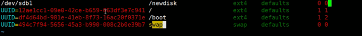

 

84. df -h 系统磁盘整体情况查询，若磁盘使用率>80% ，则需要清理内存或增加磁盘空间
85. du -h /目录 ，查询指定目录磁盘情况

- du -hs /目录 ，指定目录的占用大小汇总

- -h 带计量单位

- -a 含子目录深度

8. 通过 --max-depth=1 查看第一层子目录的最大深度（数字代表第几层子目录），该指令不会列出文件情况，只会列出目录情况，但汇总栏会包括所有内容的大小

使用实例：du -h --max-depth=1 /opt 查看opt第一层子目录的最大深度 

9. -ha --max-depth=1 查看第一层子目录最大深度的同时，列出文件和子目录

- -c 列出明细的同时增加一个汇总值，与其他可组合使用，例如： -hac --max-depth=1 会写出文件的大小汇总

86. ls -l /opt |grep “^-“ | wc -l 统计/opt目录下文件的数量，用于文件查询，也可以查询目录等，将- 换掉即可

拆分：

- grep “^-” 筛选以 -为开头的内容，即目录下所有文件

- | wc -l 统计数量

1. ls -Rl /opt |grep “^-“ | wc -l 统计/opt目录下文件和子文件的数量

87. tree /home 将目录结构以树状结构显示 

 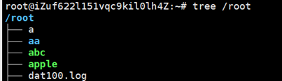

## 9.**网络相关**

88. route -n查看网络相关信息 

    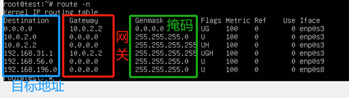

89. ifconfig查看当前虚拟机ip地址 inet后（有两个ip，前一个是虚拟机的，后一个是对主机的）

ipconfig /all 查看win主机的ip地址

90. ping+目的主机ip地址/网址（域名），测试当前服务器能否连接目的主机：请求超时则是失败
91. service network restart 重启网络服务
92. hostname 查看主机名称
93. vim /etc/hostname 修改主机名称，重启后生效
94. 主机名和host映射：

-win上ping虚拟机名称

- 去C:\Windows\System32\drivers\etc\hosts 文件,用记事本或其他软件打开hosts，在里面添加虚拟机ip地址和虚拟机hostname即可

 

- 若无法保存host的编辑内容，则将host复制去其他文件夹，再更改内容后，放回原文件夹即可。

- 成功后，可去主机终端直接ping 虚拟机hostname，检验连接是否畅通

- 虚拟机上ping win名称：

- vim /etc/hosts

- 新增内容 主机虚拟网络ip +主机名 （可根据需要设置，但不可设置中文）

- 保存后在虚拟机上ping 主机名即可

95. （在cmd）ipconfig /displaydns 查看dns域名解析缓存，即查看主机的dns域名访问记录
96. ipconfig /flushdns 手动清理dns缓存

 

## 10.**进程管理**

97. ps 用于查看系统中的进程情况，包括哪些在执行，以及执行状况等，
98. ps显示信息说明：

补充：PPID：该进程的父进程id

​     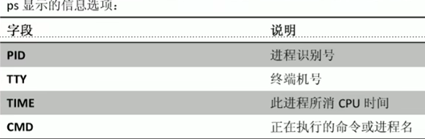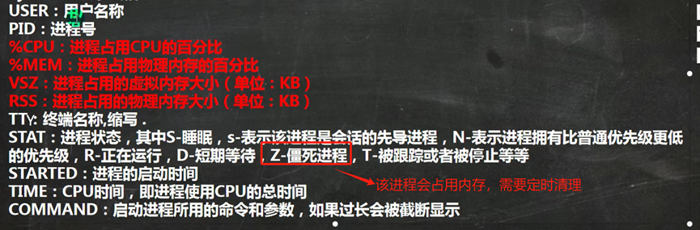

ps选项：

- ps -elf |grep+进程id/进程名 查找进程

- ps -uax |grep +进程id/进程名 ，查找进程并显示详细信息（查找结果的最后一条为当前**查找指令**的进程）

- -ef 以全格式显示当前所有进程（-e表示所有进程，-f表示所有格式），可用于查看某进程的父进程（PPID），如图：

 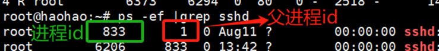

- -elf  查看当前所有进程

- -a 查看当前终端执行的所有进程（与-e区分）

- -u 以用户格式显示

- -x 显示后台进程运行参数（可组合使用，如：ps -uax）

98. pstree 查看进程详细信息，以树状形式显示

- -p显示pid

- -u 显示所属用户

99. kill +进程号， 终止进程，有时系统可能会忽略该指令，可使用-9 强制关闭进程

- killall+进程名，终止进程，可以用于终止父进程来终止其下所有子进程，可用于快速清理内存

- kill -9 **强制**终止进程，可用于终端（bash）等

## 11.**动态进程监控**

100. top 查看进程情况，与ps类似，但其可以在执行的一段时间里更新在运行的进程的情况

其中，使用**htop**更便于查看信息。查看进程的部分信息，查看ps部分

 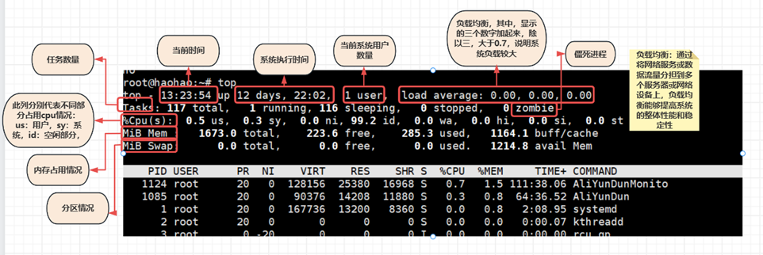

-- 选项列表

- -d +秒数，指定几秒更新一次，默认3秒

- -i，不显示任何僵死或闲置进程

- -p+进程id，指定监控某个进程的情况

（补充：僵死进程：进程因为一些原因无法继续，但是内存没有释放）

-- 交互功能：（注意大小写）

- P：以CPU使用率排序，默认是此功能

- M：以内存使用率排序

- N：以pid排序（由大到小）

- q：退出top

-- 指定功能：

- 监控指定用户：

1. 输入top
2. 然后输入u
3. 输入指定用户名后回车即可
4. 若无该用户，则会显示invalid user

- 终止指定进程：

1. 输入top
2. 输入k
3. 输入指定的进程bash的id后，会提示信号量，普通的进程使用15即可关闭，若无法停止，使用9强制停止。后回车即可

 

## 12**服务管理**

101. service +服务名+ start/stop/restart/reload(重载)/status（查看状态） 该指令在部分版本不可用

- stop ：关闭监听端口，区别于kill

102. ls -l /etc/init.d 查看当前可用的service服务，绿色代表可用
103. firewalld.service 防火墙服务

- 相关指令：

Ø firewall-cmd --permanent --add-port=端口号/协议，打开指定**端口**，其中--permanent指永久，若去掉，则重启后则会取消该命令的执行,其中端口和协议都需要写，用/分割。（常用端口有22/tcp）

Ø firewall-cmd --permanent --remove-port=端口号/协议，关闭指定端口 

Ø firewall-cmd --add-service=http（此处填服务名称） --permanent 用于打开指定**服务**

（常用服务有ssh，http，https，smtp）

Ø firewall-cmd --reload 重置防火墙规则，若之前设置的时候没有加--permanent，使用该指令则会使之前的指令失效。只有加上了--permanent，才能使用此指令来载入新的设置

Ø firewall -cmd --query-port=端口/协议，查询端口是否开放

Ø firewall -cmd --state 查询防火墙状态/存在情况

Ø 防火墙规则补充[Linux firewall-cmd 命令详解-CSDN博客](https://blog.csdn.net/gmingzhou/article/details/78090963)

- 若没有防火墙如何安装：[Linux 如何设置防火墙|极客教程 (geek-docs.com)](https://geek-docs.com/linux/linux-basic/t_how-to-setup-firewall-in-linux.html)

- 其中通过iptable建立防火墙，需要保证所操作的虚拟机在本机而不是远程，前两条指令会禁止所有远程的连接，通过iptables-save保存方案。补充解释：（`sudo iptables -P INPUT DROP` 和 `sudo iptables -P OUTPUT DROP` 这两条命令是用来设置防火墙规则的。具体来说：

 `sudo iptables -P INPUT DROP`：将默认的 INPUT 链策略设置为 DROP，意味着所有进入服务器的网络流量都被阻止，除非有特别的规则允许某些流量通过。

`sudo iptables -P OUTPUT DROP`：将默认的 OUTPUT 链策略设置为 DROP，意味着所有从服务器发出的网络流量都被阻止，除非有特别的规则允许。

由于 Xshell 是一个用于远程连接服务器的工具，执行这两条命令后，服务器将不再接受任何进入的连接请求，也无法向外部发送任何数据，这导致 Xshell 会立即断开与服务器的连接。

这就是为什么在执行这些命令后，Xshell 会掉线的原因。要恢复连接，您需要通过控制台或其他途径登录服务器并调整 iptables 规则，或者重启服务器来清空 iptables 规则。（来自微信群））

- 解决方案：若在远程登录时使用，且未保存，可通过重启解决

- 补充：文章中的—为--，

- TCP （传输控制协议），通讯两端一个叫服务器端，一个叫客户端。服务端要打开一个端口 Listen 监听来自客户端的连接。

 

 

104. setup 查看所有系统服务（现在部分版本不适用）
105. sshd ：ssh远程登录时的守护进程

- service ssh start 打开ssh（远程连接）服务，

- sudo service ssh stop 关闭ssh服务

- sudo services ssh studo 查看ssh状态

- /bin/systemctl start sshd.service 启动远程登录服务

106. systemctl [start/stop/restart /status] 服务名 ：用于管理服务，其中start，stop等指令会立即生效，但只是零时生效，重启后会失效

Ø 该指令管理的服务在 /usr/lib/systemd/system 查看

Ø systemctl list-unit-files [|grep 服务名] 查看服务开机的启动状态(自启动默认运行级别为3、5)

Ø systemctl enable 服务名 ，设置该服务在开机时自启动

Ø systemctl disable 服务名， 关闭该服务在开机时自启动

Ø systemctl is-enabled 服务名，查询该服务是否自启动，注意，若在使用中stop了该服务，但其自启动未被关闭，使用该指令查询仍显示enabled

(ps：写服务名时不需要全称，en/disable 指令使用后永久生效)

Ø  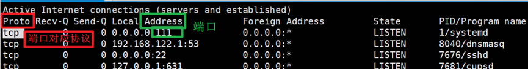

107. telnet+ip地址+端口，测试端口是否能够连接（在cmd使用），若显示没有该命令，则去：控制面板--》程序和功能---》打开或关闭Windows功能，勾上“telnet客户端”即可使用
108. netstat  显示网络的相关信息，可经常用于检查网络安全：如是否有非自己启动的端口在监听等

Ø -an 按一定顺序排列

Ø -p 显示哪个进程在调用

 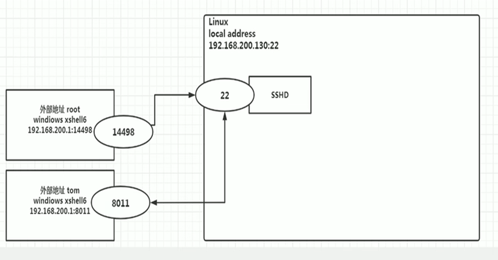

l 详细信息：

Ø local address ：local下对应该端口的liunx本地地址，如192.168.122.1 是ipv4的显示形式，而：：：是ipv6的显示形式，旁边是端口号

Ø forein address ：外部地址以及端口

l 端口连接原理示意图

 

Ø 常用端口协议（端口可以对多个地址）：

1）TFTP （简单文件传输协议）工具，端口69

2）FTP （文件传输协议），端口 21 

3）SFTP (安全文件传输协议）

4）scp，基于 ssh 协议 22 号端口，这个是目前最主要用的

5）UDP 端口 69 是 TFTP 协议用的端口，它是一种古老的文件传输协议。在嵌入式系统，或一些比较简单的系统之间进行文件传输用的比较多。

Ø 其中sate中的状态：

Ø LISTEN 监听，表示某个程序监听在某个端口上，客户端程序可以连接这个端口（即尚未连接程序，等待连接），若程序没有listen端口，则无法建立连接

Ø ESTABLISHED 表示，已经建立连接，如图：

 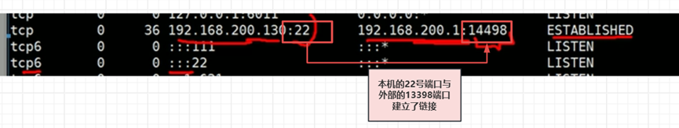

Ø TIME -WAIT（tcp协议机制）：连接上的端口被端口后，该端口的状态会变成这个，系统会判定这个端口只是**暂时断开连接**，过几分钟会自动变为监听状态

109. 端口补充：**被连接服务的端口是不改变的**，**主动连接的端口是变化且随机的**，在1-65535中随机，其中，0-1023的端口，称为**知名端口，**这些端口一直帮固定的分配给特定的程序。同时这些端口，也都有一个固定的名字，比如这些最常见：

21 ftp

22 ssh

23 telnet

53 dns

80 http

443 https。通常，很多命令显示IP和端口时，会把IP显示成域名，端口显示成字母。通过-n，可以强制把端口显示成数字。

端口不会重复使用。需要使用哪个服务，就要连哪个服务的端口，这个端口是固定的

Ø 选项列表：

- -napt ，p 表示显示“进程“，可以看到哪一个进程打开了相应的端口 ；t 表示只显示 TCP 连接

110. ping +ip，网络检验检测工具，用于检测远程主机是否正常，或是两部主机之间的网线和网卡故障

## 13. **rpm** **与yum**

​        

111. rpm -qa 查询已安装rpm的列表

Ø 其中Ubuntu的 软件包 格式是deb，如果要安装rpm的包，则要先用 **alien** **把rpm****转换成deb**

sudo apt-get install alien # alien 默认没有安装，所以首先要安装它 

sudo alien xxxx.rpm #将rpm转换位deb，完成后会生成一个同名的xxxx.deb

Ø rpm信息查看：

 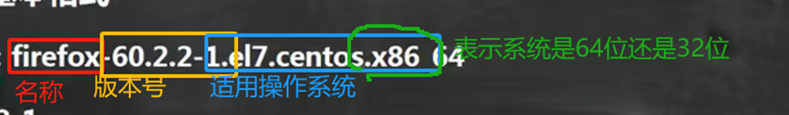

注意：若是32位的操作系统，则会显示i686或是i386

   若即适用于32位又适用于64位，则会显示noarch

Ø 选项：

Ø -q +软件包名，查询指定软件是否安装

Ø -qi +软件包名，查询软件包的相关信息

Ø -ql+软件包名，查询软件包包含的文件

Ø -qf+文件全路径名，查看文件所属的软件包

如：rpm -qf /etc/passwd 

Ø -e +rpm包名称（只需要包名，不需要版本名称，如Firefox），卸载指定rpm包（e表示erase，擦除）

注意：如要删除的包被其他软件依赖，则会提示：

 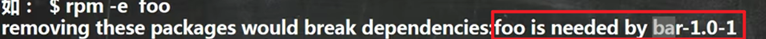

   该提示表示，所要删除的foo包，被bar这个软件依赖，如果强制删除foo，可能导致bar**无法正常使用**

 **强制删除：**-e --nodeps+rpm包名称（不推荐）

Ø -ivh +rpm包全路径名称，安装rpm包（i是安装，v是提示，h是进度条）

112. yum install+包名，从yum服务器上安装rpm包

yum list |grep xx ,查询yum服务器上是否有xx包

## 14.bash

此处内容去[bash](bash.md)中有详解

## **其他**

113. hostnamectl set-hostname +名称 ，修改主机名称

l 若出现报错：Too many arguments ，则用双引号把新名称括起来即可

l hostname 查看当前主机名称

114. 

 


 

 