[toc]


# mysql学习

#  1．   mysql入门

可参考文章：[快速入门-MySQL](https://mp.weixin.qq.com/s/uqDEEENiv9zRNaGfWRCcuQ?scene=1)

## 1.1.  数据库原理：

mysql作为数据库，会通过监听某个端口与主机连接，即：

​                       

 


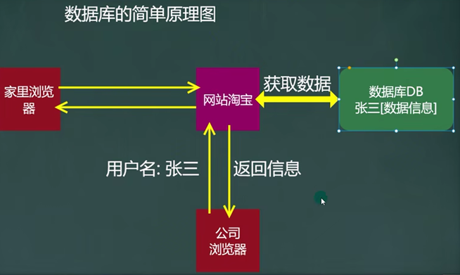

### 1.1.1 数据库的结构：

1. **数据库的基础概念**：安装mysql数据库，即在主机上安装一个**数据库管理系统** （DBMS），这个管理系统使用的SQL语言可以用于管理多个数据库，每个数据库中有很多内容，如表，视图等内容，其中**表**是最重要的。

   注：DBMS: datebase manage system

   mysql的特性有：事务支持、ACID特性（原子性、一致性、隔离性、持久性）、索引、触发器、存储过程、视图等

2. 数据库的三层结构图解：

   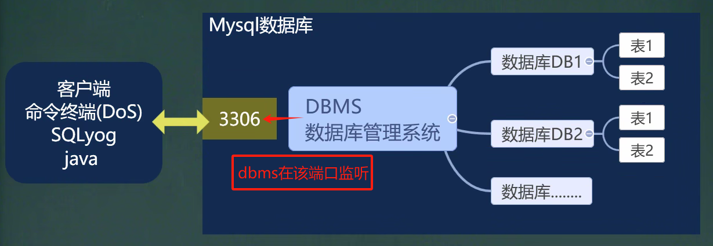

3. 数据库结构对应的具体位置：

​	1） DBMS 在监听3306端口，在cmd输入netstat -anb，可找到对应内容

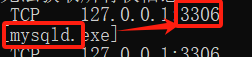

 	2）数据库db 在安装mysql的文件位置中 --> data , 即可看到：

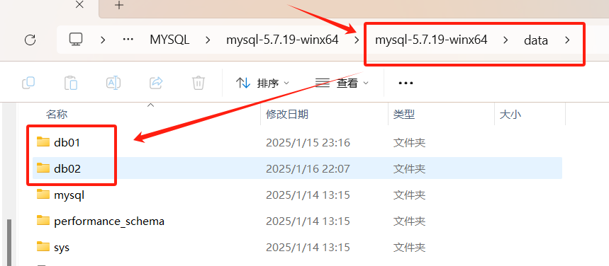

​	3） 表的位置：接上一部，点开其中一个数据库，如db01，即可看到之前创建的表的位置：

（在[1.4.3navicat的使用（基础）：](#1.4.3navicat的使用（基础）：)处可找到）

**<u>因此可知，Mysql数据库中，普通表的本质依然是==文件==</u>**

（注：并不是所有数据库的表都是文件）

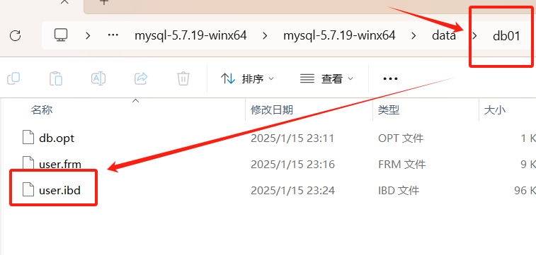

### 1.1.2 数据在数据库中的存储方式：

1. 数据通过**表**存储在数据库中
2. 在表中，竖过来的叫一列（column），横过来的叫一行（row）

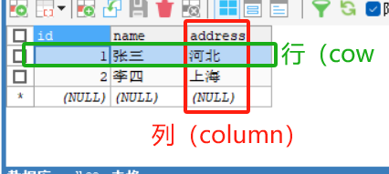

3. 表的一行称之为**一条记录** --> 在java中，一条记录往往用一个对象来表示

### 1.1.3 客户端与数据库的连接：

客户端（发出命令，如：select* from users）<--- [3306端口] DBMS监听端口，得到客户端的命令--->依据命令查找相应的表 users ，将表内的结果返回到界面

### 1.1.4 数据库和表的本质

1. 表：类似Excel表格，有行（记录）和列（字段）。
2. 数据库：存放数据的“仓库”。

3. SQL：操作数据库的语言


---

## 1.2.  mysql的安装：

### 1.2.1．mysql下载

[mysql5.7下载地址](https://dev.mysql.com/get/Downloads/MySQL-5.7/mysql-5.7.19-winx64.zip)

（ps：若在下载过程中遇到问题，或想要重新下载mysql，需要删除mysql，使用指令 sc delete mysql，<u>但在删除前一定要注意检查当前mysql里面没有存储重要内容。工作环境中不建议使用</u>）

### 1.2.2 添加环境变量：

在解压好后添加环境变量：(具体用途查看：[python](python.md)中环境变量)

- 电脑-->属性-->高级系统设置-->高级-->环境变量 :

1. 选择 Path （若没有则自己新建）

2. 编辑Path，新建，拷贝安装好的mysql 的bin目录的路径： 

   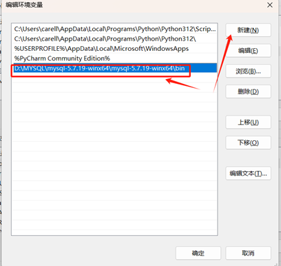

3. （ps：若以前装过mysql，此处可能会识别成之前mysql的bin目录，把当前新目录上移，移到最上面即可）

#### 1.2.3 配置mysql服务

1. 创建my.ini文件：

-  在自己安装的mysql目录（如D:\MYSQL\mysql-5.7.19-winx64\mysql-5.7.19-winx64）下创建该文件 my.ini

 开my.ini ，复制如下内容：

```
[ client ]   
port=3306    
#将客户端端口设为3306    
default-character-set=utf8    
[ mysqld ]
basedir=D:\MYSQL\mysql-5.7.19-winx64\mysql-5.7.19-winx64    
#设置为自己MYSQL的安装目录       
datadir=D:\MYSQL \mysql-5.7.19-winx64\mysql-5.7.19-winx64 \data \    
#设置为MYSQL的数据目录,这里的data是系统帮我们创建的：在mysql的安装目录后面加上：\data\ 
port=3306    
character set server=utf8   
#设置字符级
skip-grant-tables 
#跳过安全检查，即不用密码也可登录   
```

2. 初始化mysql数据库：

- 找到cmd，选择以管理员身份运行

- 切换到mysql的bin目录下：

cd  /D D:\MYSQL\mysql-5.7.19-winx64\mysql-5.7.19-winx64\bin

(ps:切到盘下，需要在cd后加/D)

- 执行指令：mysqld -install(如果此处出现问题，请查看[缺少dll库解决](#缺少dll库解决))

- 初始化数据库：mysqld --initialize-insecure --user=mysq

数据库初始化成功后，mysql目录会出现一个data目录，里面有相应的内容（注意初始化时一定要退回到你安装mysql的盘：如D盘）

 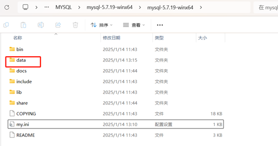

3. 启动mysql ：net start mysql

 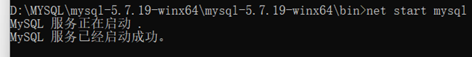

看到如上字样即为成功

在任务管理器-服务中也可以找到mysql服务：

 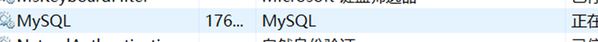

 终止mysql ：`net stop mysql`

4. 检查端口：`netstat -na` ，查看3306端口是否存在，若正常存在，则说明mysql服务已经启动
5. 进入mysql管理终端：`mysql -u root -p`（当前未设置root密码，回车即可）
6. 修改密码：

use mysql；（注意要打分号）

-  update user set authentication_string=password(“haohao123”)where user=”root”and Host=”localhost”;

**解读**：这句话的意思是：修改root用户的密码为haohao123

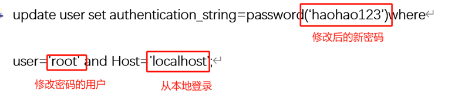

- 这样即为成功

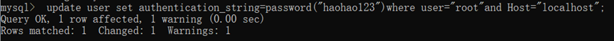

 

-  flush privileges 刷新权限即可

7. quit 退出mysql终端，mysql在后台运行
8. 修改my.ini ,再次进入就会进行权限验证：

-  删除：skip-grant-tables ，下次进入mysq时则需要使用密码

9. 修改后重启mysql，即可生效

#### 缺少dll库解决

解决方法参考：[完美解决：由于找不到msvcp120.dll,无法继续执行代码问题。 - 哔哩哔哩](https://www.bilibili.com/opus/964649886615076867)

库下载：[Download Visual C++ Redistributable Packages for Visual Studio 2013 from Official Microsoft Download Center](https://www.microsoft.com/zh-CN/download/details.aspx?id=40784)

---

## 1.3 mysql的使用

### 1.3.1 启用/命令行连接到mysql

注意，这里主要讲的是win的命令

- 启动mysql： 

​	`brew services start mysql`（win）

​	`	sudo service mysql start`(linux)

- 停止mysql：

  `sudo service mysql stop`(linux)

  `exit;`(win)

1. 连接到mysql ：` mysql -h 主机ip -P连接端口 -u用户名 -p密码` ，**注意大小写**

   注意事项：

   1）-p密码不要有空格，前面几个后面都要空格

   2）-p后若没有写密码，回车后会要求输入密码

   3）登录前保证mysql服务启动了 （即 net start mysql）

   4）如果ip地址连不上，可以尝试使用127.0.0.1（本机ip），或使用netsata -na 查看3306端口是否打开

   5）若没有写-h，默认就是主机

   6）若没有写-P的地址，默认就是3306。实际工作中，默认端口往往会修改，因此建议**不要使用默认端口**

### 1.3.2 创建和使用查询

**编写语句要在查询界面查询** ,以下将介绍如何创建和使用查询（以sqlyog为例）：

1. 在左上角这里选择新建查询编辑器，或者在‘文件’ 里新建：

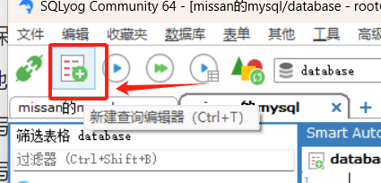

2. 创建完成后，选择 ‘ 文件 ’ --> ‘ 另存为 ’ ，即可保存查询编辑器内容，可以选择保存在**桌面**以便后续使用
3. 打开查询的方式：可以在桌面上把保存好的查询图标拖拽到sqlyog里，或者在打开方式里选择navicat（sqlyog没法通过打开方式打开）


### 1.3.3 mysql命令简介

语句的分类以及部分**命令详解**：[1.6 Sql语句的分类](#1.6 Sql语句的分类)

注：一下命令要在命令行使用, 大部分命令后都需要搭配 **;** 使用

在使用语句的时候注意，在界面版中，**执行命令的时候需要选中要执行的语句**，否则会报错，如图：

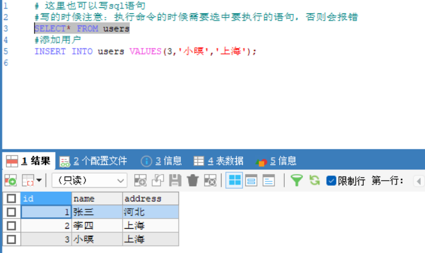

如何创建查询编辑器见：[1.5.3 sqlyog中命令行的使用：](#1.5.3 sqlyog中命令行的使用：)

执行完成后，右键左侧的主机名称，选择**刷新对象浏览器**后命令结果就可以显示

1. 查看当前主机所有数据库：`show databases ;`（databases有s，**注意和其他的区分**）

   1）查看指定数据库：`show create database 数据库名称` （此处database没有s）

   同下查找详情看[1.6.3 查询select和show](#1.6.3 查询select和show)

2. 查找数据：`select * from 表名称 where name = ‘查询内容’`。这里注意，如果查询表在不同的数据库，但同名的情况下，可以查看上方自己现在打开的是哪个数据库，==查询只会查询当前数据库的表的内容==。

   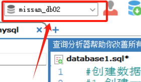-

3. 删除数据库（**谨慎使用**) : `drop database 数据库名称;`

4. 添加用户：`insert into 表名称 values (添加的内容)`(内容中注意，整形要加'',int不用。见上图)

5. 创建数据库：`create database [if not exists] 数据库名称 `，详见[1.6.2 创建数据库](#1.6.2 创建数据库)

---

## 1.4 navicat的安装和使用

### 1.4.1 navicat 功能介绍：

利：便于图形化的使用mysql功能，界面清晰，操作简单

弊：使用过程难以控制，复杂要求难以完成


### 1.4.2navicat的安装：

[破解版安装](https://blog.csdn.net/qq_36324341/article/details/140777029)


### 1.4.3navicat的使用（基础）：

1. 如何连接主机mysql：

   选择连接-->mysql

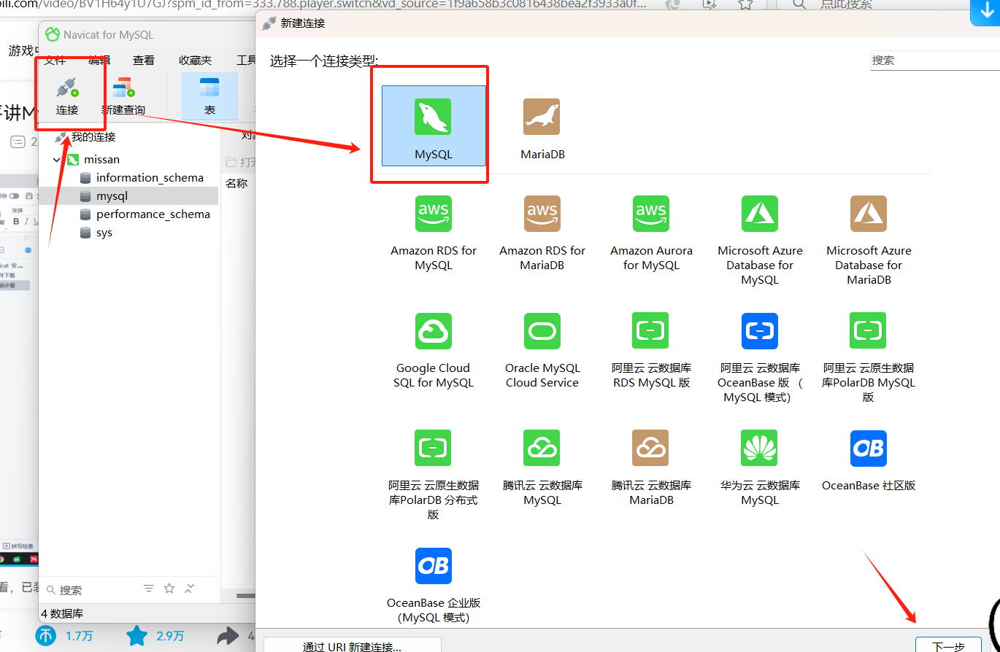

填写相关内容即可：

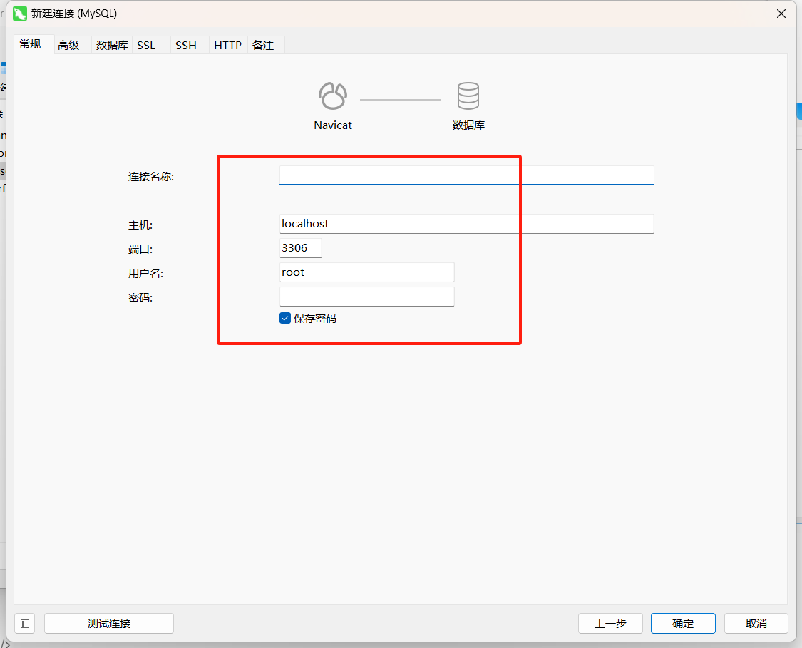

2. 使用navicat新建一个数据库，在数据库中创建表，并在表中存放数据

   1）添加数据库：

右键-->选择新建数据库

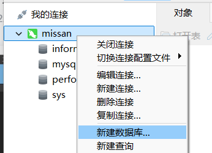

依照下图填写新数据库的配置：


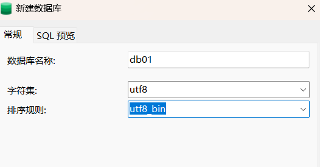

右键数据库-->打开数据库-->新建表

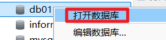


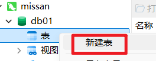

​      2）编辑表：

如图所示编辑表：

注：varchar是指**字符串**，表示在后面编辑表内容的时候，该行可以填写字符串内容

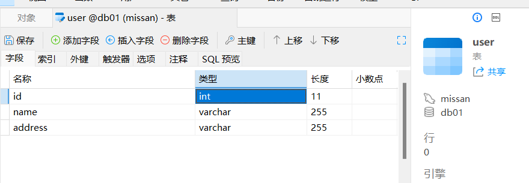

选择“保存”之后，填写表名称，如“user” 。再如图打开user表，就可以编辑表的内容了

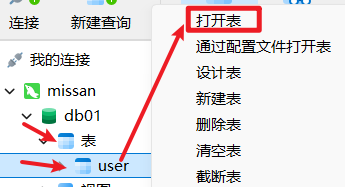

可以根据需要填写表的内容，按**tab或是左下角加号，新增行**

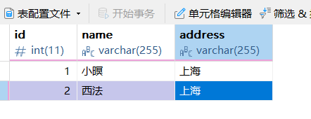

---

## 1.5 SQlyog 的安装和使用

### 1.5.1 Sqlyog的安装：

[社区版下载方法](https://blog.csdn.net/qq_72641424/article/details/128773738)

### 1.5.2 sqlyog的使用：

1. 新建一个mysql连接：

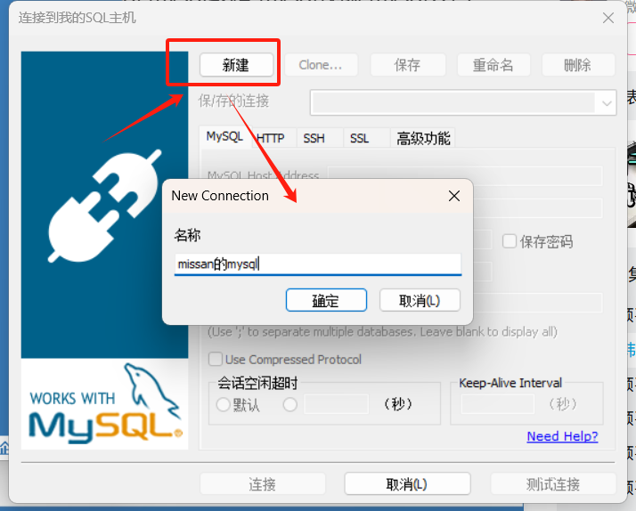

2. 如图填写内容：

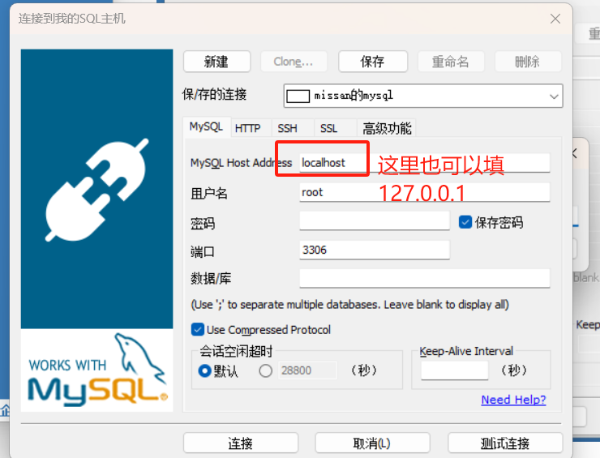

3. 此处可以看到，之前在navicat上创建的表信息在这里也可以看到：

   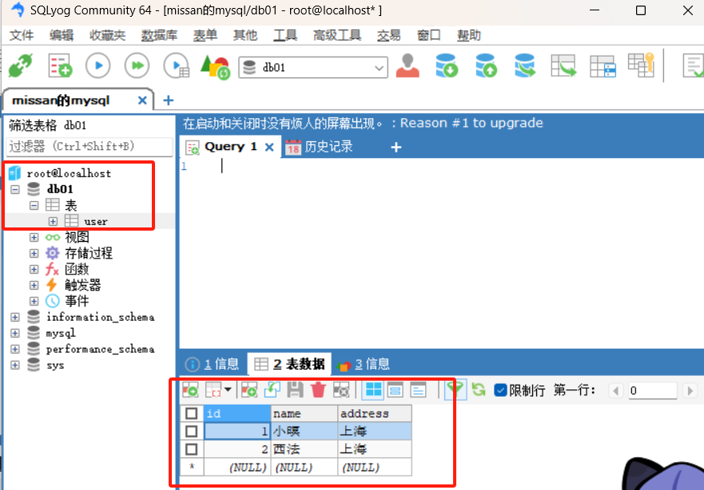

   4. 右键主机创建新数据库：

      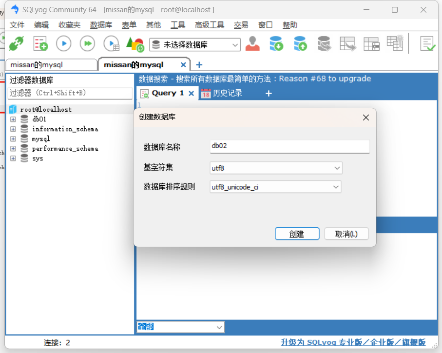

5. 根据需要创建表：

   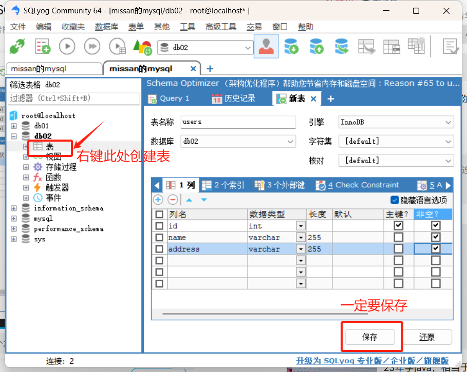

   6. 创建完成后，右键此处打开表（或者在命令行模式使用）

      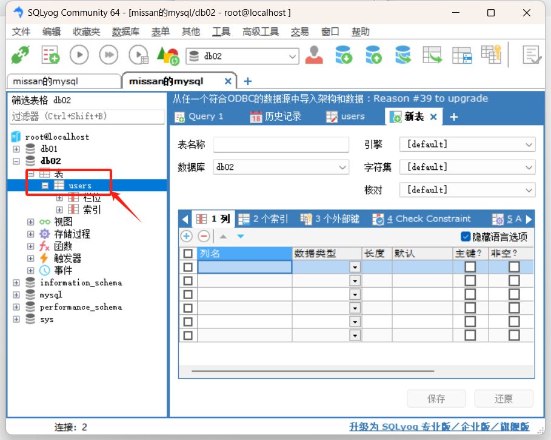

      7. 完成信息后记得保存，如果有空白行，会无法正常保存，需要删除空白行。

         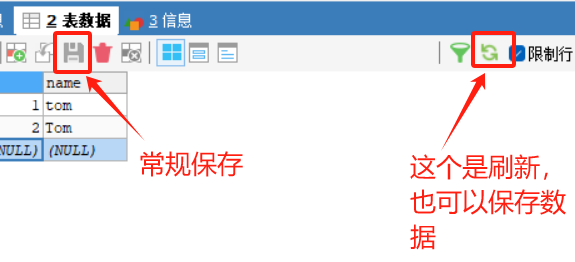

      
      8. 若创建了多余的行，可以通过表上面的垃圾桶删除：
      
         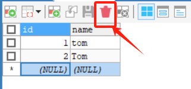
      
      9. sqlyog的优势：
      
      - sqlyog的代码行和下方的结果，都可以通过 crtl +鼠标滑轮放大缩小
      - 社区版免费，使用门槛更低

### 1.5.3 sqlyog中命令行的使用：

1. 单机上方的加号，选择 **新查询编辑器** 

   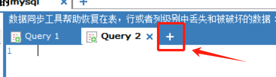 

2. 此处就可以编写mysql的语句，通过左上角的小三角执行命令：

   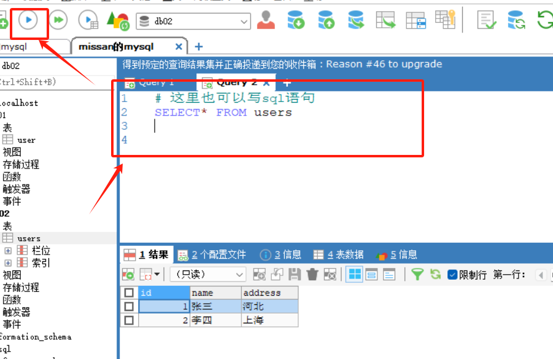
   
   ---
   
   

## 1.6 Sql语句的分类（粗略）

- 该章节将粗略的介绍部分常用语句，后续会有对部分sql语句的拓展介绍，根据超链接跳转到对应位置
- sql的概念：SQL是一种结构化查询语言，用于管理和操作数据

### 1.6.1 主要分类：

1. DDL 数据语言定义：如create 表，库

2. DML 数据操作语句：增加insert ，修改 update ，删除 delete

3. DMQ 数据查询语句：select（主要用于查询表）

4. DCL 数据控制语言：一般用于管理数据库：如用户权限 grand（授权） revoke（撤回权限）

   常见语句：[1.3.3 mysql命令简介](#1.3.3 mysql命令简介)

### 1.6.2 创建数据库

1. 基础语句：

   `create database [if not exists] 数据库名称 `

   `use 数据库名称` **切换到指定数据库**

   其中`[if not exists]`的作用为：若不增加这句话，则已经有数据库了就会报错。如果写了这句话，系统发现数据库已经存在了，就不会创建数据库了。

   - 在创建数据库,表的时候，为了规避关键字，可以使用反引号解决: 

     - ps：关键词会在你写的时候变成**大写的蓝色字体**，如果该内容不是指令，则需要用反引号括起来

     关键词：如 int ，varchar，varchar

     如：

     
     
     当然删除该数据库时也要加反引号

2. 参数：

   * `character set` : 指定数据库采用的**字符集**，若不指定，默认是==**latin1**==，需要手动设置。若创建的数据库不是utf8，则可能出现中文乱码的情况。

     例：

     `CREATE DATABASE missan_db02 CHARACTER SET utf8;`

     注： utf 8是当前世界通用字符集
   
   * `collate collation_name` : 指定**字符集的校订规则**。（collate ：校验规则），默认是latin1_swedish_ci
   
     **常用的有：**utf8_bin (区分大小写) ，utf8_general_ci (不区分大小写)
     
     ==注：==表也可以修改字符集校订规则，若不设置，默认和数据库的一致。可以在此处修改：
     
     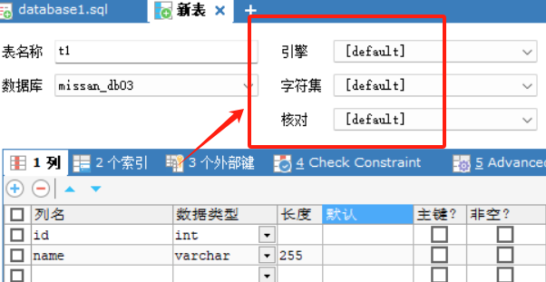
     
     例：
     
     `CREATE DATABASE missan_db03 CHARACTER SET utf8 COLLATE utf8_general_ci;`

### 1.6.3 查询select和show

select语句详解：[1.8 select 语句详解：](#1.8 select 语句详解：)

1. 查找数据：`select * from 表名称[或其他内容] where name[或其他] = ‘查询内容’`。这里注意，如果查询表在不同的数据库，但同名的情况下，可以查看上方自己现在打开的是哪个数据库，==查询只会查询当前数据库的表的内容==。

~（在此处查看当前在哪个数据库，也可以在此处更改所处数据库）~


注：如果查询内容是varchar，则要加单引号

1）* ：表示范围是全部，即整个表

2）from：表示从哪个表查询

3）where ：指的是哪个字段  ，name= xx：表示查询名称为xx的内容

- 案例1：从表中查询名称

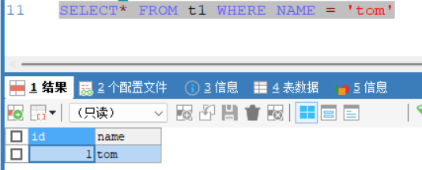

- 案例2：从列[名称]中查询列[id]内容：

​	SELECT `name` FROM users WHERE id = 1;

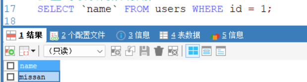

2. 查询show：

   1）查看当前主机所有数据库：`show databases ;`（databases有s，**注意和其他的区分**）

   2）查看指定数据库：`show create database 数据库名称` （此处database没有s）
   
   3）查看当前数据库所有表：`SHOW TABLES;`

- 查询结果解释：

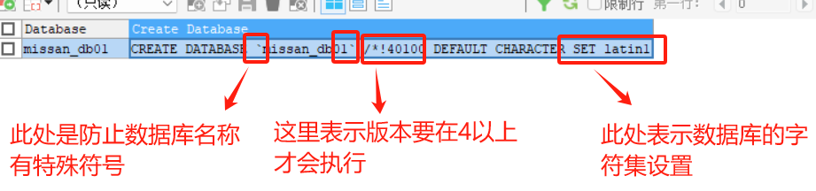

[查询相关指令：] **[https://blog.csdn.net/IT_Boy_/article/details/107096018]: www.example.com**

### 1.6.4 备份和恢复数据库/表（重要）

1. 概念：数据库的本质还是**文件系统**。备份是指将数据库的内容备份到文件中，恢复是将数据库的内容重新从文件恢复到数据库中。

   备份得到的文件，就是sql语句

2. 备份数据库：

   - 备份：也相当于导入，这个方法同样适用于将其他数据库导入到自己的数据库里

   - 界面：在软件中右键数据库，选择[备份] / [导入] 即可

   - 命令(只可在[^DOS]执行）：`mysqldump -u用户名 -p密码 -B 数据库1 数据库2 数据库n > 路径 文件名.sql`

     注意：
     
     - 一个命令可以备份多个数据库，`>` 后面是备份到的目的文件名。该指令存储在mysql的/bin目录下
     - -p后面不用加密码
     - 该命令在dos中执行时，不需要登入mysql

3. 恢复数据库：(在mysql命令行执行）`source 路径 文件名.sql`（要写备份文件的全路径）

   （此处未学完，自课程12起都需重看）

   手动恢复：打开备份的文件--> 复制里面的内容，粘贴到sql的查询器里，运行即可。

   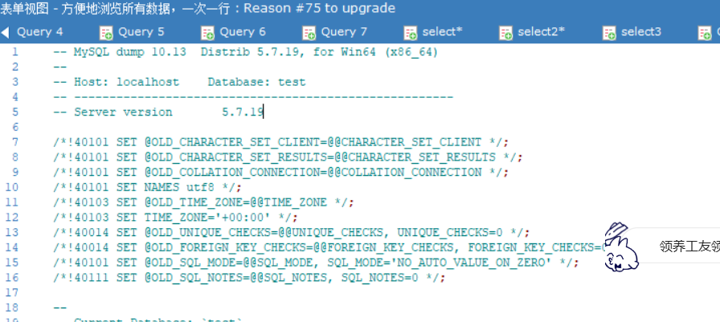

   4. 备份/恢复表：若数据库体积较大，不便于备份，可以选择备份其中的表

      语句：

      ```sql
      # 备份表：
      mysqldump -u用户名 -p 数据库1 表1 表2 表3 > 路径 文件名.sql
      # 注意不要加B
      # 恢复表
      source 路径 文件名.sql
      # 注意事项同数据库
      
      ```

      

### 1.6.5 创建/修改表

1. 基础语句：

   `create table 表名`

   ```sql
   create table 表名 (
       第一例内容   第一列格式,
   
   	第二例内容   第二列格式(整形括号里面放长度）,
   
   	第三例内容   第三列格式 )
   
   表的参数[可写可不写];
   ```

   有特殊词要用``括起来

   - ==注：==创建表时，要根据需保存的数据创建相应的列，并根据数据的类型定义相应的列类型，例：

     此处的 `ENGINE INNODB`是数据库的引擎，具体可查看：[1.10.1数据库引擎](#1.10.1数据库引擎)

     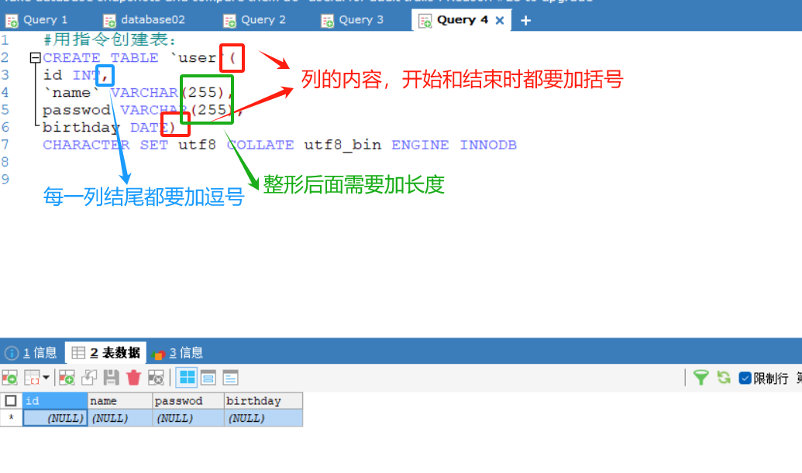

   - 表一定存在于数据库，不可以单独存在

     - 在图形界面用指令创建表的时候，注意一定要选好上方的数据库名称，不要创建到其他数据库中去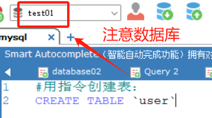

   - 注：表名的单词之间可以用下划线链接，如：table_01

2. 参数：
   - `character set `：设置字符集，默认同数据库字符集一致
   - `collate`:设置校对规则，默认同数据库字符集一致
   - `engine`：存储引擎，详细内容见 **存储引擎**

3. 图形化创建表：

   见：[1.5.2 sqlyog的使用：](#1.5.2 sqlyog的使用：)或[1.4.3navicat的使用（基础）：](#1.4.3navicat的使用（基础）：)

   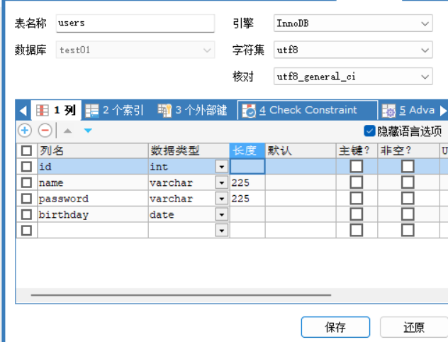

   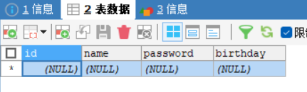
   
   4. 修改已有表：
   
      - 修改已有表的字符集：
   
        ```sql
        ALTER TABLE 表名 CONVERT TO CHARACTER SET utf8; 
        #将已有表的字符集该为utf8
        ```
   
      - 修改表的内容：
   
        ```sql
        UPDATE 表名 SET 列 = x WHERE 列 = y; 
        
        # 在表student中，将id为1的英语成绩改为79
        
        UPDATE student1 SET english = 79 WHERE id = 1; 
        ```
   
   5. 删除列：
   
      ```sql
      DELETE FROM 表名 WHERE 列 = x;   
      
      #删除user表中，id为2的列
      
      DELETE FROM users WHERE id = 2;   
      ```
   
   
   6. 删除表：
   
      ```sql
       DROP TABLE users;
      ```
   
      
   
   

### 1.6.6 插入数据：

1. 基础语法：

   ```sql
   insert into 表名（列1,列2)
   values
   ('内容1'，'内容2'),
   ('内容3'，'内容4'); # 注意这里是单引号
   ```

2. 例：

   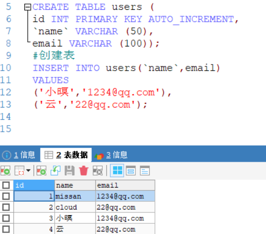
   
   注意：
   
   - values前面没有逗号
   

### 1.6.7 修改列（alter）：

列的具体内容可见:[==1.7==列的类型和参数](#==1.7==列的类型和参数)

修改列表参考文章：[如何在mysql上修改基本表 alter语句修改表结构-mysql教程-PHP中文网](https://www.php.cn/faq/1324266.html)

1. 添加列：

   基本语法：

   ```sql
   ALTER TABLE 表名
   ADD COLUMN 列名 数据类型 [参数] [位置]，
   ADD COLUMN 列名 数据类型 [参数] [位置];
   -- 该语句需要有对这个表的alter权限
   ```

   例子：

   在students表中新增一列来记录age：

   ```SQL
   ALTER TABLE students ADD COLUMN age VARCHAR(255) NOT NULL;
   ```

   

   位置可选项：

   - first 第一列
   - after 列名（指定某列后）

2. 删除列：

   ```sql
    ALTER TABLE <表名> MODIFY <列名> SMALLINT;
   ```

   ```sql
   ALTER TABLE <表名> DROP COLUMN <列名>;
   ```
   
   此操作不可逆，谨慎使用

3. 修改列的类型：

   把某一列类型修改为 SMALLINT

   ```sql
    ALTER TABLE <表名> MODIFY <列名> SMALLINT;
   ```

4. 复制表结构（不含数据）

```sql
CREATE TABLE <新表名> LIKE <旧表名>;
```

5. 清空表数据（保留表结构）
   ``` sql
   TRUNCATE TABLE <表名>;
   ```

   

### 1.6.8 表的其他操作命令

1. 查看当前数据库所有表：`SHOW TABLES;`

2. 查看表结构 ：

- `DESCRIBE users;`

- ` SHOW COLUMNS FROM users;`

3. 删除表：

   ```sql
    DROP TABLE <表名>;
   ```

4. 修改表名：

   ````sql
   RENAME TABLE <原表名> TO <新表名>;
   ````

   

---


## ==1.7==列的类型和参数

### 1.7.1 参数：

1.**primary key** （主键）可组合使用

**主键**是用于唯一标识表中每一行数据的字段。它具有以下特点：

- **唯一性**：主键字段的值必须唯一，不能重复。

- **非空**：主键字段不能为空。

- **单字段或多字段**：可以设置单字段主键或多字段主键（复合主键），用多个字段共同确定唯一性。

2. **auto_increment**（自增长），常用于id等需要自增长的数字

**自增长**是用于自动生成唯一<u>数字的字段属性</u>，通常与主键结合使用。它具有以下特点：

- **自动递增**：每次插入新记录时，字段值自动递增，默认从1开始，每次加1。

- **唯一性**：自增长字段必须是唯一索引，即主键或主键的一部分。

- **整数类型**：自增长字段只能是整数类型，如TINYINT、SMALLINT、INT、BIGINT等。

例：该语句指的是，id列的内容为整形，且具有唯一性，且会自增长

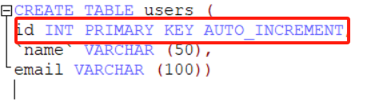

因此使用过后，在插入数据的时候可以不插入该行内容：

```sql
create table students(
	id int primary key auto_increment, 
    `name` varchar (100) , 
    age int, score int not null default 0)
    character set utf8;
    INSERT INTO students (name, age, score)
VALUES
   ('missan', 19, 99),
   ('cifer', 20, 100),
-- 此时不输入id，也能自动生成id
```


3. **not null**， 表示该列内容不可为空，若填写null则会报错

   ```sql
   CREATE TABLE example (
       id INT NOT NULL,
       name VARCHAR(100) NOT NULL
   );
   ```

4. **default xx** ，用于定义默认值为xx。若在插入数据时没有提供内容，那么此处会使用xx作为默认值

   - 与not null 配合使用，表示不可为空，若为空则默认填入xx。可用于确保此处一直有值
   - xx 处可填写<u>其他参数</u>，或是数据

---


## 1.8 select 语句详解：

### 1.8.1 select 基础语法

语法顺序：

```sql
SELECT 列名
FROM 表名
WHERE 条件
GROUP BY 分组列
HAVING 分组条件
ORDER BY 排序列
LIMIT 数量;  -- 必须放在最后
INTO OUTFILE 或 FOR UPDATE -- 可以放在limit后面
```

1. `select * from 表1`

   显示表1的全部内容

2. `select a1,b1 from 表1`

   从表1中查询列a1，b1的内容

   - 查询列的话就不需要使用*，否则会报错

3. `SELECT DISTINCT a FROM 表1;`

   从表1中查询a列的内容，**若内容每个字段都有重复，则去重**

   - 但是如果查询多个列，不是每个字段都相同，则不会去重，例：

     `SELECT DISTINCT name,english FROM student1;`

     ^这种情况，如果结果的name和English完全相同，才会去重^

     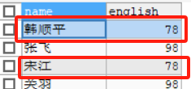


4. `SELECT DATABASE();` 查看当前选中的数据库

5. `SELECT * FROM users order by xx LIMIT n;`（只查看部分， 在查阅大量数据时十分有效）

只查看user表中的前n条数据  

注意：

- limit**必须放在最后，且必须在order by后面**

- 如何从中间开始限制:

  `limit n-1 , n2  `

  从第n条开始，取n2条数据

```sql
#查询表中所有学生的信息。
SELECT * FROM student1;

#查询表中所有学生的姓名和对应的英语成绩。
SELECT `name`,english FROM student1;

#过滤表中重复数据 distinct要查询的记录，每个字段都相同，才会去重
SELECT DISTINCT english FROM student1;

#按分数降序排列，从第 3 条开始取 3 条（即第3~5名）
SELECT * FROM students
ORDER BY score DESC
LIMIT 2, 3;
```

参数：

- [] 表示里面内容可选，本体不需要出现在语句中

- distinct ：可选项，意为在输出结果时，若内容每个字段都有重复,则去除重复数据
- *：表示查询所有列，若指定了查询哪一列，则不可加，否则会报错
- from：表示查询指定表

### 1.8.2 as语句（别名）和列间关系（加法）

1. 列之间的关系(加法）：

```sql
# 加法关系

select (列1 + 列2) from 表
# 相加的内容要用括号包起来

# 将列的内容相加，如果有数字，则得到数字的结果，varchar为0

-- 数字相加，结果见图一
SELECT `name` ,( english+chinese+math)FROM student1 
# 这条语句表示：显示name列，同时显示几列内容相加的结果。
# 注意name和后面直接要加逗号

-- 数字字符相加，结果见图二
SELECT `name` ,( english+chinese+`name`)FROM student1

-- 列也可以直接加数字，结果见图三
-- 在所有学生总分加10分的情况
SELECT `name` ,( english+chinese+math+10)FROM student1
```

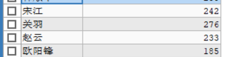^图一^

^图二^

^图三^

2. as语句

```sql
select 列名 as 别名 from 表名；
# as后面不能不加参数

-- 使用别名表示学生分数。见图一
SELECT `name` ,( english+chinese+math+10)AS score_name FROM student1

-- 将name改为中文。见图二
SELECT `name` AS '名字' ,( english+chinese+math)FROM student1
```

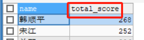^图一^

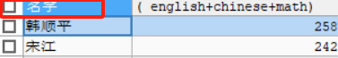^图二^


### 1.8.3 where子句

- where子句的主要功能是用于过滤
- where子句中，多个并列条件用 and 连接
- where子句中不可使用别名

- where子句中常用运算符：

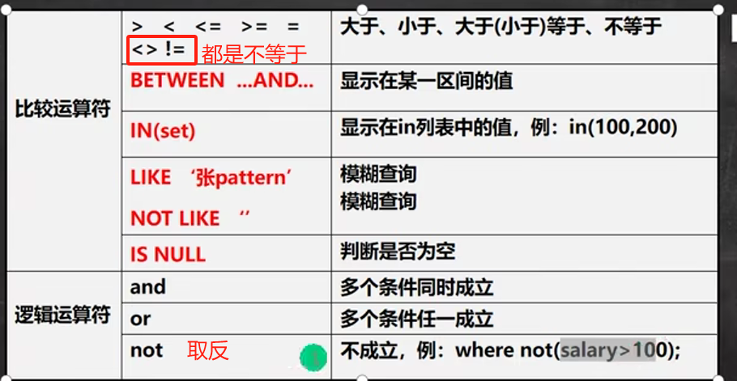

```sql
# = ，>使用 

#查询姓名为赵云的学生成绩
SELECT *FROM student1 WHERE `name`='赵云';
-- 注意如果没有指定列，则一定要加 *

# 查询英语成绩大于90分的同学
SELECT *FROM student1 WHERE english > 90;

# 查询总分大于200分的所有同学
SELECT *FROM student1 WHERE (english+chinese+math)>200;

# like和and 的使用
# 查询总分大于200分并且数学成绩小于语文成绩,的姓韩的学生.
SELECT *FROM student1 
WHERE (chinese + math + english)>200
AND math < chinese
AND `name` LIKE '韩%';
```

注意：

- like前面一定要有东西

- like的百分号：

  - 百分号表示的是任意数量的字符，_表示单字符

  - 百分号加在哪里，就代表省略哪里的东西，如

    ```sql
    # 没有叫阳的人，则查询不到结果
    SELECT *FROM student1 WHERE `name` LIKE '阳'
    
    # 可以查询到结果：欧阳修
    SELECT *FROM student1 WHERE `name` LIKE '%阳%'
    
    # 可以查询到结果：韩信
    SELECT *FROM student1 WHERE `name` LIKE '%信'
    ```

  - 后面的东西加百分号，如**'韩 %'** 指的就是所有姓韩的人

  - 不加百分号，指的是只有韩**这一个字**的选项

```sql
# between and , in() ,or的使用

#1.查询英语分数在 80-90之间的同学。
SELECT *FROM student1 WHERE english BETWEEN 80 AND 90;

#查询总分为189,190,191的同学:
SELECT *FROM student1 WHERE 
(chinese + english + math) IN (189,190,191);

#查询所有姓李 或者 姓宋 的学生成绩。
SELECT *FROM student1 WHERE `name` LIKE '李%' OR '宋';
```

注意：

- between and是一个闭区间

### 1.8.4 order by子句

- Order by 指定排序的列，排序的列既可以是表中的列名，也可以是select语句后指定的列名。

- Asc 升序[默认]、Desc 降序
- ORDER BY 子句一般位于SELECT语句的结尾

基本语句：

```sql
select 表 from 列 order by <排序对象>asc或desc

# 对数学成绩排序后输出【升序】。
SELECT *FROM student1 ORDER BY math;

# 对总分按从高到低的顺序输出
SELECT `name`,(chinese + math + english) AS total_score FROM student1 
	ORDER BY total_score DESC;
# 将总分重新命名，再在排序

#对姓韩的学生数学成绩排序输出(升序)
SELECT *FROM student1 WHERE `name` LIKE '韩%' ORDER BY math;

# 可以同时对多个对象排序
SELECT *FROM student1 ORDER BY math ASC,chinese DESc;
```

注意：

- 用别名排序的时候，如果别名是中文，不用加单引号
- order by 后面一定要加对象
- 和limit一起用时，limit要放order by后面

### 1.8.5 多表查询

1. 基础语法：

   ```sql
   -- 直接查询表
   select *from 表1，表2 ;
   ```

   （未学完）

### 1.8.6 join的使用

1. join的用途：在数据库中，可以会出现想要查询的多个数据在不同表的情况，如用户信息在a表，用户成绩在b表，想要得到用户信息+用户成绩的结果，就需要使用join来联合查询

   - 什么时候需要join：
     - 要**同时满足两个表**的数据 → `INNER JOIN`
     - 要保留**主表全部数据**（如显示所有用户） → `LEFT JOIN`

   - 注意事项：
     - 不要漏写on，漏写on会导致所有行组合（N×M行）

2. 语法1：inner join内连接

   注意：返回的是**完全匹配**的行

   ```sql
   -- 内连接，只返回两个表完全匹配的行
   SELECT 列名
   FROM 表1
   INNER JOIN 表2 ON 表1共同字段 = 表2共同字段;
   
   -- 案例：
   -- 先创建两个表，分别的内容是用户信息和成绩（此处省略插入信息）：
   CREATE TABLE users(
   id INT PRIMARY KEY AUTO_INCREMENT ,
   `name` VARCHAR (100) ,
   age INT ) 
   
   CREATE TABLE score (
       score_id INT PRIMARY KEY AUTO_INCREMENT ,
   	chinese INT,
   	math INT,
   	english INT);
   -- 在创建表的时候要注意，最好提前设置用于对应两个表的项目，如id和score_id
   -- 但是对应名称不可重复，如果两个都是id，则会报错
   
   SELECT `name`,chinese,math,english # 这里需要写完整，需要查找对应的列
   	FROM users
   	INNER JOIN score ON id = score_id
   ```

   结果：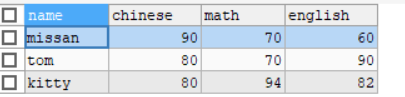

2. 语法2：left join 左连接

   返回左表**全部数据** + 右表**匹配的数据**（不匹配的显示NULL）

   ```sql
   SELECT 列名
   FROM 表1
   LEFT JOIN 表2 ON 表1.共同字段 = 表2.共同字段;
   
   -- 案例：
   -- 若直接使用上述案例，可能看不出来区别，此处先给score表增加几行数据：
   INSERT INTO score (chinese,math,english)
   VALUE 
   (80,90,80),
   (90,30,70),
   (100,67,80);
   -- 此时可知，score中的数据量应该是多余users的，在使用left join语句的时候可以看出区别
   
   SELECT `name`,chinese,math,english
   	FROM users
   	LEFT JOIN score ON id = score_id;
   -- 得到结果图一
   ```

   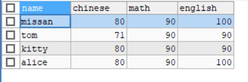图一

   此时可以发现，虽然score表的内容是多于users的，但是显示的结果却只有对应的，这验证了left join是：返回左表**全部数据** + 右表**匹配的数据**

3. 语法3：right join：
   与LEFT JOIN相反，返回右表全部数据 + 左表匹配的数据（不常用，通常用LEFT JOIN替代）

   ```sql
   SELECT 列名
   FROM 表1
   RIGHT JOIN 表2 ON 表1.共同字段 = 表2.共同字段;
   ```

   

4. 语法4：full outer join

   返回两个表的所有行（不匹配的部分填充NULL），但MySQL不支持，需用UNION实现。


### 1.8.7 case when 条件查询

相当于python中的if..else ,通过符合一定的条件，来给出查询结果

基础语法：

```SQL
CASE 列名1，列2,...
    WHEN 值1 THEN 结果1
    WHEN 值2 THEN 结果2
    ...
    ELSE 默认结果
END [AS 判断结果的名称]
```

注意：

1. `CASE WHEN` 会按顺序评估条件，第一个满足的条件会被执行，后面的条件将被忽略
2. 不要忽略`END` 关键字
3. `ELSE` 子句是可选的，如果不提供且没有条件匹配，结果将为 NULL
4. 可以在 SELECT、WHERE、ORDER BY 等子句中使用
5. 可以嵌套使用，但不宜过深以免难以维护，降低可读性

案例1：

```sql
SELECT su_name , grade,
    CASE grade
        WHEN 'a' THEN '优秀'
        WHEN 'b' THEN '良好'
        WHEN 'c' THEN '及格'
        ELSE '不及格'
    END AS grade_description
FROM students;
```


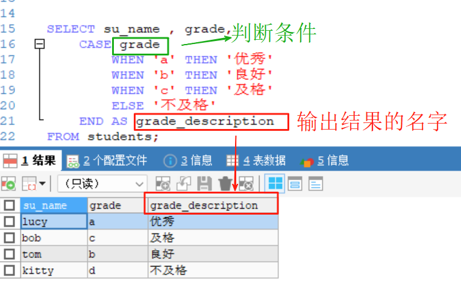

注意：

- 如果end后面不加内容，它会以上面的格式为输出结果的名称：

  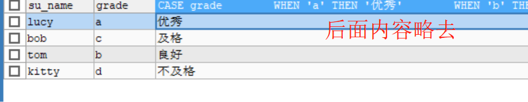

  输出效果较为不美观，建议在使用中用as命名

案例2：同样可以进行一些数值判断

```sql
SELECT sut_name, score,
    CASE
        WHEN score >= 90 THEN 'A'
        WHEN score >= 80 THEN 'B'
        WHEN score >= 60 THEN 'C'
        ELSE 'D'
    END AS grade
FROM exam_results;
```


## 1.9 用户管理

注意:

- 在已经登录进一个用户的情况下，是无法用`mysql -u -p` 进入其他用户的，需要先退出再登入用户

​	(因为无法在mysql的shell里面使用mysql命令)

- 这里的主机名(如：localhost)，是客户端的名字或者IP地址，不是服务器端的地址。

  就是用来限制，哪些客户端可以连接这台服务器

1. 创建新用户

   参考文章：[MySQL -- 创建用户 CREATE USER 、GRANT语句 - Be-myself - 博客园](https://www.cnblogs.com/gengyufei/p/13378482.html)

   ```sql
   CREATE USER <用户> [ IDENTIFIED BY [ PASSWORD ] 'password' ] ,[ 用户 [ IDENTIFIED BY [ PASSWORD ] 'password' ]]
   ```

 创建用户账号格式：

`user_name'@'host_name`

- user_name 填写需要的用户名称
- host_name 填写对应主机名称

用户默认无密码，因此password语句可省略，若要设置密码，则需要用PASSWORD

- `PASSWORD` 是使用哈希来设置密码，若不需要此方法加密，可不使用
-  `'password' ` 单引号内部填入登录密码，引号不可省略

使用案例1：不使用PASSWORD

```sql
CREATE USER 'test1'@'localhost' IDENTIFIED BY '123123';
```

案例2：使用PASSWORD

```sql
-- 此处填入你的密码
SELECT password('123123');
-- 系统输出相应的哈希值：
+-------------------------------------------+
| password('123123')                         |
+-------------------------------------------+
|  *E56A114692FE0DE073F9A1DD68A00EEB9703F3F1  |
+-------------------------------------------+
1 row in set, 1 warning (0.00 sec)

-- 其中 *E56A1... 就是所得到的哈希值
-- 再创建用户
CREATE USER 'test1'@'localhost'IDENTIFIED BY PASSWORD ' *E56A114692FE0DE073F9A1DD68A00EEB9703F3F1';
```

PASSWORD 的作用：一般用于将自己的密码进行哈希后，把哈希值交给数据库管理员统一储存，提高安全性


注意，此后的命令都要带上 @'localhost' (若主机名不是这个自行更改)

2. 授予权限

   ```sql
   GRANT ALL PRIVILEGES ON mydb.* TO 'test1'@'localhost';
   ```

   

    

3.  查看权限

   ```sql
   SHOW GRANTS FOR 'test1'@'localhost';
   ```

   

    

4. 撤销权限

   ```sql
    REVOKE ALL PRIVILEGES ON mydb.* FROM 'test1'@'localhost';
   ```

   

   

5. 修改用户密码（MySQL 8+）

   ```sql
    ALTER USER 'test1'@'localhost' IDENTIFIED BY 'newpassword';
   ```

   

6.  删除用户

   ```sql
    DROP USER 'test1'@'localhost';
   ```


7. 更改用户名：

   ```sql
   RENAME USER '旧用户名'@'主机名' TO '新用户名'@'主机名';
   ```

   - 更改用户名不会自动转移该用户创建的对象所有权，这些对象需要手动更新

   - 如果用户当前有活动连接，可能需要先终止这些连接:

     ```sql
     -- 查看进程
     SHOW PROCESSLIST;
     -- 终止特定连接
     KILL <进程ID>;
     ```

     

## 1.10 系统管理

### 1.10.1数据库引擎

概念：数据库引擎，负责数据库里数据的不同方式，不同的数据库引擎，有不同的特点，适合不同的应用场景。

​	    当前常用的引擎有：**InnoDb和 MyISAM**

- InnoDb：默认方式，适合大量并发写入操作，但读性能相对一般。功能全，适合大部分应用场景。。

- MyISAM：适合大量数据存储和查询，不支持大量并发写入。读性能好，但不能多个客户端同时写，适合大量数据存储和大量查询的场景。

两者的区分：类似于内存和硬盘的差别，内存速度快，掉电数据丢失；硬盘慢，但适合长期保存数据。

- memory引擎：直接使用，性能极好，但容量受内存限制。使用用在数据量小，但性能极高的场景。比如创建临时表，保存中间结果，用完就删除掉

- archive：归档类型，就是把大量历史数据封存起来。它适合海量数据的存储，但查询性能极低的场景。

  它是把数据顺序的写入磁盘，很少对数据进行分类标记。所以写入海量数据时速度快，但查询时，得把数据全读出一般才行，所以查询性能极低。

  它的特点：海量数据写入极快，但查询速度极慢，查询效率极低。

​										-- 不同数据库的引擎的功能对照表 --

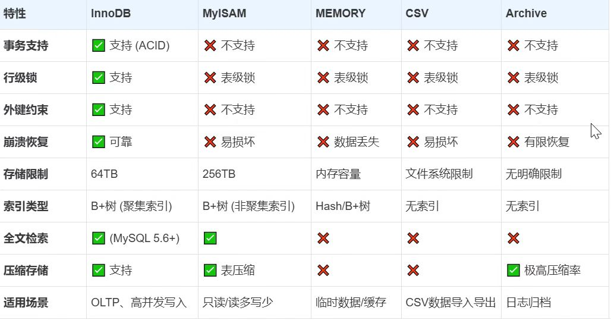

### 1.10.2 系统操作命令


1. 查看当前版本

   ```sql
   SELECT VERSION();
   ```

2. 查看当前时间
   ```sql
    SELECT NOW();
   ```

   

3. 查看连接数

   ```sql
    SHOW PROCESSLIST;
   ```

   

4. 查看系统变量
   ```sql
    SHOW VARIABLES;
   ```

   

5. 查看服务器运行状态
   ```sql
    SHOW STATUS;
   ```

   

6. 刷新权限（授权变更后执行）
   ```sql
    FLUSH PRIVILEGES;
   ```

   


[^DOS]:即win的命令行：命令提示符。通过win+r,输入cmd进入


 

 

[https://blog.csdn.net/IT_Boy_/article/details/107096018]: 

[https://blog.csdn.net/IT_Boy_/article/details/107096018]: 