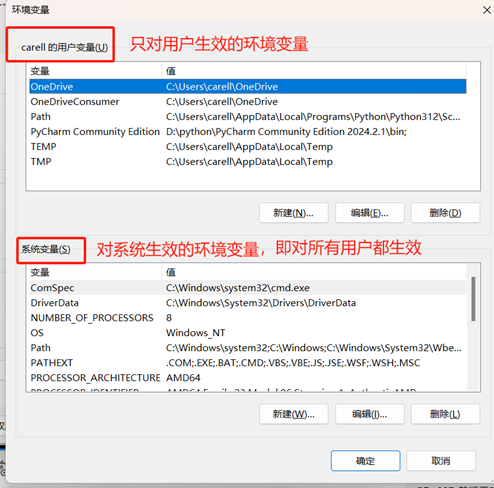
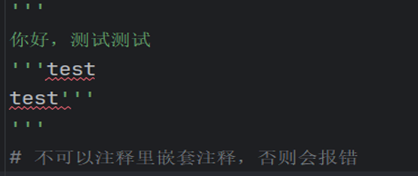
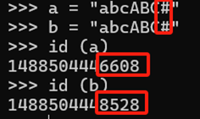
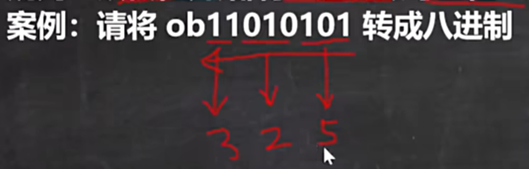
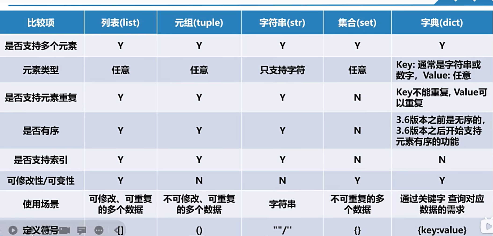
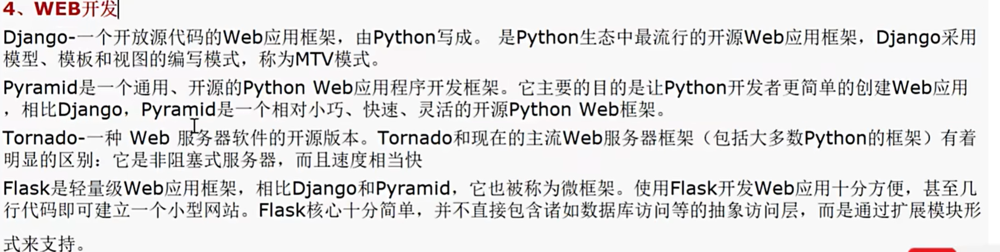

# python学习

前言：

本笔记适用于对计算机零基础的新人，因此讲述会比较冗余。笔记内容会持续更新

感谢b站韩顺平老师的网课，该笔记内有部分图片来自网课内容，菜鸟教程等。部分题目来自马蹄集

学习时间跨度较久，所以前期的笔记在格式不是很美观，请见谅

# 第一章：Python语言概述

## 1. 学前准备：

1. 如何判断电脑是32bit（32位），还是64bit：
   - 此电脑-属性

                             

其中，arm是一种cpu架构，通常支持arm架构的是手机或者平板，以及个别的电脑

2. 如何检验或查看python是否安装完毕，以及当前版本：

   - win+r - 输入cmd -输入python即可，通过exit（）退出

   

3. 如何在cmd找到python下载位置：在文件中复制路径，然后cd C:\Users\carell\AppData\Roaming\Microsoft\Windows\Start Menu\Programs\Python 3.12，使用dir，显示当前文件夹下的所有文件（相当于ls）

7. 在path的环境变量中添加python安装目录的的意义：在path环境变量下配置了python之后，能在任何路径找到python，反之则不能

- 如何查看环境变量：此电脑-属性-高级系统设置-高级-环境变量

- 环境变量内容如图所示：



- 然后选择 path -编辑


- 此时便可以看到安装时，python的安装目录了


- 原理：因此，若在path环境变量下添加python安装目录后，在cmd中，不仅可以在python的原路径查找到python，在其他文件夹下，也可以使用python命令，来查看，或使用python的相关信息


7. Python源文件通常以.py 为扩展名(规范)，但这不是必须的：如将后缀设为abc，只要该文件内容是有python可执行的语句，使用cmd依然可以运行
8. Python程序语句默认情况是**按从上至下的顺序**执行
9. Python语言区分大小写：如print写成Print，那么在执行程序的时候就无法正常运行。如图


10. Python程序由一条条语句构成，每条语句后不需要以;"结广束，但是如果带上";"，也不会报错，**建议不带**";"(规范)

## 2. python的使用：

1. python程序的编写（记事本）

-  将记事本后缀，改为 .py (若电脑无法修改文件后缀，在此电脑中打开文件资源管理器，点击 查看 -显示-文件后缀名，即可修改）

- 右键该文件，选择用记事本打开，随后编写想要内容

- 在cmd中，先进入刚才的文件所在的路径中，使用 python（或者py） +文件名.py,即可执行

- 该指令的含义图解：

 

(补充：**快速用cmd**进入文件所在目录的方法：在文件夹中，用鼠标选中文件路径，然后更改为cmd，即可快速进入。

补充2：为何要进入文件的路径，是因为在配置文件路径的时候，所配置是python这个解释器的路径，并不是写的程序的路径，因此需要单独进入该路径，才能使用这个文件)

# 第二章：pycharm的使用：

## 1.应用配置：

1. 设置模版内容：即会在每个文件显示的内容：setting-file and code templates-py script

 

2. 自定义快捷键：（以run举例）

file->settings ->keymap（快捷键）->搜索run，找到Run-Run->右键Run，选择add keyboard shortcut（即添加快捷键）->将原先内容改成自己想要的快捷键

示意图：

 

3. 若遇到光标变粗，新写的内容会覆盖原先内容，便是误触切换到改写模式了。若是使用笔记本，直接Numlk+Ins同时按即可切回

## 2.==常用快捷键==：

1. shift +delete 删除当前行
2. ctrl +d 复制并黏贴当前行
3. ctrl +/ 注释选中内容：第一次是注释内容，第二次是取消注释内容
4. ctrl +alt +l 格式化当前代码（即将代码自动编排），若一直显示波浪号，提示格式问题，可使用该快捷键
5. alt +r 运行当前代码（需要自定义，具体查看[应用配置](#_1.应用配置：)），默认ctrl+shift+F10或shift+F10
6. ctrl +H 查看一个类的层级关系（OOP继承常用）

**7.**   **ctrl +F** **查找** **（win****内通用）**

**8.**   ctrl +R 替换 ，如图所示：其中replace是单独替换，从光标处往下替换

​    

**9.**   table 代码向右移动，shift+table 向左移动。将多行代码选中后使用，可以实现一起移动

 

# **第三章：pycharm的进阶使用：**

## 1.   转义字符的使用

- 使用转义字符的原因：在使用pycharm的时候，许多常见字符是无法正常表达的，如：print中，在要输出的内容里再添加双引号会报错

- 


- 常见转义字符：

- 注意：如果需要在print中使用，输出内容，同时加上函数，需要使用转义字符，要加逗号和双引号，如：

print(“他的名字是：”,”\n”,name)

但若使用这个方法，会默认在两个输出内容直接增加空格，如下所示

```python
print("他的名字是：","\n",name)
# 输出结果：
他的名字是： 
 missan
```

 

- \t 一个制表位，实现对齐的功能（即添加空格）

- \n 换行符

- \\ 一个斜杠，若要输出两个斜杠，则需要输入\\\\

- \” 一个双引号

双引号也可以用单引号包裹使用：

```python
print('wow"o"')
```

 

- \’ 一个单引号 （单引号也可以不使用转义\）

- \r 一个回车: 如 print (“jack\rok”)中，\r后面的内容会从前面第一个字符起覆盖，最终输出内容就是 ok （无论前面多长，或前后字符数量差距多大，最终都只会输出\r后的内容）

## 2.   注释：

1. 注释的意义：尽量多去注释

 

2. 注释的类型：

- 单行注释：#xxx

 

- 多行注释（单行多行都可以）：’’’注释内容’’’,或者”””注释内容”””,使用三个双引号或是三个单引号即可

（补充：若产生警告，则是因为，py会将’’’括起来的内容生成文档,此处警告是提示这段代码将用于生成文档，可以忽略）

 

- 注释的使用事项：注意注释**不可以嵌套使用**：即注释里面加注释，否则会报错

 

- 文件编码声明注释：

- 格式:# coding:编码，在文件开头加上编码声明，用以指定文件的编码格式。若不指定，则默认是UTF-8

- 编码的查看：编码的查看，可通过另存为，查看某个txt文件的编码信息

 

查看py文件的编码：将py文件复制到桌面，使用记事本打开，另存为即可看到

- 编码的更改：若通过#coding：gbk后，该文件就会变成gbk格式，再使用记事本另存为后，则会在编码处显示ANSI

（补充：ANSI是适应于不同系统的，如我们所使用的简体中文就是ANSI，对应的就是gbk。若使用的是繁体系统，ANSI对应的就是BIG5码）

## 3.   文档规范：

1. 使用多行注释来注释多行说明
2. 如果注释函数或者其中的某个步骤，使用单行注释
3. 等号两边都要加空格：如图

 

4. 变量之间使用**逗号**+空格比较规整
5. 若单行代码太长，可以在不影响的位置换行（如print等）

6. 单句代码过长，可用 \（后无空格） 换行，在[],{}，() 则可直接换行
7. 一行多个代码，用：或； 分割

## 4.python文档的查看（重要）

1. 地址：[3.12.7 Documentation (python.org)](https://docs.python.org/zh-cn/3.12/)
2. 如何使用py文档：案例：如需要查找py的内置函数abs：1.在主页找到 库参考 2.选择内置函数 3.根据首字母查找函数

## 5.变量variable：（重要）

3. 概念：变量是组成程序的基本概念，相当于内存中一个数据存储空间的表示
4. 三要素：名称，值，类型

- 注意的是：变量的名称只能有**英文，数字，和****_** ，没有空格，多个单词间用_连接：如left_days

5. 变量的注意事项：在使用前要先定义变量


6. 使用变量的实例：


7. 更改赋值：若要更改赋值，则再次定义即可

如b=2， 后面再次输入， b = 8 则会将b的值改为8

8. 变量的原理：当程序/代码执行后，变量的值是存在计算机内存的（计算机内存，即硬件内存，内存卡）
9. （补充）计算机内存：内存(Memory)是计算机的重要部件，它用于**暂时存放****CPU****中的运算类据，以及与硬盘等外部存储交换的数据**。它是外存与CPU进行沟通的桥梁，计算机中所有程序的运行都在内存中进行 

## 6.数据类型：

1. 常见数据类型（四种）：

 

`is_pass = True #布尔类型`

2. 数据的使用注意：

- Python 中的变量在使用前都必须赋值，变量赋值以后该变量才会被创建。

3. 数据的"类型”：是变量所指的**内存数据**的类型。如：

a=1 b= “hello”中的**ab****本身是没有数据类型的**，只有数据：1，或者是hello，分别代表了整形和字符串。有时候将其称为“字面量”

4. 数据类型的查看 ：pirnt(type(a))

其中 变量，数字，和布尔型（ture或者flase）的数据是不需要带双引号的，而字符串一定要加双引号

### 6.1数据的细节：

#### 6.1.1整形：

- 整形可以表示的最大数可有4300位数字组成

- 进制：Python 的整数有十进制，十六进制，八进制，二

- 使用计算器查看进制：

（使用win自带计算器—>程序员，即可查看）

 

- 进制的简单介绍：（前缀具体使用查看liunx命令）

 

- 整形的字节与位：

- 字节(byte):计算机中（数据的）基本**存储**单元

​	位(bit):计算机中的最小存储单位

​	1byte （字节）=8 bit（位）

​	理解记忆：字节相当于房子的面积，如平米，不同字节大小可以储存不同大小的内容。

- 字节的大小：字节数随着数字增大而增大(即:python整型是变长的，这个int的大小增加，py会自动增加其字节的大小)，每次增量是四个字节，最小是24字节。详细资料：[Python中的整型占多少个字节？ - Huahua's Tech Road (mytechroad.com)](https://zxi.mytechroad.com/blog/desgin/python中的整型占多少个字节？/?%2F)

- 查看字节的大小：查看py指令 [第四章：python命令](#第四章：python命令)

 

#### 6.1.2浮点型：

- 在py中，浮点型表示的形式：

- 十进制数形式，如:5.12，-5.12 或0.512（也可以写成.512, 0可以省略，但是必须要有**小数点**)

- 科学计数法形式:（其中e不区分大小写）
  - 5.12e2（等于5.12e+10）：意思是5.12 x 10的二次方

```python
# 科学计数法编写
n4 = 5.12e2# 5.12 * 10 的二次方
print("n4=", n4)
输出结果：
n4= 512.0
```

​	5.12E-2 ：意为5.12 ÷ 10的二次方

```python
n5 = 5.12E-2  # 5.12 ÷ 10 的二次方
print("n5=", n5)
输出结果：
n5= 0.0512
```

- 浮点数的范围：（大小限制）

- 边界值为:

`max=1.7976931348623157e+308`

`min=2.2250738585072014e-308`

- 如何查看浮点数信息：

```python
import sys

print(sys.float_info)
```


- 注意：浮点类型计算后，存在**精度的损失**，可以使用 Decimal 类进行精确计算，如何使用decimal

- 若不适用Decimal：

```python
b = 8.1 / 3  # 2.7
print(b) #实际输出是2.699999
```

 

- 若要使用Decimal，则需要先导入Decimal类

```python
from decimal import Decimal
b = Decimal("8.1") / Decimal("3")
print("b=",b)

# 输出结果：
b=2.7
```

#### 6.1.3布尔类型（bool）：

- 取值：bool形只有两个值：True和False ，True 和 False 都是关键字，表示布尔值

- 比较：布尔类型可以和其他数据类型进行比较，比如数字、字符串等。在比较时，Python 会将 True 视为 1，False 视为0

```python
# 数值的使用
a = True
 b = False
 print(a + 10)
 print(b + 10)
# 将会分别输出 11 和 10
```


- 特殊：在Python中，非0被视为真值（“xx”也可以算真值），0值和None，空字符串都被视为假值（区分大小写）

```py
if 0:
print("111")
# 因为0是假，所以这条语句不会被执行4if -1:
print("222")
# 因为除0以外是真，所以这条语句会被执行

# 输出结果:
222
```


- 作用：bool类型适于逻辑运算，一般用于程序流程控制：

- 条件控制语句

 ```py
 n1 = 200
 n2 = 100
 if n1 >n2:
 #此处表示判断，如果结果为真，就执行下一个指令，若为假，则不执行↓
 print("n1 >n2")
 #输出结果:
 n1>n2
 ```


- 循环控制语句

比如判断某个条件是否成立，或者在某个条件满足时执行某些代码

- 将bool值的结果赋给变量：

  ````python
  ''' 
  此处表示，将n1>n2这个结果赋予result这个值，
  因此result就是一个布尔值，只代表真或假 
  ''' 
   result = n1 > n2
   print("result=", result)
  
  print（type（result））
  
  # 输出结果：
  Ture


- bool形的查看（格式）：

 ```py
 result = n1 > n2
 print(type(result)) # 查看result的类型
 
 print(type(1 > 2))
 
 # 输出结果：
 
 <class 'bool'>
 <class 'bool'
 ```

#### 6.1.4 字符串（string）：

1. 定义：在 Python 中处理文本数据是使用 str 对象，也称为 字符串。 字符串是由 [^Unicode 码]位构成的不可变序列。

   在Python中，字符串长度没有固定的限制，取决于计算机内存大小

   通过内置函数ord()可以查看制定字符的编码。

   ```py
   print(ord("a")) # 97
   ```

   字符串的存放：

   （图源：韩顺平)

- str就是string的缩写，在使用type()查看数据类型时，字符类型显示的是str

- 使用引号(‘或”)包括起来，创建字符串:

- 使用案例：如想输出的字符串里包括了双引号，可以使用转义字符，也可以把外面的双引号改成单引号（单引号双引号位置可以互换）

 ```py
 str1 ='tom 说“hello”'
 ```

- print也同样适用：

 ```py
 print('wow"o"')
 ```


- 通过加号可以连接字符串：

 ```py
 print ("hi"+"tom")
 # 通过加号可以连接字符串
 ```

- 字符串是不可变序列，不可修改内容：

```py
str_1[1] = "b" # 这样写会报错
```

只能整体替换字符串，替换后id也会发生改变

2. ==字符串注意事项：==

- Python 不支持单字符类型，单字符在 Python 中也是作为一个字符串使用（别的个别语言中，单字符可能认为是字符类型)

```py
str3 = "a"
print(f"str3的类型是：{type(str3)}")
# 输出结果：
str3的类型是：<class 'str'>
```

- 用三个单引号’’’内容’’’，或三个双引号"""内容""",可以使字符串内容保持原样输出（包括**保留格式**)。在输出格式复杂的内容是比较有用的，比如输出一段代码.

  使用三引号可以输出**多行内容**

- 直接使用””包括，因为文本内容复杂很容易报错：

 ```py
 content ="最棒的东西(或主意、人)to be the best thing, penson,idea,etc.
 He thinks he's the cat's whiskers (= he has a high opinion of himself)"
 ```


- 上述方法即可避免：（但注意，三个双引号（或单引号）内，不可再次出现三个双引号或单引号，否则同样会报错）

 ```py
 content =''' 最棒的东西(或主意、人)to be the best thing, penson,idea,etc.
 He thinks he's the cat's whiskers (= he has a high opinion of himself) '''
 ```


- 单独使用可以用于注释内容，具体查看[2.注释:](#2.注释：)

- 在字符串前面加'r’，可以使整个字符串不会被转义（在双引号前加上r）

```py
str4 = "jack\ntom\tking" 
#正常情况下转义符会被正常使用
print(str4)

# 输出结果：
jack
tom   king
 
#加了r之后转义字符会被显示
str5 = r"jack\ntom\tking"
print(str5) 

# 输出结果：
jack\ntom\tking
```

- 字符串的遍历输出：

  ```py
  str_1 = "abcd"
  print(str_1[0]) # 索引该字符串的第一位元素
  
  for i in str_1:
      print(i)
  ```

3. 字符串的索引：

   索引方式同列表一致，也是从0开始索引

```py
str_1 = "abcd"
print(str_1[0]) # 索引该字符串的第一位元素

# 输出结果
a
```


#### 6.1.5 字符串的常用操作（常用）

注意：所有操作中，返回字符串的副本的意思就是，原先字符串的元素不变，返回的是一个新的字符串

1. 返回字符串的副本，其中出现的**所有子字符串 old** 都将被替换为 new。(count可有可无，没有的话就**默认全替换**)
   如果给出了可选参数count，则只替换前 count 次出现

   ```py
   str.replace(old,new, [count]):
   ```

- 案例：

  ```py
  str_names ="jack tom mary hsp nono tom"
  print(str_names.replace("tom","汤姆",1)) # 将第一个tom改成中文
  print(str_names) # 对比原字符串
  
  # 输出结果：
  jack 汤姆 mary hsp nono tom
  jack tom mary hsp nono tom # 这里可以看到，原字符串的内容没有发生改变，因为字符串是不可变数据类型
  ```

2. **把字符串拆分成列表返回**：

   返回一个由字符串内单词组成的**列表**，使用 **sep** 作为分隔字符串。如果给出了 maxsplit，则最多进行 maxsplit 次拆分

   返回结果依旧是一个副本，不会影响原字符串

   (因此，列表最多会有 maxsplit+1个元素)。

    如果maxsplit **未指定或为-1**，则不限制拆分次数(进行所有可能的拆分)

   ```py
   str.split(sep=None,maxsplit=-1)
   ```

   - sep ：拆分标准。默认使用None则会不拆分，整个字符串作为列表输出
   - maxsplit ：拆分次数，不填或-1都是不限制拆分

   案例：

   ```py
   print(str_1.split(sep=None,maxsplit=-1)) # 这里不指定分隔符，则会整个输出
   str_1 = "abcd" 
   
   # 输出结果：
   ['abcd']
   
   str_1 = "a,b,c,d"
   print(str_1.split(sep=',',maxsplit=-1)) # 识别逗号作为分割
   # 输出结果：
   ['a', 'b', 'c', 'd']
   ```

3. 统计指定字符串在字符串中出现的次数

   ```py
   str.count():
   ```

   案例：

   ```py
   str_names ="jack tom mary hsp nono tom"
   print(str_names.count("tom"))
   
   a = input("名字")
   print(f"{a}在字符串中出现了{str_names.count(a)}次") # 另一种输出方式
   
   # 输出结果：
   2
   ```

4. 从字符串中找出指定字符串第一个匹配项的索引位置

   ```py
   str.index()
   ```

   案例：

   ```py
   str_names ="jack tom mary hsp nono tom"
   print(str_names.index("tom"))
   
   # 输出结果：因为是把每个字母以及空格都算作了字符串，所以是第五个
   5
   ```

   

5. 移除指定的首尾字符

   返回原字符串的副本，移除其中的**前导和末尾**的空字符。
   chars 为可选项，用于指定要移除字符的字符串，不写默认移除的是空格

   ```py
   str.strip([chars]):
   ```

   案例1：不指定移除的内容：

   ```py
   str_a = " abcda "
   print(str_a.strip()) 
   
   # 输出结果： 默认去处首尾空格
   abcd
   ```

   案例2：指定移除内容

   ```py
   str_a = "abcda"
   
   print(str_a.strip("a")) # 移除字符串里面的a
   
   print(str_a.strip("bc")) # bc都不在首尾字符中，所以不会被移除
   
   print(str_a.strip("da")) # a在首尾字符中，da也在，所以两个一起被移除了。此处字符顺序不影响
   
   # 输出结果：
   bcd  #这里可以看到，字符串里全部的a都被移除了
   abcda
   bc
   ```

   注意：

   当被去除的项不在首尾，而在中间，且没有和首尾相连的时候，是不会被去掉的

   ```py
   print("ad123ad123ad".strip("da")) # 此处有一处ad是在中间，没有与首尾的ad相连
   
   # 输出结果：
   123ad123
   ```

6. 将字符大写/小写

   - 原字符串有非英语元素也不会影响，只会改变英文单词的大小写

   ```py
   str.lower() # 返回原字符串小写的副本
   str.upper() # 返回原字符串大写的副本
   ```

7. 统计字符串的长度：包括空格，以及有多少个字符

   ```py
   len(str)
   ```

8. 字符串的比较：

1)运算符:>，>=，<，<=，== ，!=

2)比较规则:  首先比较两个字符串中的第一个字符，如果相等则继续比较下一个字符，依次比较下去，**直到两个字符串中的字符不相等时，其比较结果就是两个字符串的比较结果**，两个字符串中的所有后续字符将**不再被比较**

3)比较原理:两个字符进行比较时，比较的是其ordinal value(**原始值/码值)**,调用内置函数ord可以得到指定字符的ordinal value。

与内置函数ord对应的是内置函数chr,调用内置函数chr时指定ordina value可以得到其对应的字符

<u>（即知道码值，使用chr可以看到对应字符；知道字符使用ord可以看到对应码值）</u>

```py
print(chr(99)) # c
print(ord('c')) # 99
```

编码图解（图源：韩顺平）


- 案例：

  比较 str1 = 'abcde'   与 str2 = 'acd'

  1）a = a，因此继续往后比较

  2）b= 98 ， c =99，得出结论 str1 < str2


**字符串的习题练习**：

将以下字符串中所有英文名全部转化为大写字母开头：

str_name = "tom jack mary nono smith 张三"

```py
str_names ="tom jack mary nono smith 张三"
str_upper = " " 
for i in str_names.split(" "): # 首先将原字符串中的名字拆开
    if i.isalpha():
        str_upper += i.capitalize() + " " # 这样保证输出结果不会连接在一起

print(str_upper.strip()) # 去除尾部多余的空格

# 输出结果：
Tom Jack Mary Nono Smith 张三
```

解释：

- `str.isalpha()` 判断该字符串是否全为字母构成，且非空，则返回True，反之返回False
- `str.capitalize()`把字符串首字母大写

#### 6.1.6 ==字符串的驻留机制：==

- 概念：Python仅保存一份相同且不可变字符串，不同的值被存放在字符串的驻留池中，Pvthon的驻留机制对相同的字符只保留一份接贝，后续创建相同符串时，不会开辟新空间，而是把该字符串的地址赋给新创建的变量

- 内存地址：内存地址是一个不确定的值。

赋值过程图解

 

- 驻留机制图解：py中，多个变量对应同一个值的时候，并不会创建多个值，而是让多个变量去**同一个内存地址**去获取这个值:


 

```py
str1 = ("h")
str2 = ("h")
print("str2的地址：",id(str2))
print("str3的地址：",id(str3))

# 输出结果：
str1的地址： 140727803380312
str2的地址： 140727803380312
```

- **驻留机制几种情况讨论：只有在该范围内才会发生驻留**

**（到交互模式下：win+r—>cmd—>python）**

1) 字符串是由26个英文字母大小写，0-9组成

- 发生驻留的情况1：（只有上述字符）

 			

- 不发生驻留的情况：（即值的范围超过了上述范围） 

​			 

2)字符串长度为0（空字符串）或者1时（即便是上述不包含的情况）

​			 

3)字符串在编译时进行驻留，而非运行时

- join的意思解读：

​			 

- 这种情况下，ab的地址并不相同是因为，a的值是编译时就确定的，而b的值只有在运行时确定，<u>字符串只有在编译时驻留，而非运行时</u>

​							 

4) [-5，256]的整数数字

- 在交互模式下，强制将两个字符串指向同一个内容： 


- PyCharm对字符串进行了优化处理，不需要遵守上述规则

- 驻留机制的优势：当需要值相同的字符串时，可以直接从字符串池里拿来使用，避免频繁的创建和销毁，提升效率和节约内存

### 6.2 数据类型转换：

#### 6.2.1隐式类型转换：

- 概念：python的变量类型是不固定的，根据该变量使用的上下文（即当前值)在运行时决定的。，**注意不是所有语言都是这样，如 java，c等就是强制类型转换**

（如图：即通过赋值或其他手段，就可改变变量的值）

​						 

通过 type（变量）查看变量类型就是隐式转换，又名自动转换

- 在运算的时候，数据类型会向高精度自动转换，float的精度高于int。

```py
b= 2.1
c=a+b #3.1
print("c的类型是:"，type(c)，"c的值是:"，c) # float 3.1
b=b+0.1
plnt("b的类型是:"，type(b)，"b的值是:"，b) # float 2.2
```

#### 6.2.3显式类型转换

- 概念：如果需要对变量数据类型进行转换，只需要将数据类型作为函数名即可,这种方式就是显示转换/强制转换

- 实施：以下几个内置的函数可以完成数据类型之间的转换。实施过后，函数会返回一个新的对象/值，就是强制转换后的结果

基础类型：（其余查看python手册)

​					 

案例1：

- j=float（i）含义：将i的值从整形转化为小数，并把这个**值**赋给j

- 输出后，j的结果是10.0是因为j的类型是浮点数

- 同理把i的值变为整形，赋给k，此时k的值相当于“10”

``` py
i = 10
j = float(i) # 将i的值变为小数，并把i的值赋给j
print("j的类型是：", type(j), "j的值是：", j)
k = str(i)
print("k的类型是：", type(k), "k的值是：", k)

# 输出结果：

j的类型是： <class 'float'> j的值是： 10.0

k的类型是： <class 'str'> k的值是： 10
```


- 显式类型的转化，==注意事项==：

1）    不管什么值的**int,float**都可以转成str，str(x)将对象x转换为字符串

（对象：在python中一切皆为对象，对象如int，float等都是对象。）

```py
n1 = 100
n2 = 10.1
print(str(n1))
print(str(n2))  
# 变量本身的类型没有改变，只是输出的是改变后的变量形式
# 此时输出结果看上去还是数字，实际上已经是字符串

# 输出结果：
100
10.1
```

 

2）    int转成float时,会**增加小数部**,比如： 123->123.0，float转成int时,会**去掉小数部分**比如：123.65->123

（此时容易造成精度损失）

 ```py
 print(float(n3))
 print(int(n4))
 
 # 输出结果：
 12.0
 12
 ```


3）    str转int,float 使用 int(x),float(x)将对象x转换为int/float

- 注意：若要把str转成int/float，要求str的值本身就是一个可以转化为整数或小数的值

​	案例1：整数小数之间，无法正常转化

```py
n5 = "12.3"
print(int(n5)) 
# 此时会报错，因为n5的值不是一个整数，无法转化
```

​	案例2：字符串和整数，小数之间，都无法正常转化

 ```py
 # 值是字符串无法转化成int或float
 n7 ="hi"
 print(int(n7))
 print(float(n7))
 ```


 

4）对一个变量进行强制转换,会返回一个数据/值,注意,强制转换后,并不会影响原变量的数据（原变量指向的数据/值的数据类型)

 ```py
 i = 10
 j = float(i)
 print("i的值是:",i,"i的类型是:",type(i))
 print("j的值是:",j,"j的类型是:",type(j))
 
 # 输出结果：
 i的值是: 10 i的类型是:<class 'int'>
 j的值是: 10.0 j的类型是:<class 'float'>
 ```


 

## 7．运算符

### 7.1 基本介绍：

1. 概念：运算符是一种特殊的符号，用以表示数据的运算、赋值和比较等
2. 常见预算符：

​	1)算术运算符：加减乘除，乘方等

​	2)赋值运算符：=等

​	3)比较运算符：>,<等

​	4)逻辑运算符：判断真假

​	5)位运算符：（需要二进制基础）

3. 运算符的优先级：即表达式的运算顺序

​		- 算术运算》位运算》比较运算符》逻辑运算符》赋值运算符

​		 

 

### 7.2 运算符细则：

#### 7.2.1**算数运算符：**

- 概念：算术运算符是对数值类型的变量进行运算的，在程序中使用的非常多

- 概览：

1.  // 整除 ：

- 向下取整理解：如9/2=4.5，向下取整则是对比这个小数最近的两个整数，即5，和4，取其中较小的4

- 负数：**负数也要取较小的，如 -9//2=-5, 因为-5 比 -4 小（易错）**

- 注意和转义符[\\区分](file://区分)

- 返回结果不是小数，没有.0

 ```py
 ''' 
 整除11 结果返回的是商的整数部分（不是小数)
 且向下取整 
 ''' 
 print(10//3) # 3
 print(-9 // 2)# -5,一定要注意负数的向下取整
 ```


- **/**除号：返还的结果是小数，如果无法整除，会保留小数点后几位，如果可以整除，会保留.0

 ```py
 print(10 / 3)print(10 / 2) # 此时结果是5.0
 ```

- **：如2**4，就是2的4次方

- **%** 取模：当对一个数取模时，对应的运算公式:**a%b=a-a//b\*b**

 ```py
 print(10 % 3) # 1
 # 解折:-10 % 3= -10-(-10)//3*3 = -10-(-4)*3 = 2
 print(-10% 3) # 2
 ```

- 补充：%.2f表示保留两位小数，若没有两位，则会用0替代，根据自己的需求改变f前的内容。具体用法：

 ```py
 # 保留小数后两位
 print("华氏温度 %,2f 对应的掇氏温度是 %,2f"%(hua_shi,she_shi))
 ```


 

#### **7.2.2  **比较运算符：

- 概念：比较运算符的结果要么是True，要么是False比较表达式。经常用在**if****结构的条件**,为True 就执行相应的语句，为False 就不执行。

 ```py
 n1 = 1
 if n1 > -10:
     print("hi..")
 ```


- 比较运算符一览：

- is ：例如：a=1 ，b=1，则 a is b = Ture

​	is指的是该变量所引用的内容，即a，b是否指向同一个数据空间。

- is not ：如：a = 1 ，b = 2 ，则 a is not b = Ture

- is和==有可能不同，即变量的值相同，但是所指向的空间不同（即未发生驻留的情况）

​		 			

其中，不管是is还是==，都必须格式相同：

 ```py
 #这个案例说明了，is和== 都必须格式也相等
 a = 1
 b = str(a)
 print(a is b)# False
 print(a == b)# False
 ```


- 使用案例：

``` py
# 比较符号的使用案例(部分)
a = 8
b = 9
print(a > b)
# 将a > b 的结果(即一个布尔值)赋给flag这个变量
flag = a > b
print("flag =",flag)
print(a is b)# 判断数据是否指向同一个数据空间
```


- 注意：

- 比较运算符的结果要么是True，要么是False

- 比较运算符组成的表达式，我们称为比较表达式，比如:a>b

- 比较运算符 ==不能误写成=

#### **7.2.3 ** **逻辑运算符（布尔符号）：**

- 逻辑运算一览：

1. and：一假为假
   - and是种"短路运算符"，只有当第一个为True时才去验证第二个
   - 注意：and中前后是一体的，返回的结果是前后中的**结果**，**如果是数字，那就返回数字，是逻辑判断，才返回逻辑判断的结果**

```py
print(score >= 60 and score <= 80) # 注意，前后都是逻辑判断，返回结果是Ture
print(score >= 60 and 9.1 ) # 注意区分上一个，and前后是整体，此时只返回9.1
```


2. or：一真为真


- 案例：

```py
a = 10
b = 20
print(a and b) # and 中，a是Ture，则返回b的值
print(0 and b) # 0是False，则返回0
print(a or b) # or 中，a是Ture，则返回a的值
print(not (a and b)) # not与后面的结果相反
```

4. **赋值运算符**：

- 赋值运算符一览：

 		

- 注意：

- 运算顺序从右往左

​	`n = a+b+C`

- 赋值运算符的左边是变量,右边可以是变量、表达式、字面量

- 应用实例：

 ```py
 num1 =100
 i = 100
 print("i=",i)# 100
 i += 100 #这句话意为,i = i +100 = 200
 print("i=",i)# 200
 # 此处可见，python是按照从上至下的顺序运行
 i -= 100
 print("i=",i)# 100
 i *= 3
 print(i) # 300 
 ```

- 交换赋值的应用实例：

```py
# 交换ab变量的值
'''
思路分析：
1）定义一个中间变量temp
2）将a的值赋给temp
3）把b的值赋给a，再把temp赋给b 即可
'''
a = 100
b = 200
print(f"没有交换前，a={a},b={b}")
temp = a
a = b
b = temp
print(f"交换后，a={a},b={b}")
"""
在python中，有更简便的变量交换方式：
x , y = y , x
"""
a = 100
b = 200
print(f"没有交换前，a={a},b={b}")
a , b = b , a
print(f"交换后，a={a},b={b}")
```

#### 7.2.4 **三元运算符**：

- 概念：Python 是一种极简主义的编程语言，它没有引入?:这个运算符，而是使用 if else 关键字来实现相同的功能

- 语法: `max= a if a>b else b`

1)如果 a>b 成立,就把 a作为整个表达式的值,并赋给变量 max

2)如果 a>b不成立,就把 b作为整个表达式的值，并赋给变量 max

- 应用：

通过三元运算符，得到两个数的最小值

```py
min = a if a < b else b
print(min)
# 通过三元运算符，得到三个数的最大值
a = 1
b = 10
c = 100
d = a if a>b else b
max1 = c if c>d else d
print(f"abc中的最大值是：{max1}")

#输出结果：
abc中的最大值是：100

'''
使用一条语句完成(可读性较差，不推荐)
用于了解()的优先级是最高的
'''
max2 = (a if a>b else b) if (a if a>b else b)>(c if c>d else d) else (c if c>d else d)print(f"abc中的最大值是:{max2}")
```


 

## 8. 标识符

1. 概念：Python 对各种**变量、函数和类**等命名时使用的字符序列称为标识符。凡是自己可以**起名字的地方**都叫标识符，如：`num1=90`
2. 命名规则：

- 由26个英文字母大小写，0-9，_组成

- 数字不可以开头

- 不可以使用关键字，但能**包含关键字**

（查看下一节[**9.关键字:**](#_9.关键字：)，即系统规定的部分字母组合，如if，else，class等等）

- Python分大小写

- 标识符不能包含空格

3. 标识符命名规范（专业）：

- 变量：变量要小写,若有多个单词,使用下划线分开。

常量：全部大写 （常量：即恒定不变的量，如PI）

- 案例：

```
my_name = “lucy”
PI = 3.14
```


- 函数：函数名一律小写,如果有多个单词，用下划线隔开。私有函数以双下划线开头，如__private_func

- 类:使用大驼峰命名

- 知识扩展:

​	1.驼峰命名法有两种,大驼峰命名和小驼峰命名

​	2.大驼峰命名,多个单词的首字母用大写开头，比如:MyName

​	3.小驼峰命名,第1个单词的首字母用小写, 后面的单词首字母都大写,例如: myName

## 9.关键字：

1. 概念：被Python语言赋予了特殊含义，用做专门用途的字符串(单词)
2. 以下标识符为保留字，或称 关键字，不可用于普通标识符（变量名，函数，类名）。关键字的拼写必须与这里列出的完全一致: 

 

3. 关键词的查看：

- 进入python的交互模式，输入help（)，keywords即可

- [2. 词法分析 — Python 3.13.0 文档](https://docs.python.org/zh-cn/3/reference/lexical_analysis.html#identifiers)

## 10. 键盘输入

1. 概念：在编程中，需要接收用户输入的数据，就可以使用键盘输入语句来获取
2. 相关函数 input（）

- 介绍：input（prompt）如果存在 prompt实参（即提示信息），则将其写入标准输出，末尾不带换行符。接下来，该函数从输入中读取一行，将其转换为字符串(除了未尾的换行符)并返回。当读取到 EOF时，则触发 EOFError。

- 使用案例：

如name = input（“请输入姓名：”），回车执行后，控制台会等待用户输入内容

```py
# 要求:可以从控制台接收用户信息，【姓名，年龄，成绩】
ame = input("请输入姓名： ")
age = input("请输入年龄： ")
score = input("请输入成绩： ")

print(f"\n输出的信息如下 \n 姓名： {name} \n 年龄：{age} \n 成绩:{score}")
 
# 输出结果：
 
请输入姓名： missan
请输入年龄： 19
请输入成绩： 99
 
输出的信息如下 
 姓名： missan 
 年龄：19 
 成绩:99
```

- 细节注意：从控制台输入的内容是str，即使是数字

```py
# 注意：从控制台输入的内容是str，即使是数字
print(10 + int(score)) #直接相加会报错
# print(10 + score) 这样是错误的
 
# 输出结果：
20
<class 'str'>
```

- 也可以在接收数据的时候，直接转成需要的类型：

```py
score_2 = int(input("请输入成绩2："))
print("成绩2的类型是：",type(score_2))
 
# 输出结果：
请输入成绩2：20
成绩2的类型是： <class 'int'>
```

## 11 .进制

### 11.1 进制说明：

1. 整数的表达形式：

- 2进制: 0,1，满2进1 , 以0b或0B开头。

如：`print（0b111）`此处的111不是十进制的111，而是二进制的111

- 8进制:0-7，满8进1，因此**没有8这个数字**，二级制的8对应8进制的10。以数字0o或者0O开头表示。

如：`print（0o111）`此处的111不是十进制的111，而是8进制的111

- 10进制:0-9，满10进1。

- 16进制:0-9及A(10)-F(15)，满16进1.以0x或0X开头表示。此处的A-F不区分大小写

2. ==进制的图示：==

   

注意：x进制中不会有x，如8进制没有8，2进制没有2

  							     

### 11.2：其他进制转十进制

#### 11.2.1二进制转十进制：

1. 规则：规则:从最低位(右边)开始，将每个位上的数提取出来，乘以**2**的(位数-1)次方，然后求和。

   

2. 案例：将0b1011转化为十进制

3. 从右往左第一位是1，得到 1*2（1-1）次方 

4. 同理可得：1*2（2-1）次方 + 1*0（3-1次方）+1*2（4-1）次方

5. 将以上数相加可得，0b1011的十进制=11

#### 11.2.2 八进制转十进制：

1. 规则:从最低位(右边)开始，将每个位上的数提取出来，乘以**8**的(位数-1)次方，然后求和。
2. 案例：将0o234转化为10进制

​			 

#### 11.2.3 十六进制转十进制

1. 规则：规则:从最低位(右边)开始，将每个位上的数提取出来，乘以16的(位数-1)次方，然后求和。
2. 案例：将0x23A转化为十进制

​		 

### 11.3 十进制转其他进制

 **一. 十进制转二进制：**

1. 规则:将该数不断除以2，直到商为0为止，如果余数无法再除，则保留余数，然后将每步得到的**余数倒过来**，就是对应的二进制。
2. 案例：求34的二进制
3. 34/2 =17余0, 17/2=8 余1, 8/2=4余0,4/2=2余0, 2/2=1余1

 				

2. 将余数**反过来**组合起来：0b100010
3. 验算：通过bin（数字）来将十进制转二进制

 ```py
 print(bin(34)) # 0b100010
 ```


 **二. 十进制转八进制：**

1. 规则：将该数不断除以8，直到商为0为止，然后将每步得到的余数倒过来，就是对应的八进制。
2. 案例：将131转化为八进制
3. 131/8=16, 余3,16/8=2余0，
4. 倒过来得到，131的八进制是：0o203
5. 检验：oct(x),将整数转为八进制

检验结果正确。

 ```py
 print(oct(131)) # 0o203
 ```

**三. 十进制转十六进制**

1. 规则:将该数不断除以16，直到商为0为止，然后将每步得到的余数倒过来，就是对应的十六进制。
2. 案例:请将 237 转成十六进制
3. 237/16=14 余 13
4. 13是D，14是E，最终结果是0xED

​    3. 检验：hex（x）将整数转化为十六进制

       ```py
       print(hex(237)) # 0xed
       ```

### 11.4 二进制转其他进制

**一. 二进制转八进制：**

1. 规则:从低位（右边）开始,将二进制数**每三位一组**（若不够三位就独立成组），转成对应的十进制后再转为八进制数即可，注意最后转换的结果按原来的顺序。
2. 案例：将0b11（3）010（2）101（5）转化成八进制=0o325

​				 

**二. 二进制转十六进制：**

1. 规则：从低位开始，将二进制数每**<u>四位一组</u>**，转成对应的十六进制数即可。
2. 案例：将11010101转化为16进制：
3. 从右往左分为：1101,0101两组
4. 1101换成10进制是13，转化为16进制是D

0101转化为十六进制是5

3. 因此0b11010101=0xD5

**三. 八进制转二进制：**

1. 规则：将八进制数每1位，转成对应的一个**3****位的**二进制数即可，若不足三位，在开头补0，最开头的0可以省略
2. 案例：将0o237转化为二进制
3. 7=111， 3=11—>补0:011, 2=010（第一个0可以省略）
4. 得到：0o237=0b10011111

**四. 十六进制转二进制：**

1. 规则：将十六进制数每1位，转成对应的**4****位**的一个二进制数即可
2. 案例：将0x23B转为二进制
3. 2=10 ，3 =0011 ，B=0d11=1011
4. 0x23B =0b1000111011

#### 11.4.1 二进制在使用过程中的其他说明

**基本介绍：**

1. 概念：二进制是逢2进位的进位制，0、1是基本数字符号。
2. 应用：现代的电子计算机技术全部采用的是二进制,因为它只使用0、1两个数字符号,非常简单方便,易于用电子方式实现。

### 11.5 原码，反码，补码==（重难点）==

#### 11.5.1 概念：

**1. ** **结论1：进制的最高位是符号位:0表示正数,1**表示负数（需背）

​	解释：

​	- 最高位：即二进制数最左侧的数字

​	- 正负如何用01表示：

- ==案例：==

​	先假设，3只有1字节（1字节包括8位二进制）则

​	3 ——> 二进制：0000 0011 最左侧是0，因此表示正3

​	-3 ——> 二进制：1000 0011 最左侧是1，因此表示负3


2.结论2:  **正数**的原码，反码，补码都是一样的**（三码合一**）

- 案例：3  > 原码：0000 0011

 反码：0000 0011

补码：0000 0011


3.结论3：负数的两种情况

​	- **反码：原码的符号位不变，其他位取反（即0 ——> 1**)。还等于补码-1

- ​	案例：-3原码：1000 0011 ——> 反码：1111 1100

​	**（符号位不变）**

​	- **补码=** **反码+1** （即最小位变成1)

- ​	案例：-3反码：1111 1100 ——> 补码：1111 1101

  

4.结论4：0的补码，反码都是0


**6.**结论5： **在计算机运算的时候，都是使用补码来运算**：

- 案例1：

1.  1 + 3 在计算机中，是先分别找出他们的补码，然后进行运算

2.  1原码：0000 0001à补码：0000 0001
3.  3原码：0000 0011 à补码：0000 0011
4.  相加：0000 0001 + 0000 0011= 最后两个1相加，进一变成0，,左一位进一变成0，左二位进一变成1

得到结果：0000 0100à原码：0000 0100à4

7. 结论7：当我们看运算结果的时候，要看他的原码(如案例一)：

- 案例2: 

1. 1-3= 1补码à0000 0001 
2. -3原码:1000 0011à反码：1111 1100à反码+1à补码：**1111 1101**
3.  1-3=1+(-3)= 0000 0001 + 1111 1101（用补码运算）**=1111 1110** **补码（运算规则看案例1**）

5. 将结果的补码转化为原码：

   先转化为反码：1111 1101 ——> 转为原码：1000 0010 =-2

## 12. 常见文件模式


1. 注意：w会覆盖原文件内容，谨慎使用


## 13. 断点调试 debug

1. 定义：断点调试是指在程序的某一行设置调试过程中可以看各个变量当前的值。

   我们可以**设置一个断点**，调试时，程序运行到这一行就会停住，然后你可以一步一步往下调试，调试的过程中也可以看到当前变量的值。出错的话，调试到出错的代码行即显示错误，停下进行分析从而找到这个Bug

   - 
     也可以在代码发生错误时，一步步查看源码的发生过程而寻找错误所在。
   - 断点调试也能帮助我们进入到函数/方法内,学习别人是怎么实现功能的

注：1）将光标放在变量上，可以快速看到当前值

​	2）在debug过程中，也可以下断点

2. 界面功能展示：

   

   （图源：韩顺平）

3. 快捷键：F7(跳入)，F8，(跳过)，shift+F8(跳出)，F9(resume）,执行到下一个断点
   - F7 :跳入方法/函数内
   - F8: 逐行执行代码.
   - shift+F8: 跳出方法/函数
   - F9: 执行到下一个断点

4. 界面功能使用：

   1）相当于f8，逐行执行代码

   2）停止debug

   3）进入函数：

   4）跳出函数：

   5）跳转到下一个断点：

5. 使用断点（基础）：

- 设置断点位置：单击代码前的数字即可设置，可同时存在多个断点。再次点击同样位置取消断点


- debug ：在选择好断点后，右键程序，选择Debug

  

  debug后可以看到两个项目：Thread&Variables （查看当前的变量情况）以及Console（输出情况）

  

  

  由于当前断点处还没有输出内容，所以可以看到输出是空白

- 继续执行代码：f8

  按下f8后可以看到，代码从断点处继续向下执行了，输出也发生了改变：

  

- 在所有命令都执行完成后，则会自动退出debug

6. ==案例==：

   案例1：查看list越界异常

   ```py
   names_list = ["jordan", "kobe", "james", "Messi"]
   i=0
   #debug list 索列越界
   while i<= len(names_list): # 因为i<= 列表长度，所以i会取到4而报错
       print(f'names_list[{i}]={names_list[i]}")')
       i += 1
   ```

通过debug可以发现，前面i = 1~3 时都在正常输出结果，在4的时候发生了报错，且将报错行的开头进行了标注（小闪电）


---

案例2：进入到函数/方法内

使用场景：如果一个代码中嵌套了多层函数，通过这个办法可以快速进入函数，并查看对应的方法


（图源：韩顺平）

正常的debug是无法进入函数内部的：直接debug后就传出了输出结果

```py
def f2(num):
    res =0
    for i in range(1, num + 1):res += i
    return res
def f1(name):
    print(f'name={name} 1')
    print(f'name={name} 2')
    r=f2(6)
    print(f'r={r}')

f1('lucy') # 断点
print("end")

# debug 结果
name=lucy 1
name=lucy 2
r=21
end
```

为了进入函数f1()：

- 首先需要把断点放在f1()处，随后执行debug

- 然后执行快捷键f7，或选择工具栏的下箭头：

- 此处就可以看到，高亮的标记进入了f1()函数：

  

- 继续执行，若想进入嵌套中的 f2() 则再次 f7即可

进入函数后，若想直接跳出函数，则使用 shift + f8，或该按键，则会返回原位


---

案例3：**如何跳转到下一个断点**

该方法可以在debug过程中使用，**在debug时同时动态的添加/取消断点**

如图，当前在这个代码中，标记了三个断点，在执行debug时，会从第一个断点开始，正常来说会顺序往下执行


在实际使用中，为了更快的定位到目标位置，可使用f9，或是该按键，来快速切换到下一个断点

也可以在debug时，根据需求添加断点，通过f9来进行快速的定位。

注意：如果断点在循环的函数内，直接step out （跳出函数）可能会无法正常跳出函数，此时可以取消该函数内的断点

# 第四章：python命令

**使用注意：在cmd使用python指令时，需要先输入python，进入python的开发环境。**

## 1. 基础命令：

注意：在python中，单引号和双引号的使用完全一样

### 1.1 print

1. 基础语句：

```py
print（“ xx ”） # 向终端输出引号内的内容，注意引号要用英文
```

-- `print（”xx”,某函数)`

则表示，先输出括号里的内容，然后输出函数内容

如 :

`b = 1  print（"b的值是”, b）`，则会输出：`b的值是1`

-- 输出内容的同时，后面要加某函数或者变量，同时换行：

`print（“名字是：”，“\n”,name）`

但若使用这个方法，会默认在两个输出内容直接增加空格。 **可使用%s，会更加便捷**

```py
print("他的名字是：","\n",name)

# 输出结果：
他的名字是： 
 missan
```

2.  打印100个hello，且带编号

```py
for i in range(100):
 print("Hello %d" % i)
```

- 其中：%d 是格式化占位符，表示输出一个整数(即带编号)。还有其它，如果%s 表示输出一个字符串，%f 用来输出一个小数（浮点数）。

- 第二个 % 是 python 参数的分隔符，表示 % 后面的内容用来替换 "%d”

#### 1.1.1 格式化输出（format_output)：

1. %+规定字母 ,用于将后面的内容填补进来

​	 使用（以%s举例）：

```py
print("名字是：%s" %(name))

# 输出结果：
名字是：missan

'''
意思解读：%s 在" "内部，
%s位置的内容会用后面%（xx）中的xx来填补。
（注意，%（xx）前面没有逗号）
'''
```

​     

   作用：**便于使用各种转义符和格式**，且因为%在””内部，因此在%前后的空格，也会被如实显示。如：

```py
print("名字是：\n %s" %(name))

#输出结果：
名字是：
missan
```

- 如何同时输出多个不同格式的内容：

  如同时输出字符串和整形 : 其中**%后加不同字母表示填补的内容的格式不同**，如

  %s（string）表示字符串

   %d表示整形

  %.(某数字)f 表示浮点数（看[^补充1]）

  %（a，b）中，**多个内容需要用逗号间隔**。如：

```py
# 同时输出 字符串，整形 和 浮点数
 print("个人信息：%s %d %s %.2f" %(name , age ,gender ,score))

#输出结果：
个人信息：missan 19 女 99.90
```


2. ==format ，原理同 %，更实用==（最常使用）

- 使用方法：同%，在””内加入{} ,数量与后面需要输出的内容相对应即可。在format前要加 “.” ，format后的括号内，变量用逗号间隔

- 使用案例：

```py
print("个人信息：{} {} {} ".format(name , age , score))

#输出内容：
个人信息：missan 19 99.9
```

- 补充：若如图，在变量前自动出现一个*args （argument），意思是提醒你这是一个参数列表

 

- 更多用法：[Python format 格式化函数 | 菜鸟教程 (runoob.com)](https://www.runoob.com/python/att-string-format.html)

3. f-strings ，原理同上，但是系统会自动从上面定义的变量中调用。**<u>最为简单</u>**

- 使用：在””前加f，在””内加{变量名}即可

```py
print(f"个人信息：{name} {age} {gender} {score}")

#输出结果
个人信息：missan 19 女 99.9
```

- 与函数结合使用，如：

```py
print(f"hello的类型是：{type("hello")}")

#输出结果：
hello的类型是：<class 'str'>
```

- 更多用法：[python fstring教程（f-string教程）（python3.6+格式化字符串方法）（%惰性格式化%）-CSDN博客](https://blog.csdn.net/Dontla/article/details/139270178?utm_medium=distribute.pc_feed_404.none-task-blog-2~default~BlogCommendFromBaidu~Rate-2-139270178-blog-null.262^v1^pc_404_mixedpudn&depth_1-utm_source=distribute.pc_feed_404.none-task-blog-2~default~BlogCommendFromBaidu~Rate-2-139270178-blog-null.262^v1^pc_404_mixedpud)


### 1.2 变量：

（注意：该变量只有在pycharm中设置模版时使用，前面有#，依然可以正常运行）

-- ${NAME} 显示文件名

-- ${DATE} 显示日期  ${TIME} 显示时间

-- 变量的赋值：其中赋值有各种形式

- 变量三要素：名称，值，类型
  - a=1 其中1是一个**整形**，输入整形和浮点型时不需要加双引号（**即纯数字不需要双引号**）
  - b=9.1 其中9.1是一个**浮点型**
  - name=”tom” tom是一个**字符串**，在用字符串给变量赋值的时候要加双引号

- 一次性给多个变量赋值：
  - a,b,c=1,2,”3”

-- 更改赋值：若要更改赋值，则再次定义即可：

如b=2， 后面再次输入， b = 8 则会将b的值改为8

-- 输出变量：

- 使用print(b) 即可，或者可以使用：print（"b的值是”, b）

- 使用print（type（a））即可查看变量类型（即输出赋予a的值的类型），组合使用 ：print（“a的类型是”，type（a））

​					 

-- 变量的注意事项：在使用前要先定义变量，否则会报错：not defined。也不可以先使用变量，再定义变量，因为py是按顺序执行的

### 1.3 运算符

#### 1.3.1 运算符一览

1. 加号

-- 当左右两边都是数值型（即整形和浮点型)时，则做加法运算，如：

```py
score = 90.8
print(score + 90)
#输出内容：
180.8
```

-- 当左右两边都是字符串，则做拼接运算，注意另一边的**字符串如果不是事先定义的变量**，则需要加上””,如：

```py
name = "lucy"
print(name + " is good")
#输出内容：
lucy is good
```

- 注意：如果用””把数字包起来，那里面的数字也表示字符串，如：

```py
print("100" + "90")  # 依然是字符加字符
#输出结果：
10090
```

- 字符+数字，会报错

2. ** 表示次方，如3 ** 2 表示3的二次方
3. / 表示除号：8 / 2 = 4
4. 运算符:

-- 比较字符一览：

 

1. is的浅拷贝：

- 根据数据驻留原理，c，d的值123，指向的是同一个数据，因此两者相同
- a，b是两个列表，不适用数据驻留，两者看似一样，实则指向的内容并不相同

```py
c = 123
d = 123
print(c is d) # Ture

a = [1,2,3]
b = [1,2,3]
print(a is b) # False
```

2. is的深拷贝：

```py
a = [1,2,3]
b = list(a)
print(a is b) # False
```


-- 算数运算字符一览：

 

-- 逻辑运算符一览：其中and的优先级>or

 

1. and短路效应：

   and的顺序是从前往后判断，如果前一项错误，则不会继续判断后一项，直接返回False

```py
s=((2>3)and(n:=2>1))
print(s) # False
```

2. or的短路效应：只有前一项是False才会执行后一项

```py
c = (2>3)
c or print("right") # right

d = 1
d or print("False") # 不输出内容
```

-- 赋值运算符一览：

 

#### 1.3.2 三元运算符

 三元运算符：

`max = a if a>b else b `

即取ab中的最大值

```py
# 通过三元运算符，得到两个数的最小值
min = a if a < b else b
 print(min)

# 通过三元运算符，得到三个数的最大值
 a = 1
 b = 10
 c = 100
 d = a if a>b else b
 max1 = c if c>d else d
 print(f"abc中的最大值是：{max1}")

# 输出结果：
abc中的最大值是：100

```

#### 1.3.3 赋值运算：


1. 海象运算符：“：=”

   复制并直接判断，用于简化代码

```py
# 源代码
date = [1,2,3,4]
n = len(date)
if n > 3:
    print(f"数据过长，有{n}条数据")
    
# 使用海象简化
date = [1,2,3,4]
if (n:= len(date)) > 3:
    # 这里外面如果不加括号，那n的值就是Ture，而不是4
    print(f"数据过长，有{n}条数据")
```

- 注：海象运算符不要使用过多，不然会减少代码可读性。使用时最好用括号包裹

### 1.4 数据类型：

type(object) ,查看数据类型，其中object可以指的是具体的数据（即**字面量**），也可以是一个**变量（即查看变量所指向的数据类型）**

-- 注意：如 type（a）是查看a变量的类型，而type（”a”)则是查看a这个字符串的类型。

-- 其中 变量，数字，和布尔型（ture或者flase)的数据是不需要带双引号的，而字符串一定要加双引号

1. 输出整形的进制：

-- 十进制：直接输出即可

-- 十六进制：在对应的16进制数字前加上**前缀****0x**，输出的便是该数字在十进制中表达的数字（相当于**翻译成十进制**)：

```py
print(0x10) # 此处是16进制

# 输出结果：
16
```

-- 八进制：同理，加上前缀：**0o**

```py
print(0o10) #此处是8进制

# 输出结果：
8
```

-- 二进制：加上前缀0b：

```py
print(0b10) #此处是2进制

# 输出结果：
2
```


2. 查看对象（可以是任何类型）的大小：`sys.getsizeof `，按照字节单位返回大小 。（若显示没有定义的，在前一行加上：import sys）

（若查看的数字大小增加，返回的字节大小也会随之增大，但若数字非常相近，则返回字节可能差不多：如0,1,2）

```py
a = 0
print(sys.getsizeof(a),"类型",type(a))

# 输出结果：
28 类型 <class 'int'>
```

3. 如何查看浮点数信息：

```py
import sys

print(sys.float_info)
```

- 使用Decimal精确计算浮点数：

```py
from decimal import Decimal #导入Decimal
b = Decimal("8.1") / Decimal("3")
print("b=",b)

# 输出结果：
b=2.7
```

### 1.5 if

#### 1.5.1 if基础语句：

-- 真假判断：若条件为真，则执行命令，条件为假，则不执行，

- 注意：在python中，除了0，None，空字符串以外，其余一切都属于真

- 情况1：

```py
n1 = 200
n2 = 100

 if n1 > n2:
#此处表示判断，如果结果为真，就执行下一个指令，若为假，则不执行
   print("n1 > n2")

# 输出结果：
n1>n2
```

- 情况2：

```py
# 在Python中，非0被视为真值（“xx”也可以算真值），0值被视为假值

if 0:
    print("111")  
# 因为0是假，所以这条语句不会被执行
if -1:
    print("222")  
# 因为除0，None，空字符串以外是真，所以这条语句会被执行

# 输出结果：
222
```

 

-- 前后判断：== 表示，判断前后是否一致

 ```py
 # 两个等号表示判断前后是否相等
 a= True
 b = False
 if a == 1:
 	print("ok")
 if b == 0:
 	print("hi")
 
 # 输出结果:
 ok
 hi
 ```

#### 1.5.2 elif （双分支）

1.基础语法：

先判断条件1，若不成立判断条件2，以此类推，如果全部不成立再执行else的选项

如果执行过程中，符合任一条件，则会执行该代码块并退出语句

elif案例：[2.*.1 登录系统](#2.*.1 登录系统)

```py
if <条件1>:
	<代码块1>
elif <条件2>:
	<代码块2>
	
...

else：
	<代码块>
```

2.嵌套分支：

外部的分支叫外层分支，内部分支叫内层分支

注意：

- 嵌套最好不要超过三层（会减低可读性）

案例1：

```py
def gift():
    num = [i for i in range(100)]
    while True:
        score = input("请输入本次成绩：")
        if not score:
            print("成绩不能为空！")
            continue
        try:
            score = int(score)
        except ValueError:
            print("请输入有效成绩！")
            continue
        if 100 >= score >= 0:
            if score == 100:
                print("奖励BWM")
                break

            elif score in num[80:100]:
                print("奖励iPhone")
                break

            elif score in num[60:80]:
                print("奖励ipad")
                break

            else:
                print("没有奖励")
                break
        else:
            print("请输入有效成绩！（0-100）")
gift()
```

- `not() `:如果不满足某条件，则… ，用于判断规定条件外的条件

案例2：

```py
def rise():
    score = int(input("请输入成绩："))
    while True:
        if score >= 80:
            grade = input("请输入性别：")
            if grade == "女":
                print("恭喜加入女子组")
                break
            elif grade == "男":
                print("恭喜加入男子子组")
                break
            else:
                print("请输入正确信息")
                continue
        else:
            print("淘汰")

rise()
```


### 1.6 for的使用：

1.  基础语句：

```py
for <变量> in <范围/序列>:
	<循环操作语句> # 循环体
```

- <范围/序列> :可以是字符串或列表
- <循环操作语句> ：可以有多条语句
- 循环的次数是由数据集或范围来决定的

应用实例：

```py
num=[1,2,3,4,5] 
# 定义一个列表,可以视为一个数据集
print(num,type(num)) # 查看类型：<class 'list'>

for i in num: # 每次循环的时候，依次将nums中的值取出赋给i
	print("hello , world") # 打印五次hello，world
```

流程图：


列表内容的存储：查看[6.1.5 字符串的驻留机制：](6.1.5 字符串的驻留机制：)


```py
name = "world"
for i in [1, 2, 3]: # 此处是一个列表
    print(f"Hello {name} {i}")
    
# 输出结果： 
Hello world
Hello world
Hello world
```

#### 1.6.1 range

若需要通过for遍历数字序列，则需要通过range()函数

函数详解：

1. 基础语法：`range（start，stop，[step])`

- step 默认=1，start默认 = 0
- range() 生成的数列是前闭后开的

2. `list()` ：可用于查看生成的序列包含哪些内容

3. 案例：

   ```py
   # 生成一个[1, 2, 3, 4, 5]的序列
   print(list(range(1,6)))
   
   #[1, 3, 5, 7, 9]
   print(list(range(1,10,2)))
   
   # 生成十句hello，python
   print(list(range(1,10,2)))
   ```

#### 1.6.2 for和else的搭配

1. 基础语法：

```py
for <variable> in <sequence>:
	<statements>
else :
	<statements>
```

功能解读：在for循环**正常完成遍历后**（即没有被break打断[^打断]），则会进入else的内容

基础使用：

```py
for i in range(10):
    print("hello,python")

for i in range(3):
    print("循环中")
else:
    print("循环结束")
    
'''
输出结果:
循环中
循环中
循环中
循环结束
''' 
```

循环被打断：

```py
for i in range(4):
    print(i,"循环中")
    if i == 2:
        break
else:
    print("数据未中断")  # 可用else验证循环是否被打断
    
'''
输出结果:
0 循环中
1 循环中
2 循环中
''' 
```


### 1.7 while循环

while循环用于在表达式为真的情况下,重复的(循环的)执行

1. 基础语法：

```py
while <条件>：
	<循环体>
```

2. 案例：

输出十个hello

```py
# 方法1
while True:
    for i in range(10):
        print("hello")
    break
    
# 方法2（推荐）
i = 1
while i < 10:
    i += 1
    print(i,"hello")
```

逻辑图解：（图源韩顺平）


案例2：

要求：

某人有100,000元,每经过一次路口，需要交费,规则如下:

当现金>50000时，每次交5%

当现金<=50000时,每次交1000
编程计算该人可以经过多少次路口

```py
while True:
    if total > 50000:
        total -= total*0.05
        count += 1
    elif total >= 1000:# 此处即省略了<=50000,同时避免了钱的负数问题
        total -= 1000
        count += 1
    else:
        print(f"他总共可以走：{count}次")

        break
```

#### 1.7.2 while循环和else搭配

在 while ... else在遍历过程中,没有被打断，且判断条件为 false 时,会执行 else 的语句块

1. 案例

```py
i = 1
while i <= 10:
    print(i,"hello")
    i += 1
else:
    print("循环结束，i=",i,">10")
```

被打断：

```py
i = 1
while i <= 10:
    print(i,"hello")
    i += 1
    if i == 2:
        break
else:
    print("循环结束，i=",i,">10")
    
# 输出：1 hello

```

案例2：打印1-100所有能被3整除的数

```py
i = 1
while i <= 100 :
    if i % 3 == 0:
        print(i)
	i += 1
```

案例3:1-100所有9的倍数，并统计他们的个数和相加的和

```py
i = 1
count = 0
sum = 0
while i <= 100 :
    if i % 9 == 0:
        count += 1
        sum += i
    i += 1
else:
    print(count,sum)
```

案例4：

```py
i = int(input("请输入一个整数"))
a = 0
while  i >= 0:
    print(a,"+",i,"=",a+i)
    a += 1
    i -= 1
'''
输出结果：
请输入一个整数3
0 + 3 = 3
1 + 2 = 3
2 + 1 = 3
3 + 0 = 3
'''
```

**案例5: 99乘法表**

```py
for i in range(1,10):
    a = 1
    while  a <= 9:
        print(f"{i}*{a}={a*i}" ,end = " ")
        a += 1
    print(" ")
```


### 1.8 读取

#### 1.8.1读取文件：

- 基础语句：读取某txt文件内容并统计行数

```py
with open(r"D:\file.txt") as f: # r注销转义
    # 此处要写清楚路径
    # 打开 file.txt并把该行为写入变量f
    
    lines = f.readlines()
    # 变量line等价于：打开并读取文件内容
    
print(len(lines),lines) # len()统计行数
```

- 若不指定文件格式，默认无法正常读取含中文的文件：
  - 若有中文，则会读取成乱码
  - 有中文字符则会报错
  - 在进阶使用中，通过指定格式utf-8来正常读取中文文件
- 读取的文件会包含换行符
- with ：用安全模式打开文件，在使用完后自动关闭
- open(file_path) ：默认用**只读模式**打开文件
- as f 相当于f =，给文件路径取别名f（用于后文引用）
  - 进阶使用：检查文件是否存在，不存在则返回：“文件不存在”

```py
import os # 导入工具插件os
file_path = r"D:\file.txt" # 给文件路径命名

if os.path.exists(file_path): # 检查路径是否存在
    with open(file_path,encoding='utf-8') as f:
        lines = f.readlines()
    print(len(lines))
else:
    print("文件不存在！")
```

- import 导入
- encoding=‘utf-8’  ：加在路径后面，指定文件格式
- os：管理电脑文件的工具包

  - os.path.exists(路径）: os的功能之一，用于检测目标文件是否存在 

#### 1.8.2 **读取键盘输入内容input：**

1. 基础语法

```py
a = input("需要输出的提示词")
print(f"hello,{a}")
```

- input后的括号若为空，则不输出任何内容
- 默认返回一定是字符串类型

2. 使用实例:

```py
# 输出欢迎词
name = input("请输入您的名字：")
print(f"hello,{a}")

# 类型转化
age = int(input("输入年龄")) # 转化为int
```

3. 多值输入：

```py
# 多值输入
inform = input("输入两个数字（用空格分割）：").split( )
print(f"{inform}") # 输出： ['1', '1']
```

- .split( ) 的作用是把两个输入内容分割成两个列表，用空格区分输入内容
- 若在输入过程中，两个字符**没有用空格分割**，则会输出：['11']
- split使用：[1.8 split](#1.8 split)

4. 默认值的实用：

```py
color = input("请输入颜色（默认蓝色）") or "蓝色"
print(color)
```


5. 常见错误处理：

```py
# 类型错误
age = input("请输入年龄：")
print(age+1)
# 此处会报错，因为默认是str，不能与数字相加

#正确写法：
age =int(input("请输入年龄："))
print(age+1)
```


### 1.9 自定义函数def

1. 基础语法

```py
def <函数名>(参数列表):
   <函数内容>
<函数名>(参数内容) # 调用函数
```

2. 使用：

```py
def greet(name): # 函数名和参数
    print(f"Hello {name}")
greet("Alice")
```

函数进阶：[4. 函数：](#4. 函数：)

### 1.10 split

1. 基础语法：将输入内容按括号中内容分割成列表

```py
.split( ) # 按空格分割
.split(",") # 按逗号分割
```

区分：.split() 和.split(" ")

```py
.split() 	# 无论有几个空，都会被分割
.split(" ") # 只会分割一个空，多余的会被划分为字符串，且速度下降
```


- 注意，此处**按什么分割**，并不是指输出结果用什么分割，而是输入内容用什么分割，例：

  ```py
  a=input().split(",")
  print(a)
  
  # 输入：abcd # 输出：['abcd']
  # 输入：a b c d # 输出：['a','b','c','d']
  
  # 对比不加split
  a=input()
  print(a)
  # 输入：abcd # 输出：abcd
  # 输入：a b c d # 输出：a b c d
  ```

  由这个案例可见，input输出的结果是一个**列表**

2. 应用案例1：

- 打包

```py
inform = input("输入两个数字（用空格分割）：").split( )
print(f"{inform}") # 输出： ['1', '1']
```

- 打包并赋值：

```py
value = input("输入2数字（用空格分割）：").split( ) # 1 2
num1,num2 = map(int,value)

print(f"num1={num1},num2={num2}") # num1=1,num2=2
```

问题：若用户只输入一个数字（或未用空格分割）第二步会报错：
解决:见[2.1 异常处理try：](#2.1 异常处理try：)第一个案例


### 1. * 其他：

1. id（），返回对象/数据的内存地址

2. x , y = y , x 交换变量的值

```py
"""
在python中，有更简便的变量交换方式：
x , y = y , x
"""
a = 100
b = 200
print(f"没有交换前，a={a},b={b}")
a , b = b , a
print(f"交换后，a={a},b={b}")
```

3. 从变量中间取值：

```py
a = “12345a9b”
print(a[0,1,4]) # 取1,2,5个值
# 输出： 1,2,5

a = 1234
print(a[0,1,3]) # 若a是int/float，该方法则无法取值
```

4. 输出不换行：

   `end=""`

   - 双引号里面不填内容，如果用循环，则不间隔
   - 双引号填入什么，循环用什么间隔
   - 具体使用看：[1.*.1 多重循环==(重难点)==](#1.*.1 多重循环==(重难点)==)案例2

案例：

```py
for i in range(3):
	print("*",end="")
# 输出：***
```

换行：`print("")`

5. 保留小数点后n位：内置函数 'round'(也可以使用格式化输入的：format)

- number表示需要保留的小数，也可以是一个变量
- n是保留位数
- round保留的小数会自动**四舍五入**，且输出的是浮点数。format是字符串

```py
round(number，n)
```

```py
n = 9.33333333
m = 9.35555555
print(round(n,2),round(m,2))

# 输出结果：
9.33 9.36
```

6. 在同一行输出多个相同内容，如分隔符等：

```py
print("=" * 10) # 后面的数字填入自己想要输出同样的内容多少个
```

7. 把输出内容放在中间：

```python
"需要放在中间的内容".center(整体长度,"中间文字的前后内容")
```

```py
print("分割".center(32, "-"))

# 输出结果：
---------------分割---------------
```


#### 1.*.1 多重循环==(重难点)==

将一个循环放在另一个循环的循环体内，不建议嵌套三层以上，否则会降低可读性

注意：

- 如果外层循环为m次，内层循环为n次，则内层实际循环m*n次

  解读：以for为例，循环会执行外层的条件，然后与内层匹配所有可能的情况，再执行下一个外层条件，执行以上步骤

​	图解：


​	案例1：

```py
for i in range(2):
	for j in range(3):
		print("i=",i,"j=",j)
        
'''
输出结果：（六条）
i= 0 j= 0
i= 0 j= 1
i= 0 j= 2
i= 1 j= 0
i= 1 j= 1
i= 1 j= 2
'''
```

==案例2：==

制作一个空心的金字塔

```py
total_level = int(input("输入数值："))
# i控制层数
for i  in range(1,total_level+1):
    # k金字塔前面的空格
    for k in range(total_level-i):
        print(" ",end="")
    # j 控制*数量
    for j in range(2*i-1):
        if j == 0 or j == 2*i-2 or i == total_level:
            print("*", end="")

        else:
            print(" ",end="")
    print("") # 在每次循环后换行
```

思路分析：

第一步：

```py
# 打印矩形
total_level = 5
for i in range(total_level):
    for j in range(total_level):
        print("*", end="")
    print("") # 在每次循环后换行
```

`end=""`:一般情况下，print命令执行完之后会自动换行，如果不加这句话，会导致输出的`*`不在同一行，无法实现控制`*`数量的功能

第二步：先做半个实心金字塔

```py
# 半个三角
total_level = int(input("输入数值："))
a = 1
# i控制层数
for i  in range(1,total_level+1):
    # 1开头是因为，默认是0，会导致前面空一行
    # total_levle +1 是因为从1开头会少一位，后面补上一位
    # j 控制*数量
    for j in range(i):
        print("*", end="")
        a += 1
    print("") # 在每次循环后换行
```

第三步：用for循环在金字塔前面增加空格，补全完整金字塔

```py
    # k金字塔前面的空格
    for k in range(total_level-i):
        print(" ",end="")
    # j 控制*数量
    for j in range(2*i-1):
            print("*", end="")
            a += 1
```

第四步：

增加if的条件判断，最终生成空心金字塔

```py
if j == 0 or j == 2*i-2 or i == total_level:
    print("*", end="")
    a += 1
else:
    print(" ",end="")
```

案例3 ：

n个班级，每个班级n个人，求每个班平均分和所有班平均分，以及及格人数

```py
class_num = int(input("班级数："))
stu_num = int(input("学生数："))
count = 0
for j in range(1,class_num+1):
    a = 0.0
    for i in range(1,stu_num+1):
        score = float(input(f"输入第{j}班，{i}个学生的成绩"))
        if score >= 60:
            count += 1
        a += score
    print(f"{j}班的平均分是{a/stu_num},及格人数是{count}")
print(f"所有班平均分数是：{a/(class_num*stu_num)}，及格人数是：{count}")
```

==案例4==（较难）：**用字符绘制圆形：**

```py
a = int(input("输入半径："))
def f1(r):
    x = r
    while x > -r:
        y = r
        while y > -r:
            if x*x + y*y < r*r:
                print('a', end='')
            else:
                print(' ', end='')
            y -= 0.017
        print()
        x -= 0.05

f1(a)
```

解释：

首先这道题的重点在于，如何绘制圆形，与三角形不同，圆形的图形结构更为复杂，没法用简单的输出和空格来构造图形

根据题目要求，我们要用字符来绘制图形，此时可将这个图形具象的看做一个坐标轴中的圆形，以（0，0）为圆心，以r为半径，而为了绘制出这个圆形，我们要画出所有符合在这个圆形里和这个圆形上的点（即字符）

- 来看内层循环：

```py
...
        while y > -r:
            if x*x + y*y < r*r:
                print('a', end='')
            else:
                print(' ', end='')
            y -= 0.017
...
```

为了更简单理解，假设圆的半径=1，即r=1

那么我们得到了一个计算机内的坐标（1,1），首先y=1>-1,因此符合条件，带入圆的函数公式进行计算，这个点是否在圆内/圆上，如果是，则打印a，如果不是，则打印空格

每次内循环，y都-0.017，这个数值控制了圆的高矮，减的越多越矮胖

- 来看外层循环：

```py
...
    x = r
    while x > -r:
        y = r
      ...
        print()
        x -= 0.05
```

每次外层大循环结束，都有个print()用于换行，因此可知：**外层的循环x在控制圆的行数。**

一次循环结束，x都-0.05，这里减去的数字最终决定了圆形的宽度（减去的越少，圆形越瘦长)


#### 1.*.2 break

一般用于退出for或while的循环，它会终结最近的**外层**循环，如果循环有可选的 else 子句，也会跳过该子句

- 如果一个for 循环被break 所终结，该循环的控制变量会保持其当前值：

```py
for i in range(10):
    if i > 7:
        break
print(i) # 8
```

案例1：

随机i是1-100的随机数，当i=97时，计算循环了多少次

```py
import random
count = 0

while True:
    # 生成随机数
    i = random.randint(1, 100)
    count += 1
    if i == 97:
        print(f"生成了：{count}次,i={i}")
        break
```

案例2 ：

加深理解break的含义：

```py
count = 0
while True:
    print("hi while")
    count += 1
    if count == 3:
        break			# 这里是中止外层循环，此处终止后，下面一个循环也不会执行
    while True:
        print("OK while")
        break			# 这里只会中止内层循环，然后又返回外层循环，然后再回此处输出
else:
    print("Hello, while")
    
'''
输出：
hi while
OK while
hi while
OK while
hi while
'''
```

#### 1.*.3 random

使用前先要导入一下：import random

使用方法：

```py
import random

print(random.randint(0,9)) # 指定范围的整数
print(random.random())     # 0.1-0.9的浮点数
print(random.uniform(0,9)) # 指定范围浮点数

digital = [1,2,3,4]
print(random.choice(digital))    # 从指定范围里面随机选择

print(random.sample(digital,2))  # 选择k个内容

random.shuffle(digital)          # 乱序
print(digital)
# 如：[1, 4, 2, 3]

# 生成指定范围内的一个随机数
print(random.randrange(0, 10, 2)) # 开始，结束，步长

```

#### 1.*.4 continue

1.基础语法：用于for或while循环所嵌套的代码中**结束本次循环**，继续执行循环的下一个轮次（该项目**最近**的外层循环的下一个轮次，类似于break）

- continue原理图解：

​	以while为例，如果嵌套的语句里有可以被执行的continue，那么则会忽略后续其他语句（即结束本次循环），直接转回上一层循环。如果想要一次跳出多个循环，可使用goto语句

注：continue并非退出while循环


2. 应用案例：

   案例1：

```py
for i in range(0,2):
	for j in range(1,4):
		if j == 2:
			continue
		print("i=",i,"j=",j)
        
# 输出结果：
i= 0 j= 1
i= 0 j= 3
i= 1 j= 1
i= 1 j= 3
```

#### 1.*.5==return==

该函数在递归部分十分重要，可看[4.2 函数的递归调用](#4.2 函数的递归调用：)

1. 基础语法：return用于**跳出函数**，执行return语句时，该函数会直接结束，并跳转到**调用函数**的地方

   在函数中，如果return后面跟有变量，则会在跳出函数的同时返回变量结果

```py
def r1():
    for i in range(1,5):
        if i == 3:
            return
        print("i=",i)
    print("循环结束")
r1()

# 输出结果:
i= 1
i= 2
# 可以看到这里跳过了语句“循环结束”，以及后面的循环
```

对比break和continue：

```py
# break
def r1():
    for i in range(1,5):
        if i == 3:
            break
        print("i=",i)
    print("循环结束")
# 输出结果：
i= 1
i= 2
循环结束

# continue
def r1():
    for i in range(1,5):
        if i == 3:
            continue
        print("i=",i)
    print("循环结束")
r1()

# 输出结果：
i= 1
i= 2
i= 4
循环结束
```

若没有return，则默认返回None值：

```py
def hi():
    print("hi")

a = hi()
print("a=",a)

# 输出结果：
hi
a = None
```


## 2. 应用进阶：

### 2.1 异常处理try：

1. 基础语法：当python程序运行时，可能会因为各种原因发生异常导致程序无法正常运行，此时可以通过try/expect来排查并解决异常

```py
try:
<语句>        #运行别的代码
except <名字>：
<语句>        #如果在try部份引发了'name'异常
except <名字>，<数据>:
<语句>        #如果引发了'name'异常，获得附加的数据
else:
<语句>        #如果没有异常发生
```

2. 应用案例1：

   用户需要输入两个整数，否则会返回开头无限循环

```py
while True:
    value = input("输入2数字（用空格分割）：").split( )
    if len(value) != 2 :
        print("请输入两个数字！")
        continue 	#输入内容无效则循环
    try:
        num1,num2 = map(int,value)
        break 		# 如果输入有效数字，则退出循环
    except ValueError:
        print("不是有效整数！")
        continue
print(f"num1={num1},num2={num2}")
```

2. 应用案例2：

```py
# 读写文件
def write_mode():
    try:
        with open(r"D:\code\test_fil.txt","r+",
                  encoding="utf-8") as ow:
            ow.write("测试异常1")
    except FileNotFoundError:
        print("Error：未找到该文件！")
    else:
        print("写入内容成功！")
write_mode()
```

### 2.2 json

菜鸟教程：[Python3 JSON 数据解析 | 菜鸟教程](https://www.runoob.com/python3/python3-json.html)

python和json区别：

| 是/否 可用 | 单引号 | 双引号 |
| ---------- | ------ | :----- |
| json       | 不可用 | 可用   |
| python     | 可用   | 可用   |

1. python转json

   基础语法：`json.dumps(文件名)`

```py
import json
data = {'a':'123',
'b':'234',
'c':'567'

}
json_str = json.dumps(data)
print("json格式：",json_str)
print("原格式：",repr(data))

# 返回结果：
# json格式： {"a": "123", "b": "234", "c": "567"}
# 原格式： {'a': '123', 'b': '234', 'c': '567'}
```

`repr`：将返回的格式转为str

2. json 转python

   基础语法：`json.loads(文件名)`

```py
data2 = json.loads(json_str)
print("a=",data2['a'])
print("b=",data2['b'])

# 输出结果：
# a= 123
# b= 234
```

3. json写入文件：dump（区分dumps）

   ```py
   import json
   data = {'a':'123',
   'b':'234',
   'c':'567'
   
   with open(r"C:\Users\25870\code\test_json.txt",mode="w") as f:
       test_json = json.dump(data,f)
   print("test_json<UNK>",test_json)
   ```

解读：`test_json = json.dump(data,f)` ：意思是把data的内容写入f，并且转成json格式

这一步可以省去一个写入的过程

### 2.* 其他

1. 提取输入值并打印：

   ```py
   def main():
       s = input()                           # 读取输入
       s = [e.split('=')[1] for e in s.split(',')]  # 提取等号后的值
       print(' '.join(s))                    # 用空格拼接结果
   
   if __name__ == '__main__':  # 注意这里是双下划线
       main()
   ```

### 2.*.1 快递管理

```py
import random
import getpass
import time

admin_n = ['admin']
admin_key = {'admin':'1'}
stu_n = ['lucy']
stu_key = {'lucy':'1'}
keys = {'admin':'1', 'lucy':'2'}
time_now = time.strftime("%Y-%m-%d %H:%M:%S",time.localtime())
# deliver_input = ['123','abc','345'] # 快递单号
# deliver_input = input("请输入快递编号：").split(' ')

def trans(in_name, lis_name): # 定义一个不区分大小写的函数
    if in_name.lower() in [x.lower() for x in lis_name]:
        return True
    else:
        return False

def judge(target,iterable): # 定义一个函数代替in
    for item in iterable:
        if item == target:
            return True
        else:
            return False

def code_num(length): # 货架号函数
    chars = "ABCDEFGHIJKLMNOPQRSTUVWXYZ0123456789"
    code = ''.join(random.choice(chars) for _ in range(length))
    first = code[0:3]
    second = code[3:6]
    end = code[6:9]
    code_formatted = f"{first}-{second}-{end}"
    return code_formatted

# couriers = { '123': code_num(9),'abc': code_num(9),'345': code_num(9),
#              '789': code_num(9)
#              }
couriers = { }

def save_to_file(filename,dic_name):
    data = str(dic_name)
    with open(filename,mode="w", encoding='utf-8') as f:
        f.write(data)

def save_couriers():
    save_to_file(r"D:\code\data\couriers.txt",couriers)

def main():

    # 读取本地的数据文件
    with open(r"D:\code\data\couriers.txt", mode="r",
              encoding='utf-8') as f:
        data = f.read()
        global couriers   # 声明该变量是个全局变量，不是局部变量
        couriers = eval(data)

    while True:
        stu_name = input("输入您的名字：")
        if not stu_name:
            print("输入姓名不能为空！")
        if judge(stu_name,stu_n):
            key_a = input("请输入密码：")
            if key_a == keys['lucy']:
                print(f"欢迎，{stu_name}！")
                code_in = input("请输入需查询的快递号：")
                if code_in in couriers.keys():
                    print(f"取件码：{couriers[code_in]}")
                    choice = input("快递是否已取出？(y/n/q)").lower()
                    if choice == "y":
                        del couriers[code_in]
                        print(f"{code_in}快递已出库！") # 后面可改成加入到日志里
                        save_couriers()
                    elif choice == "n":
                        continue
                    elif choice == "q":
                        print("欢迎使用，下次再见。")
                        break
                    break
                else:
                    print("请输入正确取件号！")

            else:
                print("密码错误，请重新输入！")

        elif trans(stu_name,admin_n):
            key_a = input("请输入密码：")
            if key_a == keys['admin']:
                print("欢迎,admin\n 请选择功能：\n 1. 添加快递"
                      f"\n 2. 查询快递\n 3. 查询当前代取快递\n q. 保存并退出")
                choice = input("请输入选项：").lower()
                if choice == '1' :
                    code_in = input("请输入需添加的快递号：")
                    if code_in in couriers:
                        print("请勿输入重复快递号！")
                        continue
                    else:
                        couriers[code_in] = {
                            'shelf':code_num(9),'create_time':time_now
                    }

                    if len(code_in) != 3 :
                        print("请输入正确数字！")
                        # print(f"您新增的快递号：{code_in}\n取件号为：{couriers[code_in]['shelf']}")shelf
                        continue

                    # elif code_in in couriers:
                    #     print("请勿输入重复快递号！")
                    #     continue
                    else:
                        try:
                            _ = int(code_in)
                        except ValueError:
                            print("不是有效字符！")
                            continue

                    print(f"您新增的快递号：{code_in}\n取件号为：{couriers[code_in]['shelf']}")

                elif choice == '2' :
                    code_in = input("请输入需查询的快递号：")
                    if len(code_in) != 3 :
                        print("请输入正确数字！")
                        continue
                    else:
                        try:
                            _ = int(code_in)
                        except ValueError:
                            print("不是有效整数！")
                            continue

                    if code_in in couriers.keys():
                        print(f"取件码：{couriers[code_in]}")

                elif choice == '3':
                    num = len(couriers)
                    print(f"当前未取快递有:{num}个，"
                          f"快递号为：{couriers}")

                elif choice == 'q':
                    print("信息已保存，欢迎下次再见。")
                    save_couriers()
                    break

                else:
                    print("请输入正确选项！")
            else:
                print("密码错误，请重新输入！")
        else:
            print("请输入正确姓名！")
            continue

main()
```


内容详解：

1. random函数：详情见[1.*.3 random](#1.*.3 random)

2. ` import getpass`:由于 PyCharm 当前版本编译器与`getpass`函数有冲突，演示时该函数未实际使用，在其他环境里会投入使用

3. 自动生成随机取件码函数：

   ```py
   def code_num(length): # 货架号函数
       chars = "ABCDEFGHIJKLMNOPQRSTUVWXYZ0123456789"
       code = ''.join(random.choice(chars) for _ in range(length))
       first = code[0:3]
       second = code[3:6]
       end = code[6:9]
       code_formatted = f"{first}-{second}-{end}"
       return code_formatted
   ```

 解释：

- chars ：random函数用于调用的随机数种子

- `code = ''.join(random.choice(chars) for _ in range(length))`

  - ` ''.join`：格式要求，生成数直接无连接符
  - `(random.choice(chars))` ： random的随机选择功能，从chars里选择内容生成结果
  - `for _ in range(length)`：用于限制random生成随机数的长度，length是输入参数

- `first...end = ...` : 将生成的随机数分为三段

- ` code_formatted = f"{first}-{second}-{end}"`：将三段内容链接，用-分割

  **注：此处用f-string使可读性更高**

4. 将取件码存储在本地的函数：

   ```PY
   couriers = { }
   
   def save_to_file(filename,dic_name):
       data = str(dic_name)
       with open(filename,mode="w", encoding='utf-8') as f:
           f.write(data)
   
   def save_couriers():
       save_to_file(r"D:\code\data\couriers.txt",couriers)
   ```

解释：

- ```py
  couriers = { }
  ```

  将couriers（取件号）定义为一个空字典，便于后面存储内容

- ```PY
  data = str(dic_name)
  ```

 	将字典名参数转为str格式存入data

- ```py
  with open(filename,mode="w", encoding='utf-8') as f:
          f.write(data)
  ```

  用w（编辑）模式打开目标文件，编码设定为utf-8，避免中文乱码，并将以上内容写入data中

- ```PY
  def save_couriers():
      save_to_file(r"D:\code\data\couriers.txt",couriers)
  ```

  简化函数，因为在该脚本中，取件码都存储在同一个目录中，因此直接调用该函数则可以保存对字典的更改

5. try函数的实用注意：

   ```py
   try:
       _ = int(code_in)
   except ValueError:
       print("不是有效字符！")
       continue
   ```

- ` _ = int(code_in)`: 

  这里使用 ‘_’ 意思是，测试‘code_in’（输入内容）是否是int，同时抛弃结果，如果不抛弃结果，try则会捕获报错的结果**，并输出错误提示**

6. .lower() 的使用：

   ```py
   print("欢迎,admin\n 请选择功能：\n 1. 添加快递"
                         f"\n 2. 查询快递\n 3. 查询当前代取快递\n q. 保存并退出")
                   choice = input("请输入选项：").lower()
   ```

   `choice = input("请输入选项：").lower()` ：

   这里.lower() 的使用，可以在输入内容用包含字母时避免大小写问题，使使用体验更为流畅

7. 添加入库时间：

   ```py
     couriers[code_in] = {
                           'shelf':code_num(9),'create_time':time_now
                       }
   ```

   给字典内嵌套字典，可以查看入库时间的同时可以让格式更为美观，当前快递格式：

   {'123': {'shelf': 'YIM-HNE-8HS', 'create_time': '2025-04-15 17:44:25'}}


### 2.#.2 登录系统

```py
lab = {'lab_a':'a','lab_b':'b','lab_c':'c'}
stu_a = ['lucy','Bob','Missan']
stu_b = ['cifer','lh','xy']
stu_c = ['jy','gz','gh']

def trans(in_name,lis_name): # 定义一个不区分大小写的函数
    if in_name.lower() in [x.lower() for x in lis_name]:
        return True
    else:
        return False

def judge(target,iterable): # 定义一个函数代替in
    for item in iterable:
        if item == target:
            return True
        else:
            return False

def main():
    while True:
        stu_name = input("输入您的名字：")
        import getpass
        if not stu_name:
            print("输入姓名不能为空！")
        if judge(stu_name,stu_a):
            key_a = getpass.getpass("请输入实验室A密码：")
            print("\n你输入的密码：", key_a)
            if key_a == lab['lab_a']:
                print("欢迎进入系统！")
                break

        elif trans(stu_name,stu_b):
            print("请输入实验室B的密码：")
            key_b = input("请输入实验室B密码：")
            if key_b == lab['lab_b']:
                print("欢迎进入系统！")
                break

        elif trans(stu_name,stu_c):
            key_c = input("请输入实验室C密码：")
            if key_c == lab['lab_c']:
                print("欢迎进入系统！")
                break
        else:
            print("请输入正确姓名！")
            continue

main()
```


 内容详解：

1. 定义一个不区分大小写的函数,用于输入用户名时大小写都可以验证

```py
def trans(in_name,lis_name): 
    # 定义两个参数，一个是输入的名称，一个是列表的名称
    if in_name.lower() in [x.lower() for x in lis_name]:
        return True
    else:
        return False
```

`if in_name.lower() in [x.lower() for x in lis_name]:`

解释：将输入的 名字 ，和 名字列表 内容**都转为小写**，然后比对输入名字是否在列表内

- .lower : 把前面的参数转为小写（只支持英语）

- `[x.lower() for x in lis_name]` 

  一个列表推导式，意为把 `名字列表里`的内容转为小写

```  py
return True
    else:
        return False
```

解释：这几行是**条件返回值的标准格式**

2. 用函数代替in（避免系统不支持in的情况）

```py
def judge(target,iterable): # 定义一个函数代替in
    for item in iterable:
        if item == target:
            return True
        else:
            return False
```

3. getpass() : 输入密码时不显示密码

   功能介绍：[Python中的getpass模块介绍-CSDN博客](https://blog.csdn.net/jerry_1126/article/details/69870093)

```py
import getpass
key_a = getpass.getpass("请输入实验室A密码：")
```

- ( ) : 括号内是会输出的提示词

4. if not ：判断变量是否为空

   功能介绍：[Python 中 if not 的用法_python if not-CSDN博客](https://blog.csdn.net/u010447297/article/details/84976242)

```py
if not stu_name:
     print("输入姓名不能为空！")
```

- 此处用于判断，用户输入内容 `stu_name` 是否为空，如果为空，则结果为Ture，会继续执行下面的告警

5. elif : 用于增加其他并列的条件，必须与if连用

   功能介绍：[python中if的基本用法（if，else，elif，and，or，if嵌套，跟电脑猜拳）_python if-CSDN博客](https://blog.csdn.net/bmengmeng/article/details/93978182)

 

# 第五章：函数和数据容器

## 1. 函数：

### 1.1 函数基础：

1. 定义：为完成某一功能的程序指令(语句)的集合

2. 分类：主要分为**系统函数**和**自定义函数**。

   系统函数又包括[^内置函数],以及[^模块]。

   自定义函数使用关键字 def，后跟函数名与括号内的形参列表。函数语句从下一行开始，并且必须缩进。

3. 函数的优势：提高代码的复用性：将写好的代码封装起来，在其他用户需要使用时直接调用即可

4. 函数的命名：函数的命名遵循标识符命名规则和规范

   - 不能以数字开头
   - 不能包含除“_”以外的特殊字符

5. 基础语法：

   ```py
   # 括号内(形参列表）可不填写内容，也可填入多个参数
   # name处为函数名，根据需要填入
   def  name(形参列表):
   	# 函数内容，注意缩进
       ....
   
   name() # 调用函数
   ```

   

   图源：[韩顺平](https://www.bilibili.com/video/BV1zN4y1v7Vv/?p=67&share_source=copy_web&vd_source=670072b151e9fb277c65473cfa10e116) 

解释：

- 函数定义好之后并不会自动执行，需要通过`name(实参列表)`来调用函数

  （补充：[^形参列表和实参列表])

- 函数可以有返回值，也可以没有，无指定返回值默认为None。

  如果有返回值，则需要用return表示，return后面如果连接具体变量，则会返回变量的值：如案例中的函数，可能返回a/b中的一个数值给**这个函数**

  return用法：[return](#1.*.5return)

注意：函数用return返回的值不会输出到屏幕，而是返回给调用的函数，如案例1

- 函数有两种，一种是def定义的，这种函数可重复使用，若用lamdba定义则是匿名函数，只能使用一次

案例1：

```py
def comp(a,b):
    if a > b:
        return a
    else:
        return b

c = comp(1,2) # 调用函数
print(c)

# 输出结果：
2
```

案例2：

```py
# 从1累加到n
def cal02(n):
    a = 0
    for i in range(0,n+1):
        a += i
    print(a)

cal02(100)
```


函数的其他案例：[自定义函数def](#1.9 自定义函数def),[快递管理](#2.*.1 快递管理)

#### 1.1.1 函数的调用机制：

1. 函数的调用机制图解：

   流程图：


---


#### 1.1.2 ==函数的注意事项==

1. 函数中的变量是局部变量，不是全局变量，函数外不生效

```py
def hi():
    n = 1
    print(n)

print("n=",n) 
# 此处会报错，因为n只有在函数内有定义，在函数外没有定义
```

---


2. 如果一个文件出现多个同名函数，调用时会使用最近的函数

```py
def hi():
    print("hi")

def hi():
    print("hello")

hi()

# 输出结果：
# hello
```

---


3. 调用函数时参数的顺序：调用函数时，根据函数定义的参数位置来传递参数,这种传参方式就是**位置参数**。

   传递的实参和定义的的形参**顺序**和**个数**必须一致，同时定义的形参，不用指定数据类型，会根据传入的实参决定

   ```py
   def classmate(name,age): # 此处只需要定义形参的名字，而不需要定义类型
       print(f"姓名:{name}，年龄:{age}")
   
   classmate("missan",19)
   
   # 输出结果：
   # 姓名missan，年龄19
   
   # 传入的实参必须和形参一一对应，不可多也不可少
   def classmate(name,age): 
       print(f"姓名:{name}，年龄:{age}")
   
   classmate("missan",19，20) # 此处会报TypeError
   ```

 注意：

- 传入实参的类型和顺序不对不会导致报错，但是会导致实际结果偏移

  ```py
  def classmate(name,age):
      print(f"姓名:{name}，年龄:{age}")
  
  classmate(19,"missan")
  
  # 输出结果
  姓名:19，年龄:missan
  ```

---


4. 函数可以有多个返回值，且类型不受限制

   ```py
   def sum_n(n1,n2):
       return n1 + n2 , n1 - n2
   
   r1 , r2 = sum_n(10,20)
   print(f"r1={r1},r2={r2}")
   
   # 输出结果：
   r1=30,r2=-10
   ```

​	解释：

- 在赋值的时候：`r1 , r2 = sum_n(10,20)`，这里意思为 n1 =10，n2= 20，r1 = n1 + n2=30，同理r2=-10

---


5. 函数的关键字传参：使用 “ 形参名 = 实参内容 “ 来传递参数，避免了顺序和对应内容的问题

   - 形参名 = 实参内容

   ```py
   def classmate(name,age):
       print(f"姓名:{name}，年龄:{age}")
   
   classmate(age=19,name="missan")
   
   # 输出结果：
   # 姓名:missan，年龄:19
   ```

---


6. 函数支持默认参数/缺省参数

   即可以为函数的形参设置默认值，调用时如果没有给定实参，则会使用默认值。

```py
def classmate(name = "lucy",age = 20 ):
    print(f"姓名:{name}，年龄:{age}")

classmate("missan") # 此处只指定了姓名，所以名字会被覆盖，而年龄使用默认值

# 输出结果：
# 姓名:missan，年龄:20
```

- 默认参数要放在**参数列表后**，即有默认值的形参一定要放在最后，不可以放在前面或夹在中间

```py
# 前面的形参无默认，后面的有默认不会报错
def classmate(name ,age = 20): 
    print(f"姓名:{name}，年龄:{age}")


# 前面的形参没有默认，而后面有则会报错
def classmate(age = 20, name ):
    print(f"姓名:{name}，年龄:{age}")
```

---


7. 函数支持可变参数/不定长参数，如不确定需要传入几个实参的情况，这里允许不传入实参的情况

   函数格式：需要在不确定数量的形参前加上*

```py
def sum_n(*n)
```

注意：

- 传入的多个实参，会被组成一个元组(可存储多个数据项的数据集），元组内容见：[6.元组](#6. 元组)

```py
# 案例1： 输入 n 个数并求他们相加的和

def sum_n(*n):
    print(f"n的值有{n}，类型是{type(n)}")
    total = 0
    for i in n:
        total += i
    print(f"相加的和是：{total}")

sum_()
sum_n(1)
sum_n(1,2)

# 输出结果：
n的值有()，类型是<class 'tuple'>
相加的和是：0
n的值有(1,)，类型是<class 'tuple'>
相加的和是：1
n的值有(1, 2)，类型是<class 'tuple'>
相加的和是：3
```

由案例可以看到，可以给函数赋予0到n个实参，并会根据赋值得到对应的结果

---


8. 函数的可变参数/不定长参数还支持多个关键字参数，也就是多个“形参名=实参值”。即：当调用函数时，不确定传入多少个 **关键字参数** 的情况。这里允许不传入实参的情况

函数格式：在形参前面加上**

```py
def info(**n)
```

注意：

- 传入的多个关键字参数，会被组成一个字典，详见：[7.字典](#7. 字典：)

```py
# 要求：要传入多个信息，信息数量不确定，且要用关键字可变参数

def info(**n):
    print(f"n的内容是：{n},类型是{type(n)}")
    for name in n:
        print(f"参数名是{name}，内容是{n[name]}") # 此处查看对应名字的内容要用[]

info(name = "lucy",age = 1) # 填入实参的时候要用“关键词 = 内容”

# 输出结果：
n的内容是：{'name': 'lucy', 'age': 1},类型是<class 'dict'> # dict就是字典
参数名是name，内容是lucy
参数名是age，内容是1
```

- 在for遍历时，会去找字典的key（即关键字），通过 字典名[key] 来寻找对应内容

  ---

  

9. 在python中调用其他python文件：即 xx.py 的文件

- 案例1：

  当前有两个文件：n1.py  , n2.py

  n1的内容是：

  ```py
  def add(a,b):
  	print(a+b)
  ```

  需求是在n2.py中调用n1.py中的函数：

  ```py
  import n1.py
  n1.add(1,2)
  ```

  该方法对内置函数同样有用

#### 1.1.3 函数的传参机制：

==可变与不可变数据类型==

1**可变数据类型:**当该数据类型的变量的值发生了变化，如果它的内存地址不变，那么这个数据类型就是 可变数据类型

如：list(列表)、set(集合)、dict(字典)

2**不可变数据类型**:当该数据类型的变量的值发生了变化，如果它的内存地址改变了，那么这个数据类型就是 不可变数据类型

如：数值类型(int、float)、 bool(布尔)、string(字符串)、tuple(元组)

---

1. 数值/字符串的传参机制：

- 由于数值和字符串的驻留机制，**函数里调用的数值并不会影响原本数值，**注意区分列表

​	（驻留机制见：[6.1.5 字符串的驻留机制：](#6.1.5 ==字符串的驻留机制：==)）

- 字符串和数值类型是**不可变数据类型**：即当对应的变量的值发生了变化时，它对应的内存地址会发生改变
  

```py
# 案例中的数值换成字符串也是同理
def n(a):
    print(f"a的值是{a},id是{id(a)}")
    a += 1
    print(f"a的值是{a},id是{id(a)}")

a = 1
print(f"调用a之前，a的值是{a},id是{id(a)}")
n(a)
print(f"调用a之后，a的值是{a},id是{id(a)}")

# 输出结果：
调用a之前，a的值是1,id是140717253790136
a的值是1,id是140717253790136
a的值是2,id是140717253790168
调用a之后，a的值是1,id是140717253790136
```


2. 函数作为参数传递：

- 使用场景：如果有很多函数都有同样的需求（如比大小），那么反复写相同的代码会冗余且不利于维护。

​		   将函数作为参数传递，则可以解决该问题

- 格式：

```py
def sample(n1,n2):
	pass

def f1(fun,n1,n2)
	return fun(n1,n2)

f1(sample,a,b)
```

- 注意：1. 函数作为参数传递，传递的**不是数据**，而是业务处理逻辑一个函数

  ​	    2. 一个函数可以接收多个函数作为参数传入

- 案例：

```py
def max_num(n1,n2): # 这是一个比大小函数
    return n1 if n1 > n2 else n2 # 此处用的是三元运算符

def f1(fun,n1,n2):
    '''
    说明：
    :param fun: fun的位置用于传入函数，名称任意
    :param n1: 用于对比的形参
    :return: 返回结果直接返回fun(形参）
    '''
    return fun(n1,n2)

def f2(fun,n1,n2):
    return fun(n1,n2),n1+n2

# 在调用函数时，fun的位置填入需要传入的参数名，后面实参正常填入即可
print(f"最大数是{f1(max_num,1,2)}")
print(f"最大数,以及他们的和是{f2(max_num,1,2)}")

# 输出结果
最大数是2
最大数,以及他们的和是(2, 3)
```

3. lamdba匿名函数

- 使用场景：需要将函数作为**参数**进行传递，但是这个函数只使用一次的情况

- 函数有两种，一种是def定义的（有名称函数），这种函数可重复使用

  用lamdba定义则是匿名函数，只能使用一次

- lamdba不需要return返回结果，直接就会返回对应值

格式：

```py
def f1():
    pass

f1(lambda 形参列表: 函数体（一行代码）)
```

注意：

- 形参列表输入格式和def一样，但是不需要括号
- 代码只有一行，用于简单场合

```py
def f1(fun,n1,n2):
    return fun(n1,n2)

print(f1(lambda a,b: a if a > b else b, 1,2))
```

##### 1.1.3 .* 列表，字典，元组，集合的传参机制

1. 列表：为可变数据类型

列表在函数中被调用之后，会改变外部列表的数值。详情可见:[2.2 列表的细节](#2.2 列表的细节)

```py
def f2(list_a):
    list_a[0] = 100

ls = [1,2,3]
print("函数调用前ls=",ls,"id：",id(ls))
f2(ls)
print("函数调用后ls=",ls,"id：",id(ls))

# 输出结果：
函数调用前ls= [1, 2, 3] id： 1713075102528
函数调用后ls= [100, 2, 3] id： 1713075102528
```

- 这里可以看到，列表的内容因为函数的调用而发生改变，但是地址没有改变

列表的传参机制图解（其余几种数据容器也是类似原理，这里只用列表作为案例）

从图里可以看出来，函数引用时的列表和函数外的列表是同一个地址，因此改变函数内的列表，外面也会发生改变，但是地址不会改变。


2. 元组：传参机制类似于列表，但是不能修改，只能把元组内容整体替换

   ```py
   def f2(tuple_a):
       print("函数调用后tp=",tp,"id：",id(tp))
   
   tp = (1,2,3)
   print("函数调用前tp=",tp,"id：",id(tp))
   f2(tp)
   
   # 输出结果：
   函数调用前tp= (1, 2, 3) id： 1679918547584
   函数调用后tp= (1, 2, 3) id： 1679918547584
   ```

4. 集合：集合也同样，如果在函数内发生改变，会影响外部的集合

   ```py
   def f2(set_a):
       set_a.add(4)
   
   st = {1,2,3}
   print("函数调用前 set=", st, "id：", id(st))
   f2(st)
   print("函数调用后set=", st, "id：", id(st))
   
   # 输出结果：
   函数调用前 set= {1, 2, 3} id： 2154349446304
   函数调用后set= {1, 2, 3, 4} id： 2154349446304
   ```

5. 字典的传参同上

### 1.2 函数的递归调用：

1. 概念：递归就是函数自己调用自己，每次调用时传入不同的值
2. 优势：递归有助于编程者解决复杂问题，同时可以让代码变得简洁

3. 递归逻辑：

   函数a在函数体中调用了自己，那么在执行到被调用的a的时候，会开启一个新栈，执行a的内容，如果因为特殊条件产生多个调用，则会依次产生多个栈。

   在每个新栈的内容执行完毕后，这个新栈会被删除，并且**<u>返回上一个调用a的栈</u>**，执行未执行完成的语句，然后继续返回上一个栈，直到回到主栈为止，调用结束，主栈和新栈都已经被清除

   **总结：**函数的内容**一定会被执行完**，因为递归产导致函数只是暂时被挂起，最终都会返回远处并执行

   此处内容会结合return使用：[1.*.5return](#1.*.5==return==)

5. 内存结构图：


6. 递归注意事项：

- 执行一个函数时，就创建一个新的栈，每个栈都是个独立空间
- 函数的变量是独立的，如在不同栈中的n指向的变量不同
- 递归必须向退出递归的条件逼近,否则就是无限递归,就会出现递归错误
- 一个函数执行完毕，或者遇到return，就会返回,遵守谁调用，就将结果返回给谁

#### 1.2.1递归的案例：

1. 案例1

​	代码：

```py
def test(n):
    if n > 2:
        test(n-1)
    print("n=",n)

test(4)

# 输出结果：
n= 2
n= 3
n= 4
```

图解：

2.  ==案例2：==

代码：

```py
def fa(n):
    if n == 1:
        return 1
    else:
        return fa(n-1)*n

print(fa(4))

# 输出结果：
24
```

图解：

1：调用fa(4), n = 4,  不满足n == 1，执行 return fa（n-1）*n，即return fa（3）*4

2：上一个栈中调用了fa（3），同理得到 return fa（2）*3

3：同理得到：return fa（1）*2

4：最终得到 n == 1，返回上一个栈

5：在上一个栈执行：return fa（1）*2，因为fa（1）=  1，所以等同于return 2

6：返回上一栈，同理 fa（2）= 2，return 2*3 =6

7：返回上一栈，同理 return 6 *4 =24

最终输出 fa（4） = 24


3. 案例3：

   求在[^斐波那契数列]中第n位数的值：

   代码：

   ```py
   def fbn(n):
       if n == 1 or n == 2:
           return 1
       else:
           return fbn(n-1) + fbn(n-2)
       
   print(fbn(7))
   
   # 输出结果：
   # 13
   ```

   解释：

   - 在n是第一位或第二位时，对应的值都是1，这个是不变的条件，先写好

   - 斐波那契数列是：前两位相加，所以是fbn（n-1）+ fbn（n-2）

     拿fbn（3）为例：fbn（3）相当于： fbn（2）+fbn（1）= 1+1 =2

     题目中所求的fbn（7）相当于：fbn（6）+fbn（5）=[fbn（5）+fbn（4）] + [fbn(4)+fbn(3)] = .....依次类推

4. 案例4：

      猴子吃桃子问题:有一堆桃子，猴子第一天吃了其中的一半，并再多吃了一个!以后每天猴子都吃其中的一半，然后再多吃一个。当到第10天时，想再吃时(即还没吃)，发现只有1个桃子了。问题:最初共多少个桃子?

   代码：

   ```py
   def pec(days):
       if days == 10:
           return 1  # 步骤一
       return (pec(days + 1) + 1)* 2 # 步骤二
   
   print(f"桃子={pec(1)}")
   
   # 输出结果：
   # 桃子=1534
   ```

   解释：

   - 首先**<u>由已知内容推导公式</u>**：day9桃子/2 - 1 = day10 桃子 ，得 day9桃子= （day10桃子 + 1）*2，即：

     dayn桃子 = （day(n+1)桃子 +1）*2

   - 得到公式后，先列出已知内容：即day10 桃子 = 1 （步骤一）
   - 将天数带入已知公式（步骤二）

5. ==汉诺塔==

通过递归程序，实现汉诺塔的解题

```py
def hanoi_tower(num,a,b,c):
    if num == 1:
        print(f"把1盘从{a}挪到{c}")
    else:
        hanoi_tower(num-1,a,c,b) # 步骤一
        print(f"把{num}盘，从{a}挪到{c}") # 步骤二
        hanoi_tower(num-1,b,a,c) # 步骤三

hanoi_tower(3,"A","B","C")

# 输出结果：
# 把1盘从A挪到C
# 把2盘，从A挪到B
# 把1盘从C挪到B
....（后省略）
```

解释：

- 该题一定要理解汉诺塔的逻辑：

首先最地下的盘子num，我们的目标是把它移动到c，那么第一步就要把num-1个盘子移动到b，即步骤一

随后通过递归，我们将num从a移到c（步骤二）

现在b上有num-1个盘子，我们要把最底部的盘子移到c，就要把num-2个盘子移到a去（步骤三）

最后可以发现，a上面有n-2个盘子，我们要把他们移动到c，那么就和第一步一样，因此再次回到步骤一，直到所有盘子都放到c上跳出函数

- 要注意该题的递归非常复杂，对于abc的位置关系，要用：起点，辅助，终点来理解，其中abc的位置变化不用特地考量，只要知道他们位置的含义就可以了

### 1.3 局部变量和全局变量

1. 定义：
   - 全局变量：在整个程序范围内都可以访问，**定以在函数外**，拥有全局作用域的变量
   - 局部变量：只能在其被声明的函数范围内访问，**定义在函数内部**，拥有局部作用域的变量

2. 案例1：局部变量和全局变量的使用和差异

- 在实际使用中尽量名称不要重复
- 如果函数内部定义了一个与全局变量同名的局部变量，函数内会优先调用局部变量，函数外不受影响

```py
# 全局变量n1
n1 = 1

def f1():
    n1 = 2 # 这里n1就是局部变量，不影响外部的n1
    print("局部变量n1 =",n1)

f1()
print("全局变量n1 =",n1)

# 输出结果：
局部变量n1 = 2
全局变量n1 = 1
# 从结果可以看到，在外面是无法访问局部变量n1的，只会查找到全局变量n1
```

案例2：如果函数体内没有定义n1，则会默认使用全局变量n1

```py
n1 = 1

def f1():
    n2 = 2
    # 如果全局变量没有被局部变量覆盖，那么函数内也是可以访问的
    print("n1 =",n1)
    print("n2 =",n2)

f1()
print("全局变量n1=",n1)
```

3. global全局变量：

   在函数内部使用global关键字，来使用全局变量，避免案例1中名称重复的情况

   在函数内使用global 后，后面有关这个变量都会变成全局变量

   ```py
   n1 = 1
   
   def f1():
       global n1
       global n2
       n1 = 2 # 上面申明n1使用全局变量，所以这里n1的值会被覆写为2
       n2 = 3
       print("n1 =",n1)
       print("n2 =",n2)
   
   f1()
   print("全局变量n1=",n1)
   print("全局变量n2=",n2) # n2在函数外未被定义，但是这里可以正常输出
   
   # 输出结果：
   n1 = 2
   n2 = 3
   全局变量n1= 2
   全局变量n2= 3
   ```

---


## 数据容器

1. 定义：数据容器就是工种可以存放多个**数据/元素**的数据类型，也可以对数据容器内的元素进行：增删改查的操作

- 数据容器是一种数据类型，有些地方也简称为容器/colections
- 数据容器可以存放多个数据，每一个数据也被称为一个元素
- 存放的数据/元素可以是任意类型

2. 分类：


​										（图源：韩顺平）


3. 各个数据容器对比图示：



（图源：韩顺平）


4. 通用序列操作

   

   （图源：韩顺平）

5. 通用转换操作：把各个数据容器相互转换

   

   (图源：韩顺平)

   - 转换成列表list()：[内置函数 — Python 3.12.10 文档](https://docs.python.org/zh-cn/3.12/library/functions.html#func-list)
   - 转集合 set() :[内置函数 — Python 3.12.10 文档](https://docs.python.org/zh-cn/3.12/library/functions.html#setattr)，会自动去重，且乱序
   - 转成元组 tuple() :[内置函数 — Python 3.12.10 文档](https://docs.python.org/zh-cn/3.12/library/functions.html#func-tuple)

案例：

```py
str_a ="hello"
list_a = ["jack","tom","mary" ]
tuple_a =("hsp","tim")
set_a = {"red","black"}
dict_a= {"0001":"小倩","0002":"黑山老妖"}
```

1. 转列表（其他类型方法一样，只演示部分）

```py
print(list(str_a)) # 字符串会被拆分开作为列表元素
print(list(dict_a)) # 字典只会把键转换成列表
# 输出结果：
['h', 'e', 'l', 'l', 'o']
['0001', '0002'] 
```

2. 转字符串：

```py
print(str(list_a))
print(str(dict_a))

# 输出结果：
['jack', 'tom', 'mary']
{'0001': '小倩', '0002': '黑山老妖'}
```

- 从结果可以看到，转换成字符串后，这些数据容器似乎维持了原有的格式。但实际上他们已经变成了字符串类型

3. 转元组

```py
print(tuple(dict_a)) # 字典同列表只取了键

# 输出结果：
['0001', '0002'] 
```


## （补充）切片

1. 定义：从一个**序列**中，取出一个子序列。在工作中是一个很常见的操作。切片序列并**不会影响**原序列的内容，而是返回了一个序列

2. 序列：序列是指，内容连续、有序，可使索引的一类数据容器。列表，字符串，元组等，都可以视为索引

3. 基本语法：`序列[起始索引:结束索引:步长]`，默认起始=0，结束索引到结尾，步长=1

   解释

   - 从序列中,从指定的起始索引开始,按照指定的步长,依次取出元素,到指定结束索引为止,截取到一个新的序列

   - 切片操作是 **前闭后开**，也就是「起始索引:结束索引)：即截取的子序列,**包括起始索引,但是不包括结束索引**的部分

   - 步长：依次取出元素的间隔

     - 步长为1:一个个依次取出元素

       ```py
       b = [1,2,3,4,5,6,'a']
       print(b[0:8:1]) # [1, 2, 3, 4, 5, 6, 'a']
       ```

     - 步长为2:每次跳过一个元素取出

       ```py
       b = [1,2,3,4,5,6,'a']
       print(b[0:8:2]) #[1, 3, 5, 'a']
       ```

     - 步长为N:每次跳过N-1个元素取

4. 使用案例：

   案例1：对字符串切片

   ```py
   a = "Hello World"
   print(a[0:6]) # 只截取Hello
   
   # 输出结果：
   Hello
   ```

   案例2：对列表切片

   ```python
   b = [1,2,3,'a']
   print(b[0:3])
   
   # 输出结果
   [1,2,3]
   ```

   案例3：对元组切片

   ```py
   #要求只保留 (1,3)
   tuple_a = (1,2,3,4,5,6,'a')
   print(tuple_a[0:4:2])
   ```

### 切片的进阶使用：

1. 步长可以为负数，表示反向索引，同时注意起始索引和结束索引也要反向标记

   - 反向索引：从最后一个开始是-1，从后往前依次是 -2， -3 .....
   - 反向索引后，输出的结果应该是原本的**逆序**

   注意：**反向切片时不能省略步长！**

   案例1：

   ```py
   str="123456"
   
   a = str[-1::-1] # 从最后开始，步长为1，截取到开头，因此输出结果是逆序的
   print(a)# 654321
   
   b =str[-1:-6:-1]
   print(b)# 65432
   ```

   案例2：取最后三个名字，且保持原有顺序

   思路：反向切片后再将数据逆序

   ```py
   list_name = ["Jack","Lisa","Hsp","Paul","Smith","Kobe"]
   a = list_name[-1:-4:-1]
   a.reverse()
   print(a)
   
   # print((list_name[-1:-4:-1])[-1:-4:-1]) 也可以切片两次达到同样的效果
   
   # 输出结果：
   ['Paul', 'Smith', 'Kobe']
   ```


## 2. 列表 [list]

定义：列表可以存放多个不同类型数据，即:列表就是一列数据(多个数据)，列表也是一种**数据类型**，元素可重复

注：列表内存放的不是数据，而是地址，地址指向对应的数据空间

图解：


### 2.1 列表基础

1. 基础语法：

   - 列表的内容间用逗号分割，用方括号包裹起来
   - 字符串要加单引号
   - 输出列表会按照列表的格式输出

```py
# 创建列表：
list1 = ['a','b',1,2,3]
print(list1)
print(type(list1))

# 输出结果：
['a', 'b', 1, 2, 3]
<class 'list'>
```

### 2.2 列表的细节

1. 如何定义空列表:两种方法

```py
list1 = []
list2 = list()
```

2. 列表的元素可以有多个，而且数据类型没有限制,允许有重复元素，并且是有序的。

列表可以嵌套列表，字典等其他格式

```py
list1 = [1,'a',1,Ture]
list2 = [1,'c',[1,'c']]
```

3. 列表是可变序列：

   列表的元素是可以修改的，修改后，列表变量指向地址不变，只是数据内容变化

​	此处不会变化的**列表本身的地址**，而列表内的元素地址会发生改变


​								(图源：韩顺平)

```py
list1 = [1,2,3]
print("list=",list1,"列表id=",id(list1),"id2=",id(list1[1]))
list1[1] = 'a'
print("list=",list1,"列表id=",id(list1),"id2=",id(list1[1]))

# 输出结果
list= [1, 2, 3] 列表id= 1716067045760 id2= 140707134114264
list= [1, 'a', 3] 列表id= 1716067045760 id2= 140707134147808 
# 可以看到此处列表id没有改变，但是元素id发生了改变
```

可以这样理解：甲乙都住在a小区，信息表内原先是甲的地址，后面换成了乙的。小区地址相当于列表地址，甲乙则是元素地址，小区的地址不会改变，但是住户不同，地址也不同

4. ==列表的赋值:==

   由于列表是可变序列，当把一个列表赋值给另一个列表时，另一个列表改变数据内容会影响到原列表

   ```py
   list1 = [1,2,3]
   list2 = list1
   list2[0] = 'a'
   print(list1)
   
   # 输出结果：
   ['a', 2, 3]
   ```

解释：因为列表内存放的是地址，所以当把list1给到list2时，list2内存放的其实是list1本身的地址，更改list2的内容时，其实更改的是list1地址里的内容，所以list1也会随之改变


​								（图源：韩顺平）

5. 列表的传参：

   列表为可变数据类型，列表在函数中被调用之后，会改变外部列表的数值。

   ```py
   def f2(a):
       a[0] = 100
   
   ls = [1,2,3]
   print("函数调用前ls=",ls)
   f2(ls)
   print("函数调用后ls=",ls)
   
   # 输出结果：
   函数调用前ls= [1, 2, 3]
   函数调用后ls= [100, 2, 3]
   ```

   

### 2.3 索引列表

索引的对应关系图：


注意:

- 索引的范围是**左闭右开**的（正负都如此），即索引是从0开始编号的
- 索引必须在范围内，不能超出列表范围

基础语法：

```py
list[索引(下标)]
```

案例1：正向索引

```py
list1 = ['a','b',1,2,3]
print(list1[0],list1 = [1,'a',1,True])

# 输出结果
a b 1
```

案例2：反向索引

列表的反向索引是从-1，-2....0 编号的

```py
list1 = [1,'a',1,True]
print(list1[-1])

# 输出结果：
True
```


1. **范围索引：**这里可见[切片](#（补充）切片)部分内容进行补充说明

```py
# 正向索引
a = list1[0:3]  
print(a) # ['a', 'b', 1]

num2 = list1[0:-2] # 从第一个取到倒数第二个（不包含）
print(a) # ['a', 'b', 1]

# 逆向索引：注意逆向从-1开始编号，没有0
b = list1[-3:-1] 
print(b) # [1, 2]
```

2. **切片索引：**(适用连续范围)

```py
# 从倒数到最后
c = list1[-3:]
print(c) # [1, 2, 3]

# 从正数到最后
d = list1[1:]
print(d) # ['b', 1, 2, 3]

# 开头到倒数
e = list1[:-3]
print(e) # ['a', 'b']
```

3. **逐个索引:**

```py
num1 = [list1[0],list1[2]]
print(num1) # ['a', 1]
```

### 2.4 更改列表

1. 更改列表内容：

基础语法：

```py
列表名[需要更新内容的编号] = '更新内容'
```

- 一次性可以更改多个内容
- 更新内容不要加[],不然会变成列表

案例：

```py
ls = [1,2,3,4,'abc','efg']
list1 = [1,'a',1,True]
ls[1] = 'change'
list1[0:2] = 2,1,3 # 更改多个内容
print(ls)
print(list1)

# 输出结果：
# [1, 'change', 3, 4, 'abc', 'efg']
# [2, 1, 3, 1, True, 1]
```

2. 更新列表：append

- 注意：append只能一次添加一个元素，而且是添加在列表末尾

基础语法：

```py
列表名.append('更新内容')
```

```py
ls.append('new')
print(f"更新后的列表{ls}")
更新后的列表[1, 2, 3, 4, 'abc', 'efg', 'new']
```

3. 更改列表内容的数据类型：map

- 基础语法

```py
map(数据类型，列表名)
map(str,num)
```

```py
value=[1,2,3,4]
str_value=map(str,value) # 更改类型后赋给新的值
num1,num2,num3,num4=str_value
print(type(num1))

```

4. 删除列表元素：

- del：可以同时删除0到多个元素

```py
ls2 = [1,2,3,4,'abc','efg']
del ls2[1:4]
print(f"删除后的列表：{ls2}")
# 删除后的列表：[1, 'abc', 'efg']
```

- 清除所有元素：两种

```py
del ls[:]
ls.clear
```

```py
list1 = [1,'a',1,True]
del list1[:] # 清除所有内容
# 等同于：list1.clear()
print(list1)

# 输出结果：
[]
```

5. 将其他列表内容加入原列表

```py
list_a.extend(list_b)
```

```py
a = [1,2,3]
b = [1,1,1]
a.extend(b)
print(a)

# 输出结果
[1, 2, 3, 1, 1, 1]
```

6. 插入元素到列表指定位置
   - 原先该位置的元素整体往后移动

```py
list.insert(index,'元素') # 括号内输入索引号和元素
```

```py
a = [1,2,3]
a.insert(1,2)
print(a)

# 输出结果：
[1, 2, 2, 3]
```


### 2.5 列表的脚本操作符

图源：菜鸟教程


例：

```py
# 列表之间的运算符
ls = [1,2,3,4,5,'a']
ls2 = ['a','b','c','d']
len_ls = len(ls)
add_ls = ls + ls2
print(len_ls,add_ls)

#6 [1, 2, 3, 4, 5, 'a', 'a', 'b', 'c', 'd']

# 列表拼接：
add_ls2 = ls2 + [1,2,1]
print(len(ls2),add_ls2)
# 4 ['a', 'b', 'c', 'd', 1, 2, 1]
```

列表的嵌套：

```py
ls3 = [ls,ls2]
print(ls3)
# [[1, 2, 3, 4, 5, 'a'], ['a', 'b', 'c', 'd']]
```

### 2.6  列表推导式：

1. 基础语法：

   图源：CSDN ：[python列表推导式](https://blog.csdn.net/Twinkle_sone/article/details/142799604)

   

```py
[expression for item in iterable if condition]
```

2. 使用：

```py
a = [x for x in range(10)] # 生成一个0-9的列表
print(a)

# 生成一个(0-3)*2的列表
b = [x*2 for x in range(4)]
print(b)
# [0, 2, 4, 6]
```

3. 嵌套使用：

```py
# 生成所有范围内的坐标
point = [(a,b) for a in range(2) for b in range(3)]
print(point)
# [(0, 0), (0, 1), (0, 2), (1, 0), (1, 1), (1, 2)]
```

4. 条件判断：
   - 可以有多个条件

```py
c = [x for x in range(10) if x > 2 if x % 2 ==0]
print(c)
# [4, 6, 8]
```

5. 进阶使用：

- jion : 用单引号里的内容来分割列表的元素 

```py
''.jion(list)
```

```py
# 将输入内容拆开，最终以点分割
def main():
	i = input("请以a=b,c=d的格式输入数据:")
	i = [x.split('=')[1] for x in i.split(',')]
	print('.'.join(i))
    
main()
```

```py
# 输出结果：
请以a=b,c=d的格式输入数据:a=1,b=2,c=3
1.2.3
```

```py
# 获取当前日期，并用.分割
def time():
    import datetime
    a = datetime.datetime.today()
    date = str(a).split( )[0].split('-')
    print('.'.join(date))
time()

# 2025.04.07
```

- 注：日期本身就是列表，可以直接使用，如果再加[]会导致索引错误

### 2.7 列表的遍历

定义：将列表的每个元素依次取出，进行处理的操作，就是遍历/迭代

- 使用while进行遍历：

```py
list1 = ['a','b']
i = 0
while i < len(list1):
    print(f"第{i+1}个元素是：{list1[i]}")
    i += 1
    
# 输出结果：
第1个元素是：a
第2个元素是：b
```

- 用for遍历列表：

```py
list1 = ['a','b']
for i in list1:
    print(i)
```

- 用列表的遍历求和/平均数

```py
sum = 0
list1 = [1,2,3,4,5,6]
for i in list1:
    sum += i
print(f"总数是：{sum}，平均数是：{sum/len(list1)}")
```

### 2. 8 列表的常用命令

1. `len(list)` 获取列表长度（即列表里元素的个数）

2. `max(list)`获取列表的最大元素

   `min(list)`获取列表的最小元素

   注意：

   - 该语法不能在列表同时包含多个不同数据类型的时候使用：如str和int

   ```py
   a = [1,2,3]
   print(max(a))
   ```

3. `list.count('元素')`统计某元素在列表中出现的次数

   ```py
   b = [1,1,1]
   print(b.count(1))
   # 输出结果：
   # 3
   ```

4. `list.index('元素')`从列表中找出某个值第一个匹配项的素引位

   - 若没有该数据则会报错

   ```
   print(a.index(2))
   ```

```py
a = [1,2,3]
print("2在列表中第一次出现的索引：",a.index(2))
# 输出结果：
# 1
```

5. `list.reverse()`翻转列表

   ```py
   a = [1,2,3]
   a.reverse()
   print(a)
   # 输出结果：
   # [3, 2, 1]
   ```

6. `list.sort()`自动排序（默认从小到大）

   ```py
   list_a = [24,69,80,57,13]
   list_a.sort()
   print(list_a)
   
   # 输出结果：
   [13, 24, 57, 69, 80]
   ```

7. 

其他：

（图源：韩顺平)

### 2.9 列表生成式

```py
[列表元素的表达式 for 自定义变量 in 可迭代对象]
```

案例1：

```py
list_a = [i for i in range(1,4)]
print(list_a)
# 输出结果：
[1, 2, 3]
```

解释：

- 此处列表生成式会优先判断 变量 in 后面的结果，得到i = [1,2,3]，最终返回给i
- 第一个i的位置，以及in后面的内容可以有多种表达方式，根据具体情况选择（详见案例2)

案例2：

```py
list_a = [i+i for i in range(1,4)]
print(list_a)
# 输出结果：
[2, 4, 6]

list_a = [i+i for i in "abc"]
print(list_a)
# 输出结果：
['aa', 'bb', 'cc']
```

案例3：得到元素为[1, 4, 9, 16, 25, 36, 49, 64, 81, 100]的列表

```py
list_b = [i**2 for i in range(1,11)]
```

案例4：循环从键盘输入5个成绩，保存到列表，并输出

```py
list_c = [input("成绩:") for i in range(3)]
print(list_c)

# 运行结果：
成绩:100
成绩:99
成绩:80
['100', '99', '80']
```

## 3.元组 （tuple）

1. 定义：元组是**不可变**序列，元组实现了所有 一般 序列的操作。

- 不可变是指：元组在创建完成后就对不能对其进行 **增删改** 的操作了，但依然可以索引里面的内容
- 元组的元素可以有多个,而且数据类型没有限制(甚至可以嵌套元组)，允许有重复元素,并且是有序的

2. 格式：

定义时用多个逗号分割即可，也可使用**圆括号**包裹元素，但不是硬性要求。用括号包裹可以增强可读性

```python
tuple_a = (1,2,'a',(1,2)) # 可以嵌套元组
tuple_b = 1,2,'b'

print("元组a的类型是：",type(tuple_a),"元组b的类型是：",type(tuple_b))

# 输出结果：
元组a的类型是： <class 'tuple'> 元组b的类型是： <class 'tuple'>
```

3. 应用场景：

- 元组在创建时间和占用的空间上面都优于列表
- 元组能够对不需要修改的数据写保护

### 3.1 元组的基本使用：

1. 索引:元组的索引和列表一样，也是从0开始的

```
tuple_a[索引]
```

案例：

```py
tuple_a = (1,2,'a')
print(tuple_a[1])

# 输出结果：
2
```

- 元组的索引也可从尾部开始，规则同列表

```py
tuple_a = (1,2,'a')
print(tuple_a[-2]) # 2
```


2. 元组的遍历

用while遍历元组：

```py
tuple_a = (1,2,'a')
i = 0
while i <= (len(tuple_a) - 1):
    print(tuple_a[i])
    i += 1
    
# 输出结果
1
2
a
```

用for遍历：

```py
tuple_a = (1,2,'a')
i = 0
for i in tuple_a:
    print(i)
```

3. min，max，len，count等常规语法使用同列表一致


3. 判断某元素是否存在于元组中：

```
a in b
```

- 如果存在，返回True
- 如果不存在，返回False

案例：

```py
tuple_a = (1,2,'a')
print(3 in tuple_a)

# 输出结果
False
```


### 3. 2 元组的注意事项

1. 空元组: 用空的圆括号表示

```python
tuple_a = ()
tuple_b = tuple()
```


2. 元组本身虽然不能修改，但是如果元**组中有嵌套列表，那是可以修改列表的内容的(增删改查)**

```py
tuple_c = (1,2,[1,2])

print(tuple_c[2][0]) # 索引元组列表里的第一位元素，1

tuple_c[2][0] = 'a' # 把元组里列表的第一个元素改成'a'
print(tuple_c) # (1, 2, ['a', 2])

tuple_c[2].append(1) # 添加元素 # 
print(tuple_c) # (1, 2, ['a', 2, 1])

del tuple_c[2][0] # 删除列表中的元素
print(tuple_c) # (1, 2, [2])
```

注意：

```py
tuple_c = (1,2,[1,2])

tuple_c[2] = [1,2,3] 
del tuple_c[2] # 不可直接删除列表
```

这样的修改是错误的，因为这样直接把整个列表替换了，元组里的列表的地址就会发生改变，相当于修改了元组的元素，违反了元组是不可变类型的特点


3. 定义**一个元素的元组**时，要加上逗号，否则不是元组类型

```py
tuple_d = (1,) # 只有应该元素1
```


## 4.字典 {dict}：

1. 定义：字典(dict,完整的单词是dictionary)也是一种常用的 Python 数据类型,其他语言可能把字典称为 联合内存 或 联合数组

   字典是一种**映射类型,**非常适合处理通过xx 査询yy 的需求，这里的xx 我们称为Key(键/关键字)，这里的yy 我们称为Value(值)，即 Key----Value的映射关系
   相比于其他数据容器的单值存储，字典的存储是key，value的对应的映射关系，有助于查找具体的内容。

   ==注意==

   - 键（key）：通常是数字或字符串。不同于以固定范围的数字进行索引的序列，**字典是以 键进行索引**的，键可以是任何**不可变类型**;字符串和数字总是可以作为键。如果一个元组只包含字符串、数字或**元组**则也可以作为键

     字典的key必须是**唯一的**，如果你指定了多个相同的key，**<u>后面的键值对会覆盖前面的</u>**

   - 值（value）：可以是**任意数据类型**

2. 格式：(这里有点类似集合用{}包裹元素)

字典的元素都是键值对的格式：key：value (注意使用 **冒号：** 连接)

```py
dict_a = {key:value,key:value...}
```

- 通过key取出元素，如果key不存在会报错

```py
dict_a[key]
```

- 案例1：用键取出元素

```py
fruit = {'apple':1,'orange':2,'banana':3}
print(f"苹果的价格是{fruit['apple']}")
print(f"苹果的价格是{fruit[0]}") # 字典无法用索引来取出元素，这样写会报错

# 输出结果
1
```

- 案例2：值可以是任意数据类型, 如列表，元组，集合等....

```py
dict_ele = {
    'list' : [1,2,3], 
    'dict' : {'key':'字典也可以嵌套字典'},
    'tuple' : (1,2,3),
    'set' : {1,2,3}

}
print(dict_ele,type(dict_ele))

# 输出结果
{'list_1': [1, 2, 3], 'dict': {'key': '字典也可以嵌套字典'}, 'tuple': (1, 2, 3), 'set': {1, 2, 3}} <class 'dict'>
```


3. ==字典的遍历：==

   因为字典无法用索引取出值，所以没法用while循环，只能用for。**直接遍历只能获取key值**

   - 获取key

   ```py
   fruit = {'apple':1,'orange':2,'banana':3}
   for i in fruit:
       print(i)
   
   # 输出结果：
   apple
   orange
   banana
   ```

   - 通过key，获取key+value

   ```py
   fruit = {'apple':1,'orange':2,'banana':3}
   for key in fruit:
       print(key,fruit[key])
       
   # 输出结果：
   apple 1
   orange 2
   banana 3
   ```

   - 获取value

   ```py
   fruit = {'apple':1,'orange':2,'banana':3}
   for value in fruit:
       print(fruit[value])
       
   # 输出结果：
   1
   2
   3
   ```

   - 直接取出键值对：内置函数 items()

   ```py
   fruit = {'apple':1,'orange':2,'banana':3}
   for i,n in fruit.items():
       print(i,n)
   ```

4. 定义空字典：注意区分集合

   ```py
   dict_1 = {}
   dict_2 = dict()
   ```


### 4.1 字典的常用操作

1. 查看字典内键值对的个数：

   ```py
   len(set)
   ```

2. 检索key所对应的value

   ```py
   set(key)
   ```

   ```py
   fruit = {'apple':1,'orange':2,'banana':3}
   print(fruit['apple']) # 1
   ```

   

3. 为key赋值

   ```py
   set[key] = value
   ```

   注意：

   - 如果key不存在，则会创建一个新的键值对
   - 如果key存在，则会覆盖原有的value

   ```py
   fruit = {'apple':1,'orange':2,'banana':3}
   fruit['orange'] = 4
   fruit['pear'] = 5
   print(fruit) # 修改了orange，并新增了pear的值
   
   # 输出结果：
   {'apple': 1, 'orange': 4, 'banana': 3, 'pear': 5}
   ```

   

4. 删除键值对：如果key不存在，则会报错keyerror

   ```py
   del set[key]
   ```

   ```py
   fruit = {'apple':1,'orange':2,'banana':3}
   del fruit['banana']
   print(fruit) # {'apple': 1, 'orange': 2}
   ```

5. 移除键值对并返回值：（类似于剪切）

   注意：该操作会影响字典的值

   ```py
   pop(key[,default])
   ```

   - defalut是可选项，用于指定默认值
   - 如果指定的键值对(key) 存在于字典中 ，则将其(key)移除并返回其键值，否则返回 default。

   - 如果default 未给出，且 key 不存在于字典中，则会引发 KeyError

   ```py
   fruit = {'apple':1,'orange':2,'banana':3}
   
   # 1.key存在于字典中，则会正常移除，并返回key对应的键（value）值
   a = fruit.pop('banana','该项不存在')
   print(a) 
   # 输出结果：
   3
   
   # 2. 如果key不存在于字典，且设置了default（默认）值，则会返回default值
   a = fruit.pop('pear','该项不存在')
   print(a) 
   # 输出结果：
   该项不存在
   
   # 3.如果key不存在于字典，且未设置默认值，则会报错
   a = fruit.pop('a')
   print(a)
   # 输出结果：
   ....
   KeyError: 'a'
   ```

6. 返回字典所有的**键（key）**

   ```py
   keys()
   ```

   ```py
   fruit = {'apple':1,'orange':2,'banana':3}
   print(fruit.keys(),type(fruit.keys()))
   
   # 输出结果：
   dict_keys(['apple', 'orange', 'banana']) <class 'dict_keys'>
   ```

   从案例可以看出，.keys() 返回的并不是列表元组等类型，而是单独的 `dict_keys` 这种类型。这种类型也可以用for来遍历

   

7. 判断键是否存在于字典：

   ```py
   key in set
   ```

   - 如果存在key，则返回true，不存在则返回false

   

8. 清除字典所有元素（清空字典）

   ```py
   clear()
   ```

   ```py
   fruit.clear()
   ```

   使用该命令后，字典会被清空为空字典

9. 修改字典内容：

   ```py
   set['value1'] = '新的内容' 
   set['value1']['嵌套元素'] = '新的内容'  # 修改字典内嵌套的元素内容 
   ```

   ```py
   fruit = {
       'apple':{
           '价格':10,
           '个数':5
       }
   }
   print(fruit)
   
   # 把价格改成15
   fruit['apple']['价格']=15
   print(fruit)
   
   # 输出结果
   {'apple': {'价格': 10, '个数': 5}}
   {'apple': {'价格': 15, '个数': 5}}
   ```

   注意：

   - 如果有多个嵌套内容需要修改，则要一条条改，不能在同一个语句里集体更改

10. 

11. 

### 4.2 字典生成式

1. 定义：即生成字典的公式。与其他数据容器的生辰式不同，因为字典由键值对构成，所以需要提供可迭代对象，依据情况，迭代对象应有对应关系
2. 格式：使用内置函数 `zip()`
   - `zip ()`:可以将可迭代的对象作为参数,将对象中对应的元素打包成一个元组,返回由这些元组组成的列表

```py
{字典key的表达式:字典value的表达式 for 表示key的变量,表示value的变量 in zip(可迭代对象,可迭代对象)}
```

案例1：

```py
en = ['apple','orange','banana']
ch = ['苹果','橘子','香蕉']
fruit = {en_name:ch_name for en_name,ch_name in zip(en,ch)} # zip里的值前一个是key，后一个是value
print(fruit)

# 输出结果：
{'apple': '苹果', 'orange': '橘子', 'banana': '香蕉'}
```

解释：

- `en ，ch`两个列表，就是`zip()`的两个可迭代对象
- 字典生成式里的 key（如en_name) 和value (如ch_name) 的名字可以根据需要更改，但一定要前后对应
- 在字典生成式：
  1. 遍历首先查询` zip()` 里的内容，先提取出 `en `列表中的 'apple',将其付给 `en_name`。
  2. 然后将`ch`中的'苹果' 付给`ch_name`
  3. 最后生成式通过得到的key：'apple' 和value：'苹果' 来生成字典，继续遍历两个列表的内容，直到所有元素都被取出

案例2：迭代对象也可以是str等

```py
test = "字符串"
set_test = {key:value*2 for key,value in zip(test,test)}
print(set_test)

# 输出结果：
{'字': '字字', '符': '符符', '串': '串串'}
```


案例3：其他实用案例

```py
english_list =["red","black ","yellow","white"]
chinese_list =["红色","黑色","黄色","白色"]
set_1 = {chinese:english.upper() for chinese,english in zip(chinese_list,english_list)}
print(set_1)

# 输出结果：
{'红色': 'RED', '黑色': 'BLACK ', '黄色': 'YELLOW', '白色': 'WHITE'}
```


### 4.3 字典的使用练习

用字典来写一个职员表，包括年龄，姓名，入职时间和薪水

```py
clerk_list ={
    "0001": {
        "age": 20,
        "name":"贾宝玉",
        "entry_ time": "2011-11-11",
        "sal": 12000
    },
    "0002": {
        "age": 21,
        "name":"薛宝钗",
        "entry _time":"2015-12-12",
        "sal": 10000
    },
    "0010": {
        "age": 18,
        "name":"林黛玉",
        "entry_time": "2018-10-10",
        "sal": 20000
    }
}

# 1. 输出0010职员的信息
print(f"员工0010 的年龄{clerk_list['0010']['age']},名字{clerk_list['0010']['name']}，"
      f"入职时间{clerk_list['0010']['entry_time']}，薪水{clerk_list['0010']['sal']}")

# 输出结果：
员工0010 的年龄18,名字林黛玉，入职时间2018-10-10，薪水20000

# 2.添加新员工：
clerk_list['0020'] = {
        'age': 19,
        'name': 'missan',
        'entry_time': '2015-12-12',
        'sal': 10000

}

# 3. 把 0020 的薪水在原基础上增加10%
clerk_list['0020']['sal'] += clerk_list['0020']['sal']*0.1

# 4. 遍历所有员工，并在其工资原有的基础上增加20%
for i in clerk_list:
        clerk_list[i]['sal'] += clerk_list[i]['sal']*0.2
        print(i,clerk_list[i],clerk_list[i]['sal'])
        
# 输出结果：
'''
0001 {'age': 20, 'name': '贾宝玉', 'entry_ time': '2011-11-11', 'sal': 14400.0} 14400.0
0002 {'age': 21, 'name': '薛宝钗', 'entry _time': '2015-12-12', 'sal': 12000.0} 12000.0
....
'''

```

注意：

- 在使用字典时尽量使用单引号，以避免和其他格式里的双引号混淆

---


## 5. 集合 {set}

1. 定义：集合是由**不重复**元素组成的**无序**容器。基本用法包括成员检测、消除重复元素。（区别列表元组）

   集合对象支持合集、交集、差集、对称差分等数学运算。

   - 无序：集合中元素取出的顺序，和定义时元素顺序并不能保证一致
   - 集合底层会按照自己的一套算法来存储和取数据，所以每次取出顺序是不变的（即：取出时可能和保存时的顺序不一致，但是每次取出的顺序是一样的）

2. 应用场景：需要存储一定的不可重复数据，且对数据顺序没有要求
3. 应用格式：创建一个集合，只要用逗号分隔的不同的数据项，并使用 {} 括起来即可:`set_1 = {}`

```py
set_a = {1,1,2,3,4}
print(set_a, type(set_a))

# 输出结果：
{1, 2, 3, 4} <class 'set'> # 这里可以看到，开头的两个1自动被合并为了一个，集合的元素是不重复的
```

```py
set_a = {'a','b','c','d','e'}
print(set_a, type(set_a))

# 输出结果：
{'e', 'c', 'b', 'd', 'a'} <class 'set'> # 这里的结果可以看出来，集合的顺序是随机的，不一定和原本的一样
```

### 5.1 集合的注意事项：

1. 集合**不支持索引**：

如果使用：`set_a[0]` 这种索引方式，会导致报错

2. 集合的遍历：

   因为集合不支持索引，所以无法使用while进行遍历，只能用for遍历

   ```py
   set_a = {'a','b','c','d','e'}
   for i in set_a:
       print(i)
       
   # 输出结果：
   e
   d
   c
   a
   b
   ```

3. 创建空集合：

   创建空集合只能用 （），而不能用 {}，因为{}是字典

   ```py
   set_b = () # 这样可以定义空集合
   set_b = {} # 这样定义是一个字典
   ```

   

### 5.2 集合常用操作：

1. 集合里元素数量：

   ```py
   len(set)
   ```

   ```py
   a = {'a','a','b','b','c','d','e'}
   print(len(a)) # 5 ，自动去除了重复的a和b
   ```


2. 检测x是否为s中的成员

   ```py
   x in s
   ```

   ```py
   a = {'a','a','b','b','c','d','e'}
   print('a' in a) # True
   ```


3. 添加元素: 将元素elem添加到集合中

   因为集合是无序的，所以添加的元素位置也不确定

   ```py
   add(elem)
   ```

   ```py
   a = {'a','a','b','b','c','d','e'}
   # 添加hello到集合中
   a.add('hello')
   print(a) # {'b', 'c', 'd', 'a', 'hello', 'e'}
   ```


4. 从集合中移除元素 elem。如果 elem 不存在于集合中则会引发 KeyError

   ```py
   remove(elem)
   ```

   ```py
   a = {'a','a','b','b','c','d','e'}
   # 将集合中的a删除
   a.remove('a')
   print(a) # {'e', 'b', 'd', 'c'}
   ```


5. 从集合中**移除并返回**任意一个元素。如果集合为空则会引发KeyErro

   而每次执行的返回结果都可能不一样（随机），但是pop操作会影响原集合

   ```py
   pop()
   ```

   ```py
   a = {'a','a','b','b','c','d','e'}
   e = a.pop()
   print(e,type(e)) # a <class 'str'>
   ```

​	从结果可以看出，pop函数移除了a集合里面的'a'元素，查看类型也可以发现是字符串类型


6. 从集合中移除所有元素

   ```py
   clear()
   ```


7. 求并集：返回一个新集合，其中包含来自原集合以及 others 指定的所有集合中的元素(即对集合求并集)

   即：把集合A的内容+集合B的内容，且去除重复部分

   ```py
   set_a.union(set_b)
   
   # 也可以这样写
   
   set_a | set_b
   ```

   ```py
   b = {1,2,3,4,5}
   c = {4,5,6,7,8}
   d = b.union(c)
   print(d)
   
   # 输出结果：
   {1, 2, 3, 4, 5, 6, 7, 8}
   ```

​	可以看到，两个集合的内容虽然合并了，但是并没有多出的 4,5


8. 求交集：返回一个新集合，其中包含原集合以及 others 指定的所有集合中共有的元素

   即：求两个集合中共同的元素

   ```py
   set_a.intersection(set_b)
   set_a & set_b
   ```

   ```py
   # 求即在a班，又在b班的学生
   a = {'lucy','kitty','tom'}
   b = {'tom','bob','peter'}
   
   print(f"既在a又在b的同学有：{a.intersection(b)}")
   
   # 输出结果：
   既在a又在b的同学有：{'tom'}
   ```


9. 求叉集：返回一个新集合，其中包含原集合中在 others 指定的其他集合中不存在的元素

   ```
   set_a.difference(set_b)
   set_a - set_b
   ```
   
   ```py
   # 求只在a集合的同学
   a = {'lucy','kitty','tom'}
   b = {'peter','lucy','kitty'}
   
   print(f"只在a集合的同学有：{a.difference(b)}")
   
   # 输出结果：
   只在a集合的同学有：{'tom'}
   ```


10. 集合生成式:生成集合的公式

    集合生成式类似于列表生成式，可参考：[2.9 列表生成式](#2.9 列表生成式)

    区别列表生成式：集合生成式是：{} ，而列表是：[]

    ```py
    {集合元素表达式 for 自定义对象 in 可迭代对象}
    ```

    案例：

    生成的结果不一定是：2,4,6,8，因为集合是无序的

    ```py
    set_1 = {i*2 for i in range(5)}
    print(set_1) # {8, 2, 4, 6}
    ```

# 第六章：算法

## 1. 排序

1. 定义：将多个数据，按照指定的顺序进行排列的过程
2. 排序有多重算法（方法），其中重点了解冒泡排序即可

### 1.1 冒泡排序(Bubble Sorting)

1. 定义：重复地走访需要排序的元素列表，依次比较两个相邻的元素，如果顺序(如从大到小或从小到大)**错误**就交换它们的位置。

   重复地进行直到没有相邻的元素需要交换，则元素列表排序完成。

   概括理解：在冒泡排序中，值最大(或最小)的元素会通过交换慢慢"浮"到元素列表的"顶端”（最右侧）。就像"冒泡”一样，所以被称为冒泡排序


注意：为了更好的理解冒泡排序，要记住的是，冒泡排序的第一准则是，要把最小/大的项先排到**最右侧**，就像泡泡一样浮起来

1. 案例：列表:[24,69,80,57,13]有5个元素，使用冒泡排序法将其排成一个从小到大的有序列表

   （注：此处只是学习算法的思路，如果想要给列表排序，可以直接使用 `list.sort()` 来排序）

   思路分析：

   - 首先我们要先把最大的数放到最后，即将80排到最后。因此第一轮比较的结果如图所示：

     

     （图源：韩顺平）

     ​	从图中我们可以看到，这个列表从左往右，每次两个进行大小的比较，如果符合从小到大，则位置不变 ； 如果不符合，则把大的数字向右移

   - 按照相同的思路，我们开始第二轮比较：将第二大的数字放到倒数第二个的位置

     

     （图源：韩顺平）

     ​          同样的，我们依然从左往右两个两个的依次比较，最终在第三次比较时得到想要的结果。此时不需要进行第四次比较，因为在第一轮排序时，已经将最大的数排到最后了

   - 在后面几轮的比较，也遵循同样的规律，直到整个列表都变成从小到大的排序为止

   代码实现：

   - 首先从第一轮开始，思路是遍历列表--> 从列表中依次取出两个元素比大小 --> 排序

   ```py
   list_a = [24,69,80,57,13]
   def bubble_sort(ls):
       for j in range(0,4): # 因为后面有 j+1，所以这里只需要到4即可
           if ls[j] > ls[j+1]:
               ls[j],ls[j+1] = ls[j+1],ls[j]
       print(f"第一轮比较结果是：",ls)
           
   
   bubble_sort(list_a)
   
   # 输出结果
   第一轮比较结果是： [24, 69, 57, 13, 80]
   ```

   - 第二轮到第四轮的思路同理，只需要把j的轮次的最大值一次减小1。（例如第二轮，最大数已经排好了，只需要排前三位就可以了）
   - 由此可见，每一轮的循环内容是一样的，只有循环的次数在减少，因此通过嵌套外层循环就可以实现了

   ```py
   list_a = [24,69,80,57,13]
   n = 0
   def bubble_sort(ls):
       global n
       n += 1
       for i in range(0,4):
           for j in range(0,4 - i):
               if ls[j] > ls[j+1]:
                   ls[j],ls[j+1] = ls[j+1],ls[j]
           print(f"第一轮比较结果是：",ls)
           # bubble_sort(ls)
   
   bubble_sort(list_a)
   
   # 输出结果：
   第一轮比较结果是： [24, 69, 57, 13, 80]
   第一轮比较结果是： [24, 57, 13, 69, 80]
   第一轮比较结果是： [24, 13, 57, 69, 80]
   第一轮比较结果是： [13, 24, 57, 69, 80]
   ```

   - 为了使代码更具有适用性（如列表的长度变更），可以进一步优化：

   ```py
   list_a = [24,69,80,57,13,1,2,100,10]
   
   def bubble_sort(ls):
       n = 0 # n用于记录轮次
       for i in range(0,len(ls)-1): # 将此处的最大值改成 len(ls)-1
           n += 1
           for j in range(0,len(ls)-1 - i): 
               # 注意这里也要跟着改变:-i 是因为，每一次轮巡后，轮巡的最大次数都要-1
               if ls[j] > ls[j+1]: # 这里的索引要用内层嵌套的 j
                   ls[j],ls[j+1] = ls[j+1],ls[j]
           print(f"第{n}轮比较结果是：",ls)
           # bubble_sort(ls)
   
   bubble_sort(list_a)
   
   # 输出结果：
   第1轮比较结果是： [24, 69, 57, 13, 1, 2, 80, 10, 100]
   ...
   第7轮比较结果是： [1, 2, 10, 13, 24, 57, 69, 80, 100]
   第8轮比较结果是： [1, 2, 10, 13, 24, 57, 69, 80, 100]
   ```

   因为列表的传参机制，在函数内部改变列表的值，也会影响外部的列表，因此最终的列表已经完成了排序

   

   案例2：从大到小排序，且使用十个随机数

   ```py
   # 从大到小排序随机列表
   import random
   ls = []
   for  a in range(10):
       ls.append(random.randint(1, 100))
   
   def bubble(mylist):
       n = 0
       for i in range(len(mylist)-1):
           n += 1
           for j in range(0,len(ls)-1-i):
               if mylist[j] < mylist[j+1]:
                   mylist[j],mylist[j+1] = mylist[j+1],mylist[j]
               print(f"第{n}次排序的结果是：",mylist)
       print("最终结果是：",mylist)
   
   bubble(ls)
   ```

   ---

   （拓展：也可以直接用递归排序：）

   ```py
   list_a = [24,69,80,57,13,1,2,100,10]
   n = 0
   i = 0
   def bubble_sort(ls):
       global n
       global i
       n += 1
       if i <= len(ls)-1:
           for j in range(0,len(ls)-1-i):
               if ls[j] > ls[j+1]:
                   ls[j],ls[j+1] = ls[j+1],ls[j]
           print(f"第{n}轮比较结果是：",ls)
           i += 1
           # print(i)
           bubble_sort(ls)
   
   bubble_sort(list_a)
   
   # 输出结果：
   第1轮比较结果是： [24, 69, 57, 13, 1, 2, 80, 10, 100]
   ....
   第8轮比较结果是： [1, 2, 10, 13, 24, 57, 69, 80, 100]
   第9轮比较结果是： [1, 2, 10, 13, 24, 57, 69, 80, 100]
   ```

## 2.查找

### 2.1 顺序查找：

1. 案例：有一个列表: ['apple','orange','banana'] ,猜名字游戏:从键盘中任意输入一个名称，判断列表中是否包含此名称【顺序查找】

   ​	   要求:如果找到了，就提示找到，并给出下标值

   (此处只是教思路，如果直接查找用 list.index() 就可以了)

```py
fruit = ['apple','orange','banana']
name = 'apple'

def search_ls(ls,ind):
    for i in range(len(ls)):
        if ls[i] == ind:
            print("恭喜找到了，索引值是",i)
            break
    else:
        print("未找到")

    return ind
search_ls(fruit,name)

# 输出结果：
恭喜找到了，索引值是 0
```

2. 如果要同时索引一个列表里多个相同的元素：

思路：

- 直接删除break，或是删除else，都会导致出现多余的语句：即在正常遍历过程中，把不符合的结果输出为未找到
- 通过建立空列表来储存遍历得到的目标索引

```py
fruit = ['apple','orange','banana','apple']
name = 'apple'

def search_ls(ls,in_ls):
    true_ls = []
    for i in range(len(ls)):
        if ls[i] == in_ls:
            true_ls.append(i) # 根据题目需求只要存储索引即可，所以只要i


    return true_ls

a = search_ls(fruit,name)
print(a)

# 输出结果：
[0, 3]
```

### 2.2 二分查找

注意：使用二分查找的列表必须是**排好序**的，根据实际需求排序

1. 案例：请对一个列表(**元素是从小到大排序的**)进行二分査找[1,8,10,89,1000,1234]，输入一个数看看该列表是否存在此数，并且求出下标，如果没有就返回-1

思路分析：


（图源：韩顺平）

简而言之，二分查找就是通过不停的折半，对比和所找的数的大小，最终确定位置的方法

代码实现：

```py
ls = [1,8,10,89,1000,1234]

def binary(my_ls,find_ls):
    left,right = 0,len(my_ls)-1 # 此处是定义列表左右两侧的位置

    while left <= right:
        mid = (left + right) // 2  # 确定中间值
        if find_ls == my_ls[mid]:
            return mid
        elif find_ls > my_ls[mid]:
            left = mid + 1 # 通过这种方法，把最左侧的定位直接放到中间值的右侧，随后对整个右半边继续二分
        else:
            right = mid - 1

    else:
        return -1

result = binary(ls,0)
if  result == -1:
    print("没有找到该元素")
else:
    print("所找的元素引是：",result)
    
# 输出结果：
没有找到该元素

....
result = binary(ls,10)
# 输出结果：
所找的元素引是： 2
```

思路分析：

- 使用left 和right来界定左右的位置是为了方便后续，把二分的范围调整至左侧或者右侧
- 把 mid = (left + right) // 2 放在循环中间是因为：在第一次二分确定范围之后，中间值也会随之发生改变，直到二分到最后，中间值=寻找元素（或不等于，则返回else里的 “没有找到该元素”）为止
- 通过return来避免循环无结束，只有在确认mid=find_ls 时，使用return来跳出循环


案例2：二分查找随机列表里的数

```py
# 使用二分查找判断是否有8这个数
import random
ls = []
for  a in range(10):
    ls.append(random.randint(1, 100))

def bubble(mylist): # 先用冒泡排序，此处是从大到小排序
    n = 0
    for i in range(len(mylist)-1):
        n += 1
        for j in range(0,len(ls)-1-i):
            if mylist[j] < mylist[j+1]:
                mylist[j],mylist[j+1] = mylist[j+1],mylist[j]
            # print(f"第{n}次排序的结果是：",mylist)
    print("最终结果是：",mylist)


def sort(fun,mylist,find):
    fun(mylist)
    left,right = 0,len(mylist)-1
    while left <= right:
        mid = (right + left) // 2
        if mylist[mid] == find:
            print("所找的数的索引是：",mid)
            return 1
        elif mylist[mid] > find:
            left = mid +1
        else:
            right = mid -1
    else:
        print("该列表没有所找数")
        return -1


sort(bubble , ls , 8)

# 输出结果1：
最终结果是： [87, 83, 72, 70, 41, 35, 23, 21, 16, 14]
该列表没有所找数

# 输出结果2：
最终结果是： [100, 60, 34, 20, 10, 9, 8, 7, 5, 2]
所找的数的索引是： 6
```


# 第七章：模块与包

## 1. 模块 module

1. 定义：模块是一个py文件，后缀名.Py。模块可以定义函数、类和变量，模块里也可能包含可执行的代码

   - Python 把各种定义存入一个**文件**，在**脚本或解释器的交互式实例中使用**，这个文件就是模块。

   - 模块中的定义可以 导入（import） 到**其他模块或主模块**(在顶层和计算器模式下，执行脚本中可访问的变量）

     例如：x.py 中包含了一个函数，需要在y.py 中使用，此时就可以用import将x导入进y进行使用。

2. 作用：

   - 当函数、类和变量很多时,可以很好的进行管理

   - 开发中，可以根据业务需要,把同一类型的功能代码写到一个模块文件中，即方便管理,也方便调用

     例如一个项目内的：接口，销售，界面等功能，都可以放到不同的模块（文件）里，方便管理调用

   - 一个模块就是一个工具包，供程序员开发使用，提高开发效率

   - Python自带标准模块库，每个模块可以帮助程序员快速实现相关功能

     如: math，random 等常用模块

   python库：[10. 标准库简介 — Python 3.12.10 文档](https://docs.python.org/zh-cn/3.12/tutorial/stdlib.html)

### 1.1 模块的导入

1. 基本语法：

```py
[from 模块名] import(函数|类|变量|*)[as 别名] # [] 为可选项
```

- import尽量写在文件的开头
- 使用:模块.xx方式来使用相关功能，**.** 表示层级关系，即 模块中的xx功能

2. **查看系统模块库：**

- 直接查看：通过python手则查看模块库10. 标准库简介 — Python 3.12.10 文档

- 将光标放在所需查看的模块上，点击 `ctrl`+B, 则会自动跳转至其对应的模块库

  若不方便阅读，可点击屏幕界面旁的图标，查看该模块结构（即有什么函数），即可快速定位

  以math为例：

  

#### 1.1.1 模块的导入形式

1. 导入一个或多个模块

```py
import 模块
import 模块1，模块2
```

- 更建议使用第一种方式导入模块，可读性更好


2. 导入模块的**指定功能**：

```
from 模块 import 函数|类|变量|*
```

- 导入了具体函数、类、变量，直接使用即可，**不需要再带模块名**

```py
# 返回数的绝对值
from math import fabs
# 上面导入制定了模块的功能，这里不需要加math前缀就可以直接使用了
print(fabs(-1))

# 输出结果：
1.0
```


3. 导入模块的全部功能：

``` py
from 模块 import *
```

- 该方法不建议经常使用


4. 给导入的模块或功能取别名

```py
import 模块 as 别名 # 给导入的模块取别名
from 模块 import 函数、类、变量.. as 别名 # 给导入的功能取别名
```

- 在给模块功能取别名之后，直接使用别名即可
- 在给模块取别名之后，用`别名.xx`

```py
from math import fabs as my_fab # 给功能取别名
print(my_fab(-1))

import random as ran # 给模块取别名
print(ran.randint(1,5))
```


### 1.2 模块的使用：

1. 模块的格式：

```py
import 要导入的模块名称
模块名.函数名(参数)
```


1. **模块可以解决同名函数的问题:** 正常在python中，若出现同名函数则会采取就近原则使用函数，会导致混淆或无法正确使用的情况。这种情况下，可以将两个同名的函数分别放入两个不同的文件（即模块）中，然后在需要使用的场合直接引用模块即可

​	案例1：

​	编写两个同名函数，分别放在两个不同的文件a，b，最终在同一个文件c来使用函数ab

```py
# 文件f1.py
def hi():
    print("hi,f1")
```

```py
# 文件f2.py
def hi():
    print("hi,f2")
```

```py
# 文件use.py
# 导入模块（文件）
import f1
import f2

# 使用模块的函数
f1.hi()
f2.hi()

# 输出结果：
hi,f1
hi,f2
```


#### 1.2.1 自定义模块

1. 定义：在实际开发中，python提供的标准库模块不能满足开发需求,程序员需要一些个性化的模块，就可以进行自
   定义模块的实现

==使用以及注意事项：==

1. 通过`__name__`可以避免模块中测试代码的执行：（注意是两个下划线）

   案例：不使用`__name__`,且模块中有测试命令

   ```py
   # 模块：module1.py
   
   def hi():
       print("hi")
   
   hi() # 在写模块时，可能会在模块内测试模块
   ```

   ```py
   # 文件：use.py 在该文件中引用module的模块
   
   import module1
   module1.hi()
   
   # 输出结果：
   hi
   hi  # 此处会导致模块被执行了两次
   ```

   直接输出会发现，如果在模块里面测试的代码，也会被看做模块的一部分一起执行，因此执行了两次。

- **功能介绍：**

  当一个Python 模块\包被导入时，`__name__`会被设为**模块的名称**，通常，这将是 Python 文件本身的名称，去掉 .py 后缀。

  不过，如果模块是在**最高层级代码环境**(即主程序）中执行的，则它的`__name__`会被设为字符串`__main__`.

  演示：

  ```py
  # 模块：module1.py
  
  def hi():
      print("hi")
  
  hi() 
  print("module.py:",__name__)  # 测试__name__的输出内容
  ```

  ```py
  # 文件：use.py 在该文件中引用module的模块
  import module1
  module1.hi()
  print("use.py:",__name__) # 测试主函数的__name__
  
  # 输出结果：
  hi
  module.py: module1 # 此处可以看到，因为 __name__ 所以这里输出了去掉后缀的模块名
  hi
  use.py: __main__ # 在主函数中，__name__ 会被命名为 __main__ ,而非文件名
  ```

- **具体使用：**

  可以用于避免执行模块里的测试命令被执行：
  
  当前文件的`__name__`的值为`__name__` 才执行
  
  ```py
  if __name__ =='main':
      函数()
  ```
  
  ```py
  # 模块：module1.py
  
  def hi():
      print("hi")
  
  if __name__ == "__main__":
      hi() # 把测试模块放在这里，既不影响模块本身的测试，最终导入模块时也不会被执行两次
  ```
  
  ```py
  # 文件：use.py 在该文件中引用module的模块
  
  import module1
  module1.hi()
  
  # 输出结果：
  hi
  ```

2. 使用`__all__`可以控制 ` import*` 时,哪些功能被导入。注意:·` import 模块 `方式,不受`__all__`的限制

   案例1：不使用`__all__`时，直接使用 `import *` 会导入模块所有功能

   ```py
   # 模块：module1.py
   
   def hi():
       print("hi")
   
   def ok():
       print("ok")
   
   if __name__ == "__main__":
       hi() 
   ```

   ```py
   # 文件：use.py 在该文件中引用module的模块
   
   from module1 import *
   hi()
   ok()
   
   # 输出结果：
   hi
   ok
   ```

- 使用 `__all__`:

  ```py
  def hi():
      print("hi")
  
  def ok():
      print("ok")
  
  # 表示如果其它文件使用的是 from module1 import*导入，则只能导入ok函数
  __all__ = ['ok']
  ```

  ```py
  from module1 import *
  hi() # 这里就会报错，因为从module1只能用 * 导入ok函数
  ok()
  ```

  ```py
  import module1
  module1.hi() # 但是如果直接调用，哪怕被__all__ 限制，也可以正常使用
  module1.ok()
  ```

## 2. 包 packge

1. 定义：从结构上看,包就一个文件夹,在该文件夹下包含了一个`__init__py `文件，该文件夹可以用于包含多个模块文件。

   ​	    从逻辑上看，包可以视为**模块集合**

   - `__init_.py__`:控制包的导入操作

2. 包的结构图：

   

   （图源：韩顺平）

3. 使用场景： 在实际使用中，可能会遇到有非常多的模块的情况，此时若把所有模块都放在一个目录下，可能会导致管理的混乱。

   ​		     此时，把不同的模块放入多个包内进行管理，会更为清晰：

   

   （图源：韩顺平）

###  2.1 包的导入和使用

创建包：以pycharm为例：创建包之后，会自动创建`__init__`文件

.

创建后得到的包：

.


1. 导入：

   注意：<u>包内的文件或者不在同一个文件夹下的文件</u>是不能导入这个包的，必须是**和包平行的文件**才能导入这个包

```python
import 包名.模块
包名.模块.功能 # 使用
```

#### 2.1.1**快捷键（仅限pycharm）：**

alt+enter / shift+alt+enter  快捷导入

1. alt + enter ：显示解决方案。

   若不导入模块，直接使用功能会导致报错，将光标停在错误位置，使用该快捷键，会提示应当导入的模块：如图


因为未导入math模块直接使用fabs导致了报错，通过该快捷键可以得知该导入哪个模块


2. shift +alt +enter：直接导入相关模块

   将电脑的鼠标光标放在报错区域（注意是电脑的光标，而不是输入的光标）

   

   使用快捷键后会自动补齐导入模块：

   

---

#### 2.1.2 导入&使用：

1. **导入：**

- `from 包名 import 模块`，这种方式导入，在使用时，直接用:`模块.功能`，不用带包名

```py
from 包名 import 模块
模块.功能 # 使用

from package_learn import module_1
module_1.ok()
```


- 也可以导入包的指定模块的功能：

```py
from 包名.模块 import 功能

from package_learn.module_1 import ok
ok()
```


- 导入模块的全部功能：

```py
from 包名.模块 import *
```


- 导入包内全部模块：

```py
from 包名 import *
```


2. **使用：**

```py
包名.模块.功能
```


**案例1：导入并使用包里的模块**

1. 创建包：package_learn
2. 在包里创建两个模块：

```python
# 创建在包package_learn 下的 module_1.py 模块
def ok():
    print("module1:ok")
```

```python
# 创建在包package_learn 下的 module_2.py 模块
def hi():
    print("module2:hi")
```

3. 创建与**包平行的文件**：use_packge.py,并在该文件中导入并使用包模块

```py
# 与包同级的文件use_package.py

import package_learn.module_1
import package_learn.module_2

package_learn.module_1.ok()
package_learn.module_2.hi()

# 输出结果：
module1:ok
module2:hi
```


### 2.2 包的使用细节

1. `__init__·py` 通过`__all__`控制允许导入的模块

   这样在导入包内所有模块时，也会只导入在all里设定好的模块

```py
# 在__init__.py 文件
__all__ = [模块] # 限定允许导入的模块范围
```

注意：

- 这种方式只对`from 包名 import *` 的方法有限定效果，对 `import 模块`的方式无效

2. 创建子包：在包下面创建新的包，可以嵌套使用。用 `.`来区分层级

​	图例：


​	（如图：package_2 就是package_learn下的子包)

---

**使用子包的方法：**

1. 直接导入子包的模块：

缺点：使用麻烦

优点：层级关系清晰，可读性好，无同名函数问题

```py
import 外层包名.内层包名.模块名
```

使用：使用时相对麻烦，需要将包的层级关系写清楚

```py
外层包名.内层包名.模块名.功能
```

案例：

```py
import package_learn.package_2.module_3
package_learn.package_2.module_3.hello()
```


2. 从包导入功能：

缺点：若有多个同名函数时需要取别名

优点：使用更为方便

```py
from 外层包.内层包.模块 import 功能
```

使用：直接写功能名即可

```py
功能
```

案例：

```py
from package_learn.package_2.module_3 import hello
hello()
```


3. 从包导入模块：

```py
from 外层包.内层包 import 模块
```

使用：

```py
模块.功能
```

案例：

```py
from package_learn.package_2 import module_3
module_3.hello()
```

## 3. （拓展）第三方库

常用第三方库：[常用第三方库](https://zhuanlan.zhihu.com/p/138634430)

1. 定义：第三方库/包:就是非Pvthon 官方提供的库，Pvthon语言有很多的第三方库，盖几乎所有领域，比如:网络爬虫、自动化、数据分析与可视化、WEB开发、机器学习等

2. 常见第三方库：（图源：韩顺平）

   1）网络爬虫：

   - requests-对HTTP协议进行高度封装，支持非常丰富的链接访问功能。
   - PySpider-一个国人编写的强大的网络爬虫系统并带有强大的WebUl
   - bs4-beautifulsoup4库，用于解析和处理HTML和XML。
   - Scrapy-很强大的爬虫框架，用于抓取网站并从其页面中提取结构化数据。可用于从数据挖掘到监控和自动化测试的各种用途
   - Crawley-高速爬取对应网站的内容，支持关系和非关系数据库，数据可以导出为JSON、XML等
   - Portia-可视化爬取网页内容
   - cola-分布式爬虫框架

​	2）自动化：


​	3）数据分析与可视化


​	4）web开发




### 3.1 使用pip安装第三方库：

1. 定义：pip是Python的包管理器，是一个工具，允许你安装和管理第三方库和依赖

   注意:pip 是通过网络安装的，需要网络是连通的

2. 使用pip：

   1)进入到命令行控制台cmd

   2)语法:pip install 库名/包名

   3)pip 除了安装还有很多其它用法,可以根据需求选择使用，比如:

3. 常用命令：

   - install ： 安装
   - uninstall ：卸载
   - list ：列出当前安装的第三方库列表

4. 案例：

   案例1：通过pip安装第三方库 requests

```py
pip install requests
```


看到这个提示则是安装成功：


检验是否安装成功：在pythoncharm中Import这个函数，如果能成功import，则代表成功（如果安装好没有提示，重启pycharm即可）

---

[^补充1]: 补充1：关于浮点数：%.2f表示保留两位小数，若没有两位，则会用0替代，根据自己的需求改变f前的内容

% 的更多使用：[Python之格式化输出(print %)_python print %-CSDN博客](https://blog.csdn.net/hesongzefairy/article/details/104179419) 

[^打断]: 即在循环过程中跳出循环，循环被中止
[^内置函数]: https://docs.python.org/zh-cn/3.11/library/functions.html
[^模块]: https://docs.python.org/zh-cn/3.12/py-modindex.html，各种专业领域的函数，如数学模块
[^形参列表和实参列表]: 形参：在定义函数时指定的参数名，如案例1 comp (a,b)。实参：调用时输入的参数，如案例1中的comp（1,2）
[^斐波那契数列]: 即：1,1,2,3,5,8,13 .... 的数列，从第三位起，由前两位相加构成
[^Unicode 码]: 一种字符编码，能够表示的数量为65536个字符，是国际组织制定的可以容纳世界上所有文字和符号的字符编码方案。
