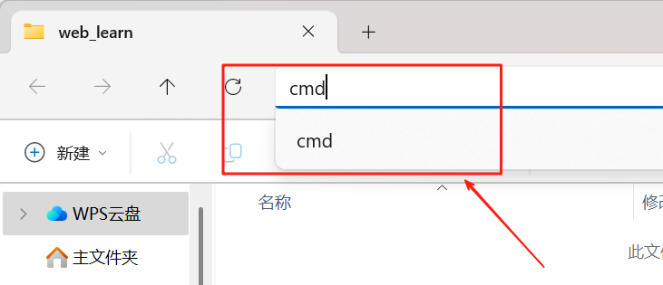
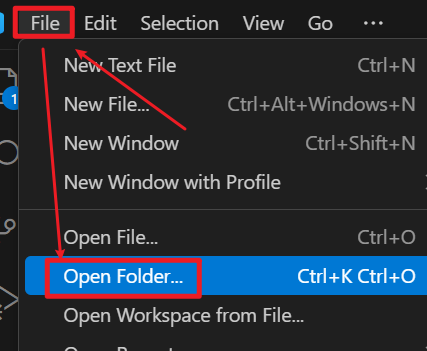
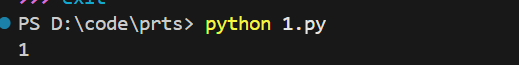

# vscode

# 基础使用：

1. 如何在Vscode打开指定文件夹：

   法1：

   - 打开指定文件夹，选择上面的路径栏，并输入cmd

   

   - 进入控制台后输入：`code .` (注意空格）即可

   法2：

   也可依照图示手动打开文件夹：

   

2. 在文件夹中新建所需要的目标文件，注意，如果是代码文件，需要加对应的后缀：

3. 运行代码：
   - 在完成代码后输入：ctrl+~ ，可进入该文件目录，此时再使用对应的命令运行即可
   - 注意在win中，只有exe和bat（可执行文件）是可以直接运行的，其他文件需要对应的解释器来运行

